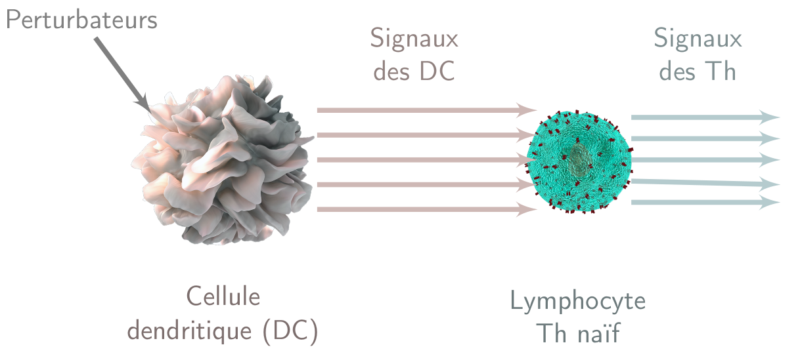
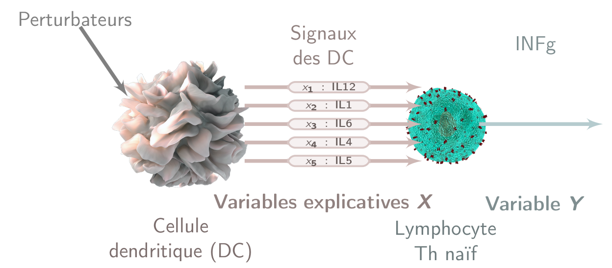

```{r,message=FALSE,echo=FALSE}
library(tidyverse)
library(extrafont) 
require(ggsci)
library(ggpubr)
library(knitr)
library(ggfortify)
library(ggrepel)
library(corrplot)
knitr::opts_chunk$set(echo=FALSE)
```

## Ce qu'il faut retenir de ce cours

::: {style="font-size: 0.75em;"}


:::{.callout-note title="Pourquoi fait-on de la sélection de variable ?"}
- Modèle plus simple et interprétable.
- Évite les redondances.
:::

:::{.callout-note title="Critère de sélection de modèle"}

- $R^2$ (à maximiser).
- $R^2_{aj}$ (à maximiser).
- $AIC$ (à minimiser).
- $BIC$ (à minimiser).

:::

:::{.callout-tip title="Vraissemblance du modèle linéaire mulitple"}
 L'$AIC$ et le $BIC$ sont des critères basées sur la log-vraisemblance $ln(L)$ pénalisée, ayant pour forme : 
 
 $$-2 ln\left( L\right) + 2(p+1) f(n)$$

- $AIC : f(n)= 1$ 
- $BIC : f(n) = ln(n)/2$. 

:::

:::

## Introduction

Dans bon nombre d'études statistiques, nous disposons d'un ensemble de variables explicatives pour expliquer une variable. Cependant, rien ne nous assure que le modèle le plus pertinent soit celui avec toutes les variables explicatives.

::: {.fragment .fade-transparent}

- Certaines variables ne contribuent pas à l'explication de la variable à expliquer.
  
:::
::: {.fragment .fade-transparent}


- Certaines sont fortement corrélées et apportent une information redondantes. Il n'est pas forcément judicieux de les mettre toutes. 
  
:::
::: {.fragment .fade-transparent}

- L'utilisateur a donc à sa disposition un ensemble de variables potentiellement explicatives ou variables candidates.
:::

::: {.fragment .fade-transparent}

:::{.callout-warning title="Objectif"}

Comment sélectionner les variables explicatives ? 
Comment choisir le "meilleur" modèle parmi les modèles disponibles ? Que veut dire meilleur modèle ?
:::

:::


## Explicatif ou prédictif ?


::: {.callout-note title ="Modèle prédictif"}

Un modèle est prédictif quand les régresseurs permettent de bien prédire la variable à expliquer. n'importe quel modèle pourrait, a priori, tout aussi bien convenir.

:::

::: {.fragment .fade-transparent}


::: {.callout-note title ="Modèle explicatif"}

Un modèle est explicatif quand il y a une vraie liaison causale (par exemple d'une loi physique ou chimique) entre la variable à expliquer et les régresseurs.

:::

:::
::: {.fragment .fade-transparent}


:::{.callout-caution title="Remarque"}

- Les modèles explicatifs peuvent être prédictifs.
- En réalité, les modèles explicatifs sont assez rares.

:::

:::

## Importance de la sélection de variable

::: {.callout-warning title="Objectif"}

Il est important de privilégier le modèle le plus simple possible.

::: {.fragment .fade-transparent}
  - Plus facile à interpréter : Plus facile de comprendre d'où viennent  les liens entre les variables explicatives sélectionnées et la variable réponse.
  
:::
::: {.fragment .fade-transparent}
  - Évite à l'utilisateur l'acquisition de données inutiles s'il souhaite prédire la variable réponse.
  
:::
::: {.fragment .fade-transparent}
  - Il faut cependant faire attention de ne pas retirer trop de variables.  (Pour ne pas trop mal prédire ou pour ne pas rater des liens intéréssants).
  
:::

:::


## Petit exemple à 3  variables explicatives 

- On cherche à expliquer une variable $y$ et on  a trois variables explicatives $x_1$, $x_2$ et $x_3$.

::: {.fragment .fade-transparent}


- On note $y_i$ la mesure de la variable réponse de l'individu $i$ et $x_{j,i}$ la valeur de la variable $x_j$ de l'individu $i$ (pour $1 \leq j \leq 3$)

:::

::: {.fragment .fade-transparent}

On suppose que $y_i$ est la réalisation d'une variable aléatoire $Y_i$. 

:::

::: {.fragment .fade-transparent}
Combien de modèle possible peut-on considérer ?
:::

## Le modèle complet 

$$Y_i =  \beta + \alpha_1 x_{1,i} +  \alpha_2 x_{2,i} + \alpha_3 x_{3,i}  + E_i, 1 \leq i \leq n$$

## Modèles à deux variables explicatives

* Un modèle avec $x_1$ et $x_2$

$$Y_i =  \beta + \alpha_1 x_{1,i} +  \alpha_2 x_{2,i}  + E_i, 1 \leq i \leq n$$

 * Un modèle avec $x_1$ et $x_3$

$$Y_i =  \beta + \alpha_1 x_{1,i}  + \alpha_3 x_{3,i}  + E_i, 1 \leq i \leq n$$


* Un modèle avec $x_2$ et $x_3$

$$Y_i =  \beta + \alpha_2 x_{2,i}  + \alpha_3 x_{3,i}  + E_i, 1 \leq i \leq n$$


## Modèles à une variable explicative

* Un modèle avec $x_1$ 

$$Y_i =  \beta + \alpha_1 x_{1,i} + E_i, 1 \leq i \leq n$$

 * Un modèle avec $x_2$

$$Y_i =  \beta + \alpha_2 x_{2,i}   + E_i, 1 \leq i \leq n$$


* Un modèle avec $x_3$

$$Y_i =  \beta +  \alpha_3 x_{3,i}  + E_i, 1 \leq i \leq n$$


## Modèle à 0 variable explicative

$$Y_i =  \beta  + E_i, 1 \leq i \leq n$$

## Résultat

  * 1 modèle complet (on explique $y$ en fonction $x_1$, $x_2$ et $x_3$)
  * 3 modèles à deux variables explicatives ( $y$ en fonction $x_1$ et $x_2$ ou de   $x_1$ et $x_3$  ou de  $x_2$ et  $x_3$)
  * 3 modèles à une variable explicative ( $y$ en fonction $x_1$  ou de   $x_2$  ou de $x_3$ )
  * 1 modèle avec 0 variable explicative (juste l'intercept)
  
**Il y a 8 modèle à comparer !**


# Un exemple en immunologie

##  Un exemple en imunologie 




##  Un exemple en imunologie 



**Question:** Quelles sont les signaux des DC qui influencent INFg ? 


## Comment répondre à la question 

1. Création des données : Expériences faites par des immunologistes.

::: {.fragment .fade-transparent}
2. **Modélisation des données** : modèle fait par un statisticien.
:::

::: {.fragment .fade-transparent}
3. Validations biologiques : expériences faites par des immunologistes pour valider les supositions des statisticiens.
:::

## Etape 1 Création des données

Les immunologistes font $n = 100$ expériences.
Pour les expériences $1 \leq i \leq n$ 

::: {.fragment .fade-transparent}

1. On perturbe (donne un virus ou un champignon ou une bactérie) une cellule dendritique puis  on mesure la quantité des signaux des cellules dendritiques dans l'expérience $i$: 

|$x_{1,i}$| $x_{2,i}$|$x_{3,i}$|$x_{4,i}$|$x_{5,i}$|
|:-:|:-:|:-:|:-:|:-:|
|IL12|IL1|IL6|IL4|IL5|

:::


::: {.fragment .fade-transparent}
  
2. On ajoute des lymphocytes Th puis on mesure la quantité $y_i$ de IFNg sécrétées par les lymphocytes Th dans l'éxpérience $i$.

:::

## Etape 2 : Modélisation

:::{.callout-warning title="Objectif"}


Faire de la sélection de variable dans le modèle 

$$
Y_i = \beta + \sum_{j = 1}^5 \alpha_j x_{j,i} + E_i
$$

On veut : 

- Ne garder que des variables pertinentes pour essayer de trouver des variables explicatives  sans trop donner de variables qui n'influent pas $y$ (IFNg)
- Ne pas oublier de variables importantes.

:::

## Etape 3 : Validations biologiques


Le statisticien a gardé $q$ sur les $p$ variables du modèle. 
Les immunologistes vont faire des experiences pour essayer de voir si ces variables ont, en effet, un effet sur la variable réponse (la quantité d'IFNg)

::: {.fragment .fade-transparent}

Par exemple si on sélectionne le signal $x_1$ (IL12) des celulles dendritiques, on donne du $x_1$ (IL12) à un lymphocyte Th et on regarde si ça a une influence sur la quantité d'INFg qu'il produit. 

:::
::: {.fragment .fade-transparent}


- Ces expériences sont chères il est donc important de ne **pas trop sélectionner de variables**

:::
::: {.fragment .fade-transparent}


- Pour bien comprendre le système immunitaire il faut essayer de **ne pas oublier de variables importantes!**

$\Rightarrow$ on veut trouver un juste milieu.

:::


## Critère de choix de modèle 

Il faut donc définir un critère quantifiant la qualité du modèle

::: {.fragment .fade-transparent}

- Ce critère dépend de l'objectif de la régression

:::
::: {.fragment .fade-transparent}

- Une fois le critère choisi, il faudra déterminer des procédures permettant de trouver le meilleur modèle.

:::
::: {.fragment .fade-transparent}

- Le nombre de modèle à tester peut être grand ( pour un modèle à $p$ variables explicatives il y a $2^p$ modèles possible) $\Rightarrow$ on ne teste pas forcément tous les modèles.

:::

## Etude des données d'immunologie 

Chargement des données (disponible sur moodle)

```{r, include = FALSE}
Data_tmod <- readxl::read_excel("mmc2.xlsx")  
immuno <-  Data_tmod %>% 
  filter(IFNg !=0) %>% 
  transmute(IFNg = log(IFNg), IL12 =IL12p70, 
                                   IL1 = IL1a + IL1b,
            IL6 = IL6...41, 
            IL4 = IL4, IL5 =IL5) %>% 
  slice(1:100)
save(immuno, file= "Data_immuno.Rdata")
 
```


```{r}
load("Data_immuno.Rdata")
head(immuno)
```


## Corrélation entre les variables

```{r}
M = cor(immuno)
corrplot.mixed(M)
```


## Écriture du modèle complet

Soit $M_6$ le modèle : 
pour $1 \leq i \leq n$ on suppose $y_i$ la réalisation d'une variable aléatoire $Y_i$ telle que :

$$
Y_i = \beta + \alpha_1 x_{1,i} + \alpha_2 x_{2,i}+ \alpha_3 x_{3,i}+ \alpha_4 x_{4,i}+ \alpha_5 x_{5,i} + E_i, \; \mbox{où } E_i \overset{iid}{\sim} \mathcal{N}(0, \sigma^2)
$$


## Écriture matricielle du modèle complet

::: {style="font-size: 0.80em;"}

$$Y = X\theta + E$$


où 


$$ X = \left[  \begin{array}{rrrrrrr}
  Intercept & IL12 & IL1 & IL6 & IL4 & IL5 \\ 
  \hline
 1.00 & 0.00 & 0.00 & 0.00 & 101.40 & 206.88 \\ 
   1.00 & 106.42 & 73.74 & 173185.80 & 244.55 & 1381.31 \\ 
  \vdots & \vdots & \vdots & \vdots & \vdots & \vdots \\ 
   1.00 & 23 & 2.1 & 25088 & 690 & 1388 \\ 
   1.00 & 248 & 236 & 46309 & 1278 & 2492 \\ 
\end{array} \right]
$$
$$ Y = \left[  \begin{array}{rr}
 INFg \\ 
  \hline
10.97 \\ 
  9.93 \\ 
   \vdots\\ 
   10.7 \\ 
   11.1 \\ 
\end{array}
\right]\;
\theta = \left[  \begin{array}{}
\beta \\
\alpha_1\\
\alpha_2 \\
\alpha_3 \\
\alpha_4 \\
\alpha_5
\end{array} \right] 
\;
 E = \left[ \begin{array}{} E_1 \\ 
  E_2 \\ 
   \vdots\\ 
   E_{99} \\ 
   E_{100} \\ 
\end{array} \right]
\;E \sim \mathcal{N}(0,\sigma^2 I_n)$$


:::


## Création du modèle complet
```{r,echo=TRUE}
mod_comp <- lm(IFNg ~ IL12 + IL1 + IL6 + IL4 + IL5, data = immuno)
summary(mod_comp)
```


## On teste le modèle complet contre le modèle $M_1$


::: {style="font-size: 0.75em;"}


:::{.callout-tip title="Hypothèses"}


$H_0$ : le modèle $M_1$  $$Y_i =  \beta  + E_i,\quad E_i \overset{i.i.d.}{\sim} \mathcal{N}(0, \sigma^2)$$
vs $H_1$ : le modèle $M_6$

$$
Y_i = \beta + \alpha_1 x_{1,i} + \alpha_2 x_{2,i}+ \alpha_3 x_{3,i}+ \alpha_4 x_{4,i}+ \alpha_5 x_{5,i} + E_i, \quad E_i \overset{i.i.d.}{\sim} \mathcal{N}(0, \sigma^2)
$$
 
:::

::: {.fragment .fade-transparent}


:::{.callout-tip title="Statistique de test"}


 

$$
T_n=\frac{(SCR(M_{1})-SCR(M_{p+1}))/(p)}{SCR(M_{p+1})/(n-p-1)}\underset{H_0}{\sim} \mathcal{F}(p,n-p-1)
$$

:::
:::

::: {.fragment .fade-transparent}


:::{.callout-tip title="Zone de rejet"}


$$R_\delta = \{T_n >f_{1-\delta} \} $$
:::
:::

:::


## Avec R


```{r,echo=TRUE}
m1 <- lm(IFNg ~ 1, data = immuno)
anova(m1, mod_comp)
```


## Remarques et objectifs


:::{.callout-caution title = "Remarques"}
 - Comme le test global $H_0$ : $M_1$ contre $H_1$ : $M_{p+1}$ est significatif, au moins une des variables explicatives contribue à expliquer $Y$.

::: {.fragment .fade-transparent}

- Dans ce cas on peut modéliser nos données pas un modèle de régression linéaire multiple (sous réserve de validation des hypothèses).

:::
::: {.fragment .fade-transparent}


- Prendre en compte toutes les variables peut s'avérer très couteux, il est donc naturel de se poser la question suivante :

:::

:::
::: {.fragment .fade-transparent}


::: {.callout-warning title="Objectif"}

Quelles sont les variables qui contribuent réellement (le plus) à expliquer $Y$ parmi les $x_1,\cdots,x_p$ ?
Dans notre cadre : quels sont les signaux des cellules dendritiques qui contribuent réellement à expliquer la quantité d'IFNg ?

:::
:::


## Une première idée 

Ne garder que les variables explicatives pour lesquels le test de student dit que le coefficient est significativement différent de 0.

::: {.fragment .fade-transparent}


- Tester la nullité de chaque coefficient de régression avec le test de Student $\forall k=1,\cdots,p$, $H_0 : \alpha_k=0$ contre $H_1:\alpha_k\neq 0$
:::
::: {.fragment .fade-transparent}


- À partir de $$T_n^k=\frac{A_k}{\sqrt{S^2_{M_{p+1}}c_{kk}}}\underset{H_0}{\sim} \mathcal{T}(n-p-1)$$

:::
::: {.fragment .fade-transparent}


- On élimine toutes les variables $x_k$ dont le test de Student associé n'est pas significatif.

:::

::: {.fragment .fade-transparent}

::: {.callout-warning title = "Spoiler"}

Cette  démarche est incorrecte. 

:::
:::

## Pourquoi cette démarche est fausse ?

:::{.callout-note title="Explications"}


- Chaque test est effectué alors que les autres variables explicatives sont fixées.
- On ne prend donc pas en compte les possibles effets conjoints.
- La difficulté provient de la colinéarité des variables explicatives.
- Si on retire ou ajoute une variable cela peut modifier la significativité des autres coefficients. 


:::

## Exemple 

```{r,echo=TRUE}
mod_comp <- lm(IFNg ~ IL12 + IL1 + IL6 + IL4 + IL5, data = immuno)
summary(mod_comp)$coefficients
```


::: {.fragment .fade-transparent}


```{r,echo=TRUE}
m5 <- lm(IFNg ~ IL12 + IL6 + IL4 + IL5, data = immuno)
summary(m5)$coefficients
```

:::

::: {.fragment .fade-transparent}


```{r,echo=TRUE}
m4 <- lm(IFNg ~ IL12 + IL4 + IL5, data = immuno)
summary(m4)$coefficients
```

:::

## Problème de colinéarité

:::{.callout-caution title="Une situation classique"}

- $r(x_1,x_2)$ élevé : les 2 variables explicatives sont fortement corrélées.

::: {.fragment .fade-transparent}
- $r(x_1,y)$ et $r(x_2,y)$ : les 2 variables explicatives sont corrélées avec la variable à expliquer.
:::

::: {.fragment .fade-transparent}
- Dans le modèle avec $x_1$ seul, $x_1$ est significatif
:::

::: {.fragment .fade-transparent}
- Dans le modèle avec $x_2$ seul, $x_2$ est significatif
:::

::: {.fragment .fade-transparent}
- Dans le modèle avec les deux variables, ni $x_1$, ni $x_2$ ne sont significatifs
:::

::: {.fragment .fade-transparent}
- Quel modèle choisir ? Celui avec $x_1$ seul ou celui avec $x_2$ seul ? 
:::

:::

## Représentation des corrélations 

```{r,echo=TRUE}
plot(immuno)
```

## Représentation des correlations

```{r,echo=TRUE}
library(corrplot)
corrplot.mixed(cor(immuno))
```


## Les effets de la colinéarité

:::{.callout-caution title="Remarques"}

- La variance des estimateurs peut être très grande.

- Au point que le test de student peut ne pas être significatif (poussant à une suppression indue des variables).

- Les estimations des paramètres sont instables : l'ajout ou suppression de variables modifie la valeur et le signe des estimations des coefficients de régression.

:::


## Deuxième idée

::: {style="font-size: 0.85em;"}


:::{.callout-warning title="Objectif"}

- Soient $x_1, x_2,\cdots,x_{p}$ $p$ variables explicatives : 

- Le but est de sélectionner un certain nombre $q$ variables explicatives pertinentes parmi ces $p$ variables disponibles. 

:::

::: {.fragment .fade-transparent}


:::{.callout-note title="Deux méthodes de sélection"}

- **Méthode de recherche exhaustive**

- **Méthode de sélections de variables pas à pas**


:::

:::

::: {.fragment .fade-transparent}


:::{.callout-caution title="Remarques"}

- On utilisera **un critère pour choisir parmi les modèles pris en compte**.


- Si les seuls modèles considérés sont emboités, il possible de choisir le modèle avec le test de Fisher. Mais comment faire si ce n'est pas le cas ?

:::


:::

:::


# Méthode de recherche exhaustive

## Méthode de recherche exhaustive

::: {.callout-warning title="Objectif"}
On va comparer pour tous les modèles possible selon un critères. 
On prendra ensuite le modèle qui maximise (ou minimise) ce critère. 
:::


## Exemple de critères de choix de modèle

:::{.callout-note title="Critère de choix de modèle"}


- Critère du $R^2$.
- Critère du $R^2$ ajusté.
- $AIC$
- $BIC$

:::

::: {.fragment .fade-transparent}

:::{.callout-caution title="Remarques"}
 L'$AIC$ et le $BIC$ sont des critères basées sur une vraisemblance pénalisée
:::


:::


## Critère du $R^2$ 

::: {style="font-size: 0.90em;"}

::: {.callout-note title = "Coefficient de détermination"}
La qualité d'ajustement d'un modèle à $p$ variables explicatives $M_{p+1}$ peut être mesurée avec son coefficient de détermination $R^2$ :

$$R^2=\frac{SCM(M_{p+1})}{SCT}=1-\frac{SCR(M_{p+1})}{SCT}$$

:::

::: {.fragment .fade-transparent}


::: {.callout-caution title="Remarques"}
- $0 \leq R^2 \leq 1$ donne le pourcentage de la variation totale de $Y$ expliquée par le modèle de régression linéaire.
- $R^2$ augmente avec le nombre $p$ de variables explicatives qui entrent dans le modèle.
- $R^2$ atteint son maximum si toutes les variables disponibles sont incluses, c'est à dire pour le modèle complet $M_{p+1}$.
- **Défaut : on ne peut pas comparer deux modèles ayant des nombres de variables explicatives différents.**

:::

:::
:::


## Critère du $R^2$ avec R

```{r,echo=TRUE}
summary(mod_comp)$r.squared
```


```{r,echo=TRUE}
m5_1 <- lm(IFNg ~ IL12 + IL6 + IL4 + IL5, data = immuno)
summary(m5_1)$r.squared
m5_2 <- lm(IFNg ~ IL12 + IL1 + IL4 + IL5, data = immuno)
summary(m5_2)$r.squared

```

On sélectionnerait le modèle avec IL12, IL6, IL4 et IL5 plutôt que celui avec IL12, IL1, IL4 et IL5.


## Critère du $R^2$ avec R

```{r,echo=TRUE}
library(leaps)
a <- regsubsets(IFNg~., data = immuno, method = "exhaustive", 
                nbest = 5)
plot(a, scale = "r2")
```


## Critère du $R^2$ ajusté

::: {style="font-size: 0.90em;"}


::: {.callout-note title = "Coefficient de détermination ajusté"}

Lorsque l'on souhaite comparer deux modèles n'ayant pas le même nombre $p$ de variables explicatives on peut calculer le $R^2$ ajusté :
$$R^2_{aj}=1-\frac{SCR(M_{p+1})/(n-p-1)}{SCT/(n-1)}$$

:::

::: {.fragment .fade-transparent}


::: {.callout-caution title="Remarques"}

- $R^2_{aj} < R^2$ si $p\geq 2$.
- $R^2_{aj}$ n'augmente pas forcément lors de l'introduction de variables supplémentaires dans le modèle.
	
- On peut comparer deux modèles n'ayant pas le même nombre de variables explicatives.

- On choisira le modèle pour lequel le $R^2_{aj}$ est le plus grand.

:::

:::
:::

## Critère du $R^2$ ajusté avec R 

```{r,echo=TRUE}
summary(mod_comp)$adj.r.squared
```

```{r,echo=TRUE}
m5_1 <- lm(IFNg ~ IL12 + IL6 + IL4 + IL5, data = immuno)
summary(m5_1)$adj.r.squared
m5_2 <- lm(IFNg ~ IL12 + IL1 + IL4 + IL5, data = immuno)
summary(m5_2)$adj.r.squared

```

## Critère du $R^2$ ajusté avec R

```{r,echo=TRUE}
library(leaps)
a <- regsubsets(IFNg~., data = immuno, method = "exhaustive",
                nbest = 5)
plot(a, scale = "adjr2")
```


## Fonction de vraisemblance 
::: {.fragment .fade-transparent}

::: {.callout-note title = 'Densité d&#39;une variable aléatoire gaussienne/normale'}

Soit $Y \sim \mathcal{N}(\mu,\sigma^2)$. La densité de $Y$ est définie par 

$$f_Y(y_i, \mu, \sigma^2)= \frac{1}{\sqrt{2\pi\sigma^2}} \exp\left(-\frac{1}{2\sigma^2}(y_i-\mu)^2\right)$$

:::

:::
::: {.fragment .fade-transparent}


::: {.callout-note title = "Vraissemblance de variables aléatoires indépendantes"}


La vraissemblance de v.a. indépendantes est le produit des densités des v.a.

Soit $n$ v.a. indépendantes $Y_1, \dots,Y_n$  : 

$$L(y_1,\cdots,y_n, \mu, \sigma^2) =\prod_{i=1}^n f_{Y_i}(y_i,  \mu, \sigma^2)$$

:::
:::


## Maximisation de la vraissemblance 

La fonction $ln$ est une fonction croissante

 $\Rightarrow$ les paramètres ($\beta, \alpha_1, \dots,\alpha_p$) qui maximisent $log(L)$ maximisent aussi $L$.

:::{.callout-tip title="Log-vraissemblance du modèle linéaire multiple"}


::: {style="font-size: 0.65em;"}
:::{.fragment}

$$\begin{align}
&ln(L(y_1,\cdots,y_n, \beta, \alpha_1, \dots,\alpha_p,\sigma^2))  =ln(\prod_{i=1}^n f_Y(y_i, \beta, \alpha_1, \dots,\alpha_p,\sigma^2))\\
&= \sum_{i=1}^n ln(f_Y(y_i, \beta, \alpha_1, \dots,\alpha_p,\sigma^2))\\
& =\sum_{i=1}^n ln\left(\frac{1}{\sqrt{2\pi\sigma^2}} \exp \left(-\frac{1}{2\sigma^2}(y_i-(\beta+\alpha_1\,x_{1,i}+\cdots+\alpha_{p}\,x_{p,i}))^2\right)\right)\\
&  =\sum_{i=1}^n ln\left(\frac{1}{\sqrt{2\pi\sigma^2}}\right) + ln\left(\exp \left(-\frac{1}{2\sigma^2}(y_i-(\beta+\alpha_1\,x_{1,i}+\cdots+\alpha_{p}\,x_{p,i}))^2\right)\right)\\
& =\sum_{i=1}^n -ln\left(\sqrt{2\pi\sigma^2}\right) + -\frac{1}{2\sigma^2}(y_i-(\beta+\alpha_1\,x_{1,i}+\cdots+\alpha_{p}\,x_{p,i}))^2\\
&= -n \ln(\sqrt{2\pi\sigma ^2}) -\frac{1}{2\sigma^2} \sum^{n}_{i=1} (y_i-(\beta+\alpha_1\,x_{1,i}+\cdots+\alpha_{p}\,x_{p,i}))^2\\
&= -\frac{n}{2} \ln(2\pi\sigma ^2) -\frac{1}{2\sigma^2} \sum^{n}_{i=1} (y_i-(\beta+\alpha_1\,x_{1,i}+\cdots+\alpha_{p}\,x_{p,i}))^2
\end{align}$$

:::
:::


:::


## *MLE* du modèle linéaire

:::{.callout-tip title="Théorème"}


 Les estimateurs des paramètres par la méthode du maximum de vraisemblance (connus sous les initiales  $MLE$: *Maximum Likelihood Estimators*) sont obtenus en maximisant la vraisemblance $L$ ou son logarithme $ln(L)$:
 
$$ln(L)= -\frac{n}{2} \ln(2\pi\sigma ^2) -\frac{1}{2\sigma^2} \sum^{n}_{i=1} (y_i-(\beta+\alpha_1\,x_{1,i}+\cdots+\alpha_{p}\,x_{p,i}))^2$$

::: {.fragment }


 Chercher les paramètres ($\beta,\alpha_1,\dots, \alpha_p$) qui maximisent  $ln(L)$ revient à minimiser
$$\sum^{n}_{i=1} (y_i-(\beta+\alpha_1\,x_{1,i}+\alpha_2\,x_{2,i}+\cdots+\alpha_{p}\,x_{p,i}))^2=SCR(M_{p+1})$$

Par conséquent les estimateurs du maximum de vraisemblance ($\hat{\beta},\hat{\alpha}_{1},\cdots, \hat{\alpha}_{p}$) sont les mêmes que les estimateurs par les moindres carrés "ordinaires".
:::
:::

## Remarques sur le *MLE*

:::{.callout-caution title="Remarques"}

- L'estimateur $MLE$ de $\sigma^2$ est égal à $SCR(M_{p+1})/n$ (biaisé) et donc différent de $SCR(M_{p+1})/(n-p-1)$ (non biaisé).

- En remplaçant les paramètres par leurs estimateurs dans l'expression de la Log-vraisemblance, on obtient:

$$ln(L)= -\frac{n}{2} ln \left(\frac{SCR(M_{p+1})}{n} \right) - \frac{n}{2}\left( 1+ ln(2\pi) \right)$$


- Choisir un modèle en maximisant la vraisemblance revient à choisir le modèle ayant la plus petite $SCR(M_{p+1})/n$. 


 Comme $ln(L)$ augmente avec l'introduction de nouvelles variables dans le modèle il faut donc introduire une pénalisation !

:::

## Sélection de modèles par vraisemblance pénalisée

::: {style="font-size: 0.85em;"}


:::{.callout-note title="Définition : critère de vraisemblance pénalisée"}

On appelle **critère de vraisemblance pénalisée** les fonctions de la forme 


$$-2 ln\left( L\right) + 2(p+1) f(n)$$
où $ln(L)$ est la log-vraisemblance du modèle et $f(n)$ est une fonction de pénalisation dépendant de $n$.

:::

::: {.fragment .fade-transparent}


:::{.callout-caution title="Remarques"}

- On prend l'opposé de la log-vraisemblance donc il faudra **minimiser** le critère.

- Que prendre pour fonction $f(n)$ ?

 + Bozdogan (1987) a proposé $2f (n) = ln (n) + 1$.
 
 + Hannan \& Quinn (1979) ont proposé $f (n) = c\, log (ln (n))$ où $c$ est une constante plus grande que 1. 

 + Il existe de très nombreuses pénalisations dans la littérature mais les deux les plus répandues sont le $BIC$ et l'$AIC$.
 
:::


:::

:::


## L'Akaike Information Criterion (AIC)

::: {style="font-size: 0.85em;"}


:::{.callout-note title="Définition"}
Ce critère, introduit par Akaike en 1973 est défini pour $f(n)=1$ par

$$\begin{eqnarray}
AIC(p) &=& -2ln(L) + 2(p +1)\times 1\\
&=& n \left(ln(2\pi)+1\right) +n\ ln\left(\frac{SCR(M_{p+1})}{n}\right)+ 2p+2\\
&=& C +n\ ln\left(\frac{SCR(M_{p+1})}{n}\right)+ 2p+2
\end{eqnarray}$$

où $C$ est une constante

:::
::: {.fragment .fade-transparent}


:::{.callout-caution title="Remarques"}

L'AIC est une pénalisation de la log-vraisemblance par deux fois le nombre de paramètres $p+1$


- L'utilisation de ce critère est simple : il suffit de le calculer pour tous les modèles concurrents et de choisir celui qui possède **l'AIC le plus faible**.


:::

:::
:::

## Le Bayesian Information Criterion (BIC)

::: {style="font-size: 0.85em;"}


:::{.callout-note title="Définition"}

Le BIC (Schwarz, 1978) est défini pour $f(n)=ln(n)/2$ par 
$$\begin{eqnarray*}
BIC(p)&=&- 2 ln(L) +  (p+2)ln (n)\\ 
&=&C + n\ ln\left(\frac{SCR(M_{p+1})}{n}\right)+ (p+2)ln (n)
\end{eqnarray*}$$

où $C$ est une constante.

:::

::: {.fragment .fade-transparent}


:::{.callout-caution title="Remarques"}


- L'utilisation de ce critère est identique à celle de l'AIC.

- Nous pouvons constater qu'il revient aussi à pénaliser la log-vraisemblance par le nombre de paramètres $p+1$ multiplié par une fonction des observations (et non plus 2). 

- Ainsi, plus le nombre d'observations $n$ augmente, plus la pénalisation est faible. 

- Cependant, cette pénalisation est en général plus grande que 2 (dès que $n > 7$) et donc le BIC a tendance à sélectionner des modèles plus petits que l'AIC.

:::
:::

:::

## AIC et BIC avec R 

```{r,echo=TRUE}
AIC(mod_comp)
```

```{r,echo=TRUE}
m5_1 <- lm(IFNg ~ IL12 + IL6 + IL4 + IL5, data = immuno)
AIC(m5_1)
m5_2 <- lm(IFNg ~ IL12 + IL1 + IL4 + IL5, data = immuno)
AIC(m5_2)

```

::: {.fragment .fade-transparent}


```{r,echo=TRUE}
BIC(mod_comp)
```

```{r,echo=TRUE}
m5_1 <- lm(IFNg ~ IL12 + IL6 + IL4 + IL5, data = immuno)
BIC(m5_1)
m5_2 <- lm(IFNg ~ IL12 + IL1 + IL4 + IL5, data = immuno)
BIC(m5_2)

```

:::

## Critère BIC  avec R


```{r,echo=TRUE}
library(leaps)
a <- regsubsets(IFNg~., data = immuno, method = "exhaustive", nbest = 5)
plot(a, scale = "bic")
```


## Résumé

:::{.callout-note title="Modèle obtenus"}


- Critère du $R^2$ $\Longrightarrow$ **IL12, IL1, IL6, IL4, IL5**
	
- Critère du $R^2$ ajusté $\Longrightarrow$ **IL12,  IL6, IL4, IL5**
	
- Critère $BIC$ $\Longrightarrow$ **IL12,  IL6, IL4**

:::


::: {.fragment .fade-transparent}

:::{.callout-caution title="Remarques"}

- La sélection par la méthode exhaustive est très coûteuse du point de vue temps car il faut analyser toutes les régressions possibles à partir des $p$ variables explicatives disponibles, où $2^p$ peut-être très grand. 

- Par exemple pour $p=20$, il y a environ 1 Million de modèles envisageables.

- Par conséquent, on considérera les procédures algorithmiques pas à pas.

:::

:::


## Ce qu'il faut retenir de ce cours

::: {style="font-size: 0.75em;"}


:::{.callout-note title="Pourquoi fait-on de la sélection de variable ?"}
- Modèle plus simple et interprétable.
- Évite les redondances.
:::

:::{.callout-note title="Critère de sélection de modèle"}

- $R^2$ (à maximiser).
- $R^2_{aj}$ (à maximiser).
- $AIC$ (à minimiser).
- $BIC$ (à minimiser).

:::

:::{.callout-tip title="Vraissemblance du modèle linéaire mulitple"}
 L'$AIC$ et le $BIC$ sont des critères basées sur la log-vraisemblance $ln(L)$ pénalisée, ayant pour forme : 
 
 $$-2 ln\left( L\right) + 2(p+1) f(n)$$

- $AIC : f(n)= 1$ 
- $BIC : f(n) = ln(n)/2$. 

:::

:::


# Sélection de variables : méthodes pas à pas 

## Introduction des méthodes pas à pas

- On va introduire ou supprimer une variable l'une après l'autre.

- On n'est pas à l'abri d'enlever des variables réellement significatives.

- Il n'y a pas de garantie de résultat optimal. On pourra seulement trouver un optimum local dépendant du point de départ choisi. Si les variables explicatives sont orthogonales, alors l'optimum trouvé sera toujours l'optimum global.

- C'est une méthode algorithmique: elle est donc rapide et économique.

- Le but étant d'extraire un groupe de variables suffisamment explicatif et donc de conserver un **modèle explicatif** : relativement simple et facile à interpréter.


## Méthode de sélection de variables pas à pas

::: {style="font-size: 0.75em;"}


:::{.callout-caution title="Remarques"}
On va s'interesser à **trois méthodes** algorithmique de sélection de variable.

Chacunes de ces méthodes se fait en plusieurs étapes : on **ajoute ou enlève une seule variable** à chaque étapes.
:::

::: {.fragment .fade-transparent}

:::{.callout-note title="Sélection ascendante (Forward)"}


On part d'un modèle sans variables et on en ajoute.

```{mermaid}
%%| fig-align: center
flowchart LR
A[$$M_1$$] --> B[$$M_2$$]
B --> C[$$M_3$$] 
C --> D[$$...$$] 
D --> E["$$M_{p_f}$$"] 

```


:::
:::
::: {.fragment .fade-transparent}


:::{.callout-note title="Élimination descendante (Backward)"}


On part d'un modèle avec toutes les variables et on en enlève.

```{mermaid}
%%| fig-align: center
flowchart LR
A["$$M_{p}$$"] --> B["$$M_{p-1}$$"]
B --> C["$$M_{p-2}$$"] 
C --> D[$$...$$] 
D --> E["$$M_{p_b}$$"] 

```

:::

:::
:::


## Procédure pas à pas

:::{.callout-note title="Procédure pas à pas (Stepwise)"}

On part du modèle qu'on veut et on ajoute ou enlève des variables.


```{mermaid}
%%| fig-align: center
flowchart LR
A["$$M_{p}$$"] --> B["$$M_{p-1}$$"]
B --> C["$$M_{p-2}$$"] 
C --> D["$$M_{p-1}$$"] 
D --> E[$$...$$] 
E --> F["$$M_{p_b}$$"] 

```


:::


## Sélection ascendante (forward selection)

:::{.callout-note title="Explication"}
::: {.fragment .fade-transparent}


On fait rentrer les variables les unes à la suite des autres: 
:::

::: {.fragment .fade-transparent}

- On sélectionne la "meilleure" variable 

:::
::: {.fragment .fade-transparent}

 - On choisit ensuite une deuxième variable qui (avec la première variable selectionnée) va faire le meilleur modèle à deux variables 
    
:::
::: {.fragment .fade-transparent}

- On choisit ensuite une troisième variable qui (avec les deux premières variables selectionnées) va faire le meilleur modèle à trois variables 
    
:::    

::: {.fragment .fade-transparent}

- ...

:::

::: {.fragment .fade-transparent}

- On s'arrête quand aucune des variables à ajouter (donc pas encore dans le modèle) n'améliore le modèle

:::


:::


## La "meilleure" variable ?

:::{.callout-note title="Critère"}

On choisit un critère avant de commencer. 
On veut un modèle qui donne 


-   le $R^2_{aj}$ le plus élevé.
-  ou l'AIC le plus bas.
-  ou  le BIC le plus bas.

:::

## Sélection ascendante (forward selection)

::: {style="font-size: 0.75em;"}


:::{.callout-note title="Étape 1:  modèle à 1 variable "}

📈  	On effectue toutes les régressions simples possibles avec une seule variable explicative.     

🛑  Si aucun critère n'est 'meilleur' que le modèle à $0$ variables on s'arrête là.

⏩ Sinon, on retient le modèle qui maximise (ou minimise) le critère, **la première variable est sélectionnée**.
    
:::

::: {.fragment .fade-transparent}

:::{.callout-note title="Étape 2: modèle à 2 variables"}

📈   On effectue les régressions possibles avec deux variables explicatives qui comportent la variable sélectionnée à l'étape précédente. ($p-1$ modèles possibles)
    
🛑 Si aucun modèle n'est 'meilleur' que celui à 1 variable, on s'arrête là.

⏩   Sinon, on retient le modèle qui maximise (ou minimise) le critère, **la deuxième variable est sélectionnée**.

:::
:::
::: {.fragment .fade-transparent}


On reitère, en effectuant les régressions possibles avec 3 variables explicatives parmi lesquelles se trouvent les 2 variables sélectionnées, 4 variables avec les 3 ...

:::
::: {.fragment .fade-transparent}


:::{.callout-note title="🛑 Fin de l'algorithme"}

Le processus se termine lorsqu'un modèle d'une étape précédente est meilleur que tous les modèles de l'étape actuelle.
:::

:::
:::


## Écriture du modèle à l'étape 1

📈 On part du modèle $M_1:Y_i=\beta+E_i$ et on calcul le critère. 

::: {.fragment .fade-transparent}


📈 Pour les variables $x_1$ jusqu'à $x_{p}$ on lance le modèle 
$$M_2^{(k)}:Y_i=\beta+\alpha_k x_k +E_i,\quad 1 \leq k \leq p$$
on fait donc $p$  modèles. Sur chacun de ces modèles, on calcule notre critère. 

:::
::: {.fragment .fade-transparent}


🛑 Si le meilleur modèle (au sens du critère donné) est le modèle $M_1$ on s'arrete là. Le modèle $M_1$ est le modèle sélectionné.

:::
::: {.fragment .fade-transparent}


⏩ Sinon on passe à l'étape suivante avec le modèle qui maximise $R^2_{aj}$ ou minimise l'$AIC$ ou le $BIC$. Appelons le 
$$M_2^{(k_1)}:Y_i=\beta+\alpha_{k_1} x_{k_1} +E_i$$

⏩ La variable $x_{k_1}$ est sélectionnée dans le modèle.

:::

## Écriture du modèle à l'étape 2

::: {.fragment .fade-transparent}


📈 On part du modèle $M_2^{(k_1)}:Y_i=\beta+\alpha_{k_1} x_{k_1} +E_i$ et on calcul le critère. 
:::
::: {.fragment .fade-transparent}


📈 Pour les variables $x_1$ jusqu'à $x_{p}$ (sauf la variable $x_{k_1}$) on lance le modèle 
$$M_3^{(k)}:Y_i=\beta+\alpha_{k_1} x_{k_1} +\alpha_k x_k +E_i,\quad 1 \leq k \leq p \mbox{ et } k \neq k_1$$
on fait donc $p-1$  modèles. Sur chacun de ces modèles, on calcule notre critère. 
:::
::: {.fragment .fade-transparent}


🛑 Si le meilleur modèle (au sens du critère donné) est le modèle $M_2^{(k_1)}$ on s'arrête là. Le modèle $M_2^{(k_1)}$ est le modèle sélectionné.

:::
::: {.fragment .fade-transparent}


⏩ Sinon on passe à l'étape suivante avec le modèle qui maximise $R^2_{aj}$ ou minimise l'$AIC$ ou le $BIC$. Appelons le 
 
$$M_3^{(k_{2})}:Y_i=\beta+\alpha_{k_1} x_{k_1}+\alpha_{k_2} x_{k_2} +E_i$$
⏩ Les variables $x_{k_1}$ et $x_{k_2}$ sont sélectionnées dans le modèle.

:::

## Écriture du modèle à l'étape $q$


📈 On part du modèle $M_q^{(k_{q -1})}:Y_i=\beta+\sum _{i=1}^{q-1} \alpha_{k_i} x_{k_i} +E_i$ et on calcul le critère. 
(Les variables $x_{k_1},\dots, x_{k_{q-1}}$) ont été selectionnées aux $q-1$ étapes précédentes)

::: {.fragment .fade-transparent}


📈 Pour les variables $x_1$ jusqu'à $x_{p}$ (sauf les variables $x_{k_1}, \dots, x_{k_{q-1}}$) on lance le modèle 
$$M_{q+1}^{(k)}:Y_i=\beta+\sum _{i=1}^{q-1} \alpha_{k_i} x_{k_i} +\alpha_k x_k +E_i, \quad  k \mbox{ pas encore sélectionné}$$
on fait donc $p-(q-1)$  modèles. Sur chacuns de ces modèles on calcul notre critère. 
:::
::: {.fragment .fade-transparent}


🛑 Si le meilleur modèle (au sens du critère donné) est le modèle $M_q^{(k_{q -1})}$ on s'arrête là. Le modèle $M_q^{(k_{q -1})}$ est le modèle sélectionné.

:::
::: {.fragment .fade-transparent}


⏩ Sinon on passe à l'étape suivante avec le modèle qui maximise $R^2_{aj}$ ou minimise l'$AIC$ ou le $BIC$. Appelons le 

$$M_{q+1}^{(k_q)}:Y_i=\beta+\alpha_{k_1} x_{k_1}+\alpha_{k_2} x_{k_2}+...+\alpha_{k_q} x_{k_q} +E_i$$

⏩ Les variables $x_{k_1},x_{k_2},\dots,x_{k_q}$ sont sélectionnées dans le modèle.

:::

## 🛑 Fin de l'algorithme


:::{.callout-note title="Arrêt de l'algorithme"}

On s'arrête si :

- Dans une des étapes si l' $AIC$ ou le $BIC$ (resp. $R^2_{aj}$) du modèle $M_{q}^{k_{q}}$ est plus petit (resp. plus grand) que celui du modèle $M_{q +1}^{(k_{q +1})}$.

- Si on arrive au bout et qu'on a toutes les variables dans le modèles : on garde le modèle complet.

:::


## Sélection ascendante  (Forward) avec R : AIC


```{r, eval= FALSE,echo=TRUE}
#| code-line-numbers: "|1,2|3|4|5|6|"
m1 <- lm(IFNg~1, data = immuno)
step(m1,
     scope=list(upper=~IL12+IL1+IL6+IL4+IL5),
     direction="forward",
     trace=TRUE,
     k = 2)
```

Arguments de step : 

- `m1` le modèle duquel on part

- `scope=list(upper=~IL12+IL1+IL6+IL4+IL5)` : on a le droit d'aller jusqu'au modèle 
IFNg~IL12+IL1+IL6+IL4+IL5

- `direction = "forward"` : on fait de la selection forward (on part du petit modèle pour aller vers le grand)
- `trace = TRUE` : affiche toutes les étapes 
- `k = 2` : la pénalité devant le nombre de paramètres. pour BIC `k=log(n)` où $n$ est le nombre d'observations.


## Première étape

```{r, eval= FALSE}
m1 <- lm(IFNg~1, data = immuno)
step(m1,scope=list(upper=~IL12+IL1+IL6+IL4+IL5),
direction="forward", trace=TRUE, k = 2)
```

📈

````
Start:  AIC=73.89
IFNg ~ 1

       Df Sum of Sq    RSS    AIC
+ IL12  1   29.0138 176.21 60.653
+ IL4   1   11.7248 193.50 70.012
+ IL6   1    9.2897 195.94 71.263
+ IL1   1    4.3201 200.91 73.767
<none>              205.23 73.895
+ IL5   1    2.9707 202.26 74.437

````
::: {.fragment .fade-transparent}


⏩  Si on ajoute IL12 on passe d'un AIC de 73.89 à un AIC 60.65. 

⏩  Le premier modèle est $IFNg = \beta + \alpha_1 IL12 + E$
 
:::

 
## Deuxième étape 

📈

````
Step:  AIC=60.65
IFNg ~ IL12

       Df Sum of Sq    RSS    AIC
+ IL4   1   15.3796 160.83 53.520
+ IL6   1    9.1733 167.04 57.306
+ IL1   1    4.2064 172.01 60.237
<none>              176.21 60.653
+ IL5   1    0.2443 175.97 62.514

````
::: {.fragment .fade-transparent}

⏩  Si on ajoute IL4, on passe d'un AIC 60.65  à un  AIC de 53.52

⏩  Le deuxième modèle est $IFNg = \beta + \alpha_1 IL12 + \alpha_2 IL4 + E$

:::

## Troisième étape 

📈

````
Step:  AIC=53.52
IFNg ~ IL12 + IL4

       Df Sum of Sq    RSS    AIC
+ IL6   1   14.0990 146.74 46.346
+ IL1   1    8.0410 152.79 50.391
+ IL5   1    7.2759 153.56 50.891
<none>              160.83 53.520


````

::: {.fragment .fade-transparent}

⏩   Si on ajoute IL6, on passe  d'un  AIC de 53.52 à un AIC 46.346

⏩   Le troisième modèle est $IFNg =\beta + \alpha_1 IL12 + \alpha_2 IL4 + \alpha_3 IL6 + E$
 
:::

## Quatrième étape 

📈

````
Step:  AIC=46.35
IFNg ~ IL12 + IL4 + IL6

       Df Sum of Sq    RSS    AIC
+ IL5   1    3.2290 143.51 46.121
<none>              146.74 46.346
+ IL1   1    0.5704 146.16 47.956
````

::: {.fragment .fade-transparent}


⏩  Si on ajoute IL5, on passe  d'un  AIC de 46.35 à un AIC 46.121. 

⏩  Le quatrième modèle est $IFNg = \beta + \alpha_1 IL12 + \alpha_2 IL4 + \alpha_3 IL6 + \alpha_4 IL5 + E$

:::

## Cinquième étape 

📈

````
Step:  AIC=46.12
IFNg ~ IL12 + IL4 + IL6 + IL5

       Df Sum of Sq    RSS    AIC
<none>              143.51 46.121
+ IL1   1   0.56321 142.94 47.727


Call:
lm(formula = IFNg ~ IL12 + IL4 + IL6 + IL5, data = immuno)

Coefficients:
(Intercept)         IL12          IL4          IL6          IL5  
  8.836e+00    9.687e-05    1.984e-03    5.488e-06   -2.229e-04
````

::: {.fragment .fade-transparent}

🛑 On n'ajoute pas  IL1 (car cela ferait augmenter l'AIC et passer de 46.121 à 47.727) 

🛑 On s'arrete là!

🛑 **Le  modèle final est $IFNg = \beta + \alpha_1 IL12 + \alpha_2 IL4 + \alpha_3 IL6 + \alpha_4 IL5 + E$**

🛑  l'AIC final est de 46.121

:::
 


## Sélection ascendante  (Forward) avec R : BIC

📈

⏩  

```{r, eval= TRUE,echo=TRUE}
m1 <- lm(IFNg~1, data = immuno)
n <- nrow(immuno)
step(m1,
     scope=list(upper=~IL12+IL1+IL6+IL4+IL5),
     direction="forward",
     trace=FALSE,
     k = log(n))
```


**Ici on a changé $k = 2$ en $k = log(n)$**

`Le trace = FALSE` n'affiche pas toutes les étapes mais seulement l'étape finale


🛑  **Le  modèle final est $IFNg =\beta + \alpha_1 IL12 + \alpha_2 IL4 + \alpha_3 IL6  + E$**
 
 
## Sélection descendante (bacward selection)


:::{.callout-note title="Sélection ascendante (Forward)"}


On part d'un modèle sans variables et on en ajoute.

```{mermaid}
%%| fig-align: center
flowchart LR
A[$$M_1$$] --> B[$$M_2$$]
B --> C[$$M_3$$] 
C --> D[$$...$$] 
D --> E["$$M_{p_f}$$"] 

```


:::

::: {.fragment .fade-transparent}


:::{.callout-note title="Élimination descendante (Backward)"}


On part d'un modèle avec toutes les variables et on en enlève.

```{mermaid}
%%| fig-align: center
flowchart LR
A["$$M_{p}$$"] --> B["$$M_{p-1}$$"]
B --> C["$$M_{p-2}$$"] 
C --> D[$$...$$] 
D --> E["$$M_{p_b}$$"] 

```

:::

:::

 
	   
## Sélection descendante (backward selection)

::: {style="font-size: 0.75em;"}


:::{.callout-note title="Étape 1:  modèle à $p-1$ variable "}

📈
On effectue toutes les régressions simples possibles avec $p-1$ variable explicative.     

🛑  Si aucun modèle n'est 'meilleur' que celui à $p$ variables on s'arrête là.

⏩ Sinon, on retient le modèle qui maximise (ou minimise) le critère, **la première variable est retirée**.
    
:::

::: {.fragment .fade-transparent}

:::{.callout-note title="Étape 2: modèle à $p-2$ variables"}

📈   On effectue les régressions possibles avec $p-2$ variables explicatives qui ne comportent pas la variable retirée à l'étape précédente. 
    
🛑 Si aucun modèle n'est 'meilleur' que celui à $p-1$ variable, on s'arrête là.

⏩   Sinon, on retient le modèle qui maximise (ou minimise) le critère, **la deuxième variable est retirée**.

:::
:::
::: {.fragment .fade-transparent}


On reitère, en effectuant les régressions possibles avec $p-3$ variables explicatives, puis $p-4$...

:::
::: {.fragment .fade-transparent}


:::{.callout-note title="🛑 Fin de l'algorithme"}

Le processus se termine lorsqu'un modèle d'une étape précédente est meilleur que tous les modèles de l'étape actuelle.
:::

:::
:::


## Sélection descendante  (Backward) avec R : AIC


```{r, eval= TRUE,echo=TRUE}
step(mod_comp,
     direction="backward",
     trace=FALSE,
     k = 2)
```

## Sélection descendante  (Backward) avec R : BIC


```{r,echo=TRUE,eval=FALSE}
n <- nrow(immuno)
step(mod_comp, 
     direction="backward",
     trace=TRUE,
     k = log(n))
```

## Première étape

```{r,eval=FALSE, echo=TRUE}
n <- nrow(immuno)
step(mod_comp, 
     direction="backward",
     trace=TRUE,
     k = log(n))
```

```
Start:  AIC=63.36
IFNg ~ IL12 + IL1 + IL6 + IL4 + IL5

       Df Sum of Sq    RSS    AIC
- IL1   1    0.5632 143.51 59.146
- IL5   1    3.2219 146.16 60.982
- IL6   1    4.6127 147.56 61.929
<none>              142.94 63.358
- IL4   1   23.8140 166.76 74.162
- IL12  1   27.1734 170.12 76.157
```

:::{.callout-caution title="Remarque"}
Même si il y a écrit $AIC$ il s'agit bien du $BIC$ car on a changé $k$.
:::

::: {.fragment .fade-transparent}


⏩ Si on enlève IL1, on passe d'un BIC de 63.36 à 59.146

⏩ Le modèle est :  $IFNg = \alpha_1 IL12 + \alpha_2 IL4 + \alpha_3 IL6 + \alpha_4 IL5 + E$

:::


## Deuxième étape

```
Step:  AIC=59.15
IFNg ~ IL12 + IL6 + IL4 + IL5

       Df Sum of Sq    RSS    AIC
- IL5   1     3.229 146.74 56.766
<none>              143.51 59.146
- IL6   1    10.052 153.56 61.312
- IL4   1    23.337 166.84 69.609
- IL12  1    27.125 170.63 71.854
```

::: {.fragment .fade-transparent}


⏩  Si on enlève IL5, on passe d'un BIC de 59.146 à 56.766 

⏩  Le modèle est :  $IFNg = \alpha_1 IL12 + \alpha_2 IL4 + \alpha_3 IL6  + E$

:::

## Troisième  étape

```
Step:  AIC=56.77
IFNg ~ IL12 + IL6 + IL4

       Df Sum of Sq    RSS    AIC
<none>              146.74 56.766
- IL6   1    14.099 160.83 61.336
- IL4   1    20.305 167.04 65.122
- IL12  1    33.178 179.91 72.546
```
```

Call:
lm(formula = IFNg ~ IL12 + IL6 + IL4, data = immuno)

Coefficients:
(Intercept)         IL12          IL6          IL4  
  8.651e+00    1.044e-04    6.283e-06    1.649e-03  
```

::: {.fragment .fade-transparent}

🛑 On s'arrete là! 

🛑 Le modèle finale est $IFNg = \alpha_1 IL12 + \alpha_2 IL4 + \alpha_3 IL6  + E$

:::


## Procédure pas à pas


:::{.callout-note title="Élimination descendante (Backward)"}


On part d'un modèle avec toutes les variables et on en enlève.

```{mermaid}
%%| fig-align: center
flowchart LR
A["$$M_{p}$$"] --> B["$$M_{p-1}$$"]
B --> C["$$M_{p-2}$$"] 
C --> D[$$...$$] 
D --> E["$$M_{p_b}$$"] 

```

:::

::: {.fragment .fade-transparent}


:::{.callout-note title="Procédure pas à pas (Stepwise)"}

On part du modèle qu'on veut et on ajoute ou enlève des variables.


```{mermaid}
%%| fig-align: center
flowchart LR
A["$$M_{p}$$"] --> B["$$M_{p-1}$$"]
B --> C["$$M_{p-2}$$"] 
C --> D["$$M_{p-1}$$"] 
D --> E[$$...$$] 
E --> F["$$M_{p_b}$$"] 

```

:::

:::

## Sélection de variable stepwise (dans les deux sens)

::: {style="font-size: 0.75em;"}


:::{.callout-note title="Initialisation"}

On peut partir du modèle complet $M_p$, du modèle $M_1$, ou du modèle qu'on veut.

:::

::: {.fragment .fade-transparent}

:::{.callout-note title="Étape $q$"}

📈 On re-éxamine à chaque étape les variables introduites ou retirées du modèle.

- À chaque étape on peut soit:

  ⏩  ajouter une variable qui n'est pas dans le modèle.
  
  ⏩  retirer une variable qui est dans le modèle .
  

:::
:::
::: {.fragment .fade-transparent}

:::{.callout-caution title="Remarque"}

Une variable introduite à un moment peut être retirée à un autre si elle est corrélées avec d'autre qui sont introduites plus tard dans le modèle.

:::

:::
::: {.fragment .fade-transparent}

:::{.callout-note title="🛑 Fin de l'algorithme"}
Le processus continue jusqu'à ce qu'on ne puisse plus améliorer le critère en ajoutant ou retirant des variables 

:::
:::


:::

## Détail de l'étape $q$ "en français"


:::{.callout-note title="Étape $q$"}

📈  Pour toutes les variables qui **ne sont pas** dans le modèle actuel on lance le modèle avec les variables inclues dans **le modèle précédent et cette variable**.

::: {.fragment .fade-transparent}

📈 Pour toutes les variables qui **sont** dans le modèle précédent on lance le modèle avec les variables inclues dans **le modèle précédent moins cette variable**.
:::

::: {.fragment .fade-transparent}


📈 On calcule le critère pour tous ces modèles.

:::
::: {.fragment .fade-transparent}

🛑  Si aucun critère n'est 'meilleur' que le modèle précédent on s'arrête là.

:::
::: {.fragment .fade-transparent}

⏩ Sinon, on retient le modèle qui maximise (ou minimise) le critère.

:::

:::


## Détail de l'étape $q$ "en maths"

::: {style="font-size: 0.60em;"}


::: {.fragment .fade-transparent}
:::{.callout-note title="Initialisation"}
On Choisit un modèle de départ :

Soit $S^{(1)} \subset \{1, \dots, p\}$ le sous-ensemble des variable sélectionnées dans le modèle de départ
$$M^{(1)}: Y_i = \beta + \sum_{j \in S^{(1)}} \alpha_j x_{j,i} + E_i$$

:::
:::

:::{.callout-note title="Étape $q$"}
On lance $p$ modèles et on calcule notre critère sur ces $p$ modèles.

::: {.fragment .fade-transparent}


📈  Pour $k \notin S^{(q-1)}$
$$M^{(q,k)}: Y_i = \sum_{j \in S^{(q-1)} } \alpha_j x_{j,i} + \alpha_k x_{k,i} + E_i$$
:::
::: {.fragment .fade-transparent}


📈 Pour $k \in S^{(q-1)}$
$$M^{(q,k)}: Y_i = \sum_{j \in S^{(q-1)} \& j \neq k } \alpha_j x_{j,i} + E_i$$
:::
::: {.fragment .fade-transparent}


⏩ On sélectionne ensuite le modèle pour lequel le critère est le plus faible (ou plus élevé si $R^2_{aj}$).

⏩ On note $S^{(q)}$ le sous ensemble des variables selectionnées à l'étape $q$.

:::
::: {.fragment .fade-transparent}

🛑  Si aucun critère n'est 'meilleur' que le modèle précédent on s'arrête là.
:::
:::

:::


## Sélection stepwise avec R (AIC)

En Partant du modèle M1

```{r, eval= FALSE,echo=TRUE}

n <- nrow(immuno)
step(m1,
     scope=list(upper=~IL12+IL1+IL6+IL4+IL5),
     direction="both",
     trace=TRUE,
     k = 2)
```

## Première étape

📈 On regarde les 5 modèles à une variables

```
Start:  AIC=73.89
IFNg ~ 1

       Df Sum of Sq    RSS    AIC
+ IL12  1   29.0138 176.21 60.653
+ IL4   1   11.7248 193.50 70.012
+ IL6   1    9.2897 195.94 71.263
+ IL1   1    4.3201 200.91 73.767
<none>              205.23 73.895
+ IL5   1    2.9707 202.26 74.437
```

⏩ Si on ajoute IL12, l'AIC passe de 73.89 à 60.653

⏩ Le modèle est $IFNg = \beta + \alpha_1 IL12 + E$

## Deuxième etape

📈 On regarde les 4 modèles avec IL12 et une autre variable
📈 On regarde le modèle auquel on retire IL12 (donc le modèle $M1$)

```
 Step:  AIC=60.65
IFNg ~ IL12

       Df Sum of Sq    RSS    AIC
+ IL4   1   15.3796 160.83 53.520
+ IL6   1    9.1733 167.04 57.306
+ IL1   1    4.2064 172.01 60.237
<none>              176.21 60.653
+ IL5   1    0.2443 175.97 62.514
- IL12  1   29.0138 205.23 73.895

```

⏩ Si on ajoute IL4, l'AIC passe de 60.65 à 53.520

⏩ Le modèle est $IFNg = \beta + \alpha_1 IL12 +\alpha_2 IL4+ E$


## Troisième étape 

📈 On regarde les 3 modèles avec IL12 et IL4 et une autre variable
📈 On regarde le modèle auquel on retire IL12 ou IL4 


```
Step:  AIC=53.52
IFNg ~ IL12 + IL4

       Df Sum of Sq    RSS    AIC
+ IL6   1    14.099 146.74 46.346
+ IL1   1     8.041 152.79 50.391
+ IL5   1     7.276 153.56 50.891
<none>              160.83 53.520
- IL4   1    15.380 176.21 60.653
- IL12  1    32.669 193.50 70.012
```


⏩ Si on ajoute IL6, l'AIC passe de 53.52 à 46.346

⏩ Le modèle est $IFNg = \beta + \alpha_1 IL12 +\alpha_2 IL4+ \alpha_3IL6+ E$


## Quatrième étape 

```
Step:  AIC=46.35
IFNg ~ IL12 + IL4 + IL6

       Df Sum of Sq    RSS    AIC
+ IL5   1     3.229 143.51 46.121
<none>              146.74 46.346
+ IL1   1     0.570 146.16 47.956
- IL6   1    14.099 160.83 53.520
- IL4   1    20.305 167.04 57.306
- IL12  1    33.178 179.91 64.730
```

## Cinquième étape 

```
Step:  AIC=46.12
IFNg ~ IL12 + IL4 + IL6 + IL5

       Df Sum of Sq    RSS    AIC
<none>              143.51 46.121
- IL5   1    3.2290 146.74 46.346
+ IL1   1    0.5632 142.94 47.727
- IL6   1   10.0521 153.56 50.891
- IL4   1   23.3367 166.84 59.188
- IL12  1   27.1246 170.63 61.433
```
```

Call:
lm(formula = IFNg ~ IL12 + IL4 + IL6 + IL5, data = immuno)

Coefficients:
(Intercept)         IL12          IL4          IL6          IL5  
  8.836e+00    9.687e-05    1.984e-03    5.488e-06   -2.229e-04  
```

🛑 Le modèle final est 

$$
INFg =\beta+ \alpha_1 IL12 + \alpha_2 IL4 + \alpha_3 IL6 + \alpha_4 IL5 +E
$$


## Sélection stepwise avec R (BIC)

En Partant du modèle M1

```{r,echo=TRUE,eval=FALSE}
n <- nrow(immuno)
step(m1,
     scope=list(upper=~IL12+IL1+IL6+IL4+IL5),
     direction="both", 
     trace=TRUE, 
     k = log(n))
```

```{r}
n <- nrow(immuno)
step(m1,
     scope=list(upper=~IL12+IL1+IL6+IL4+IL5),
     direction="both", 
     trace=TRUE, 
     k = log(n))
```

## Sélection stepwise avec R (AIC)

En Partant du modèle Modèle complet

```{r,echo=TRUE,eval=FALSE}

step(mod_comp,
     scope=list(upper=~IL12+IL1+IL6+IL4+IL5),
     direction="both",
     trace=FALSE,
     k = 2)
```


## Sélection stepwise  avec R (AIC)

En Partant du modèle  complet

```{r}
step(mod_comp,
     scope=list(upper=~IL12+IL1+IL6+IL4+IL5),
     direction="both",
     trace=TRUE,
     k = 2)
```


## Sélection stepwise  avec R (BIC)

En Partant du modèle  complet

```{r, eval= FALSE,echo=TRUE}
n <- nrow(immuno)
step(mod_comp,
     direction="both",
     trace=TRUE,
     k = log(n))
```

## Sélection stepwise avec R (BIC)

```{r}
n <- nrow(immuno)
step(mod_comp,
direction="both", trace=TRUE, k = log(n))
```

## Résumé selection de variable pas à pas 

::: {style="font-size: 0.90em;"}


**Sélection ascendante (forward):**

-  AIC : IL12 + IL4 + IL6 + IL5
-  BIC : IL12 + IL4 + IL6

**Sélection descendante (backward):**

-  AIC : IL12 + IL4 + IL6 + IL5
-  BIC : IL12 + IL4 + IL6

**Sélection dans les deux sens (stepwise):**

-  En partant du modèle $M_1$

    +  AIC : IL12 + IL4 + IL6 + IL5
  
    +  BIC : IL12 + IL4 + IL6

-  En partant du modèle complet

    +  AIC : IL12 + IL4 + IL6 + IL5
  
    +  BIC : IL12 + IL4 + IL6


:::


## Choix final

On peut regarder les deux modèles : 

:::{.columns}
:::{.column width="50%"}


```{r,echo=TRUE}
mod_fin_aic <- lm(IFNg~ IL12 +IL4+ IL6+IL5 , data = immuno)
summary(mod_fin_aic)
```

:::
:::{.column width="50%"}

```{r,echo=TRUE}
mod_fin_bic <- lm(IFNg~ IL12 +IL4+ IL6 , data = immuno)
summary(mod_fin_bic)
```
:::
:::


## Décision 

::: {style="font-size: 0.80em;"}


:::{.callout-caution title="Remarques"}


- On aime conserver les modèles le plus simple 

- Le coefficient de IL5 n'est pas significativement différent de 0 (même au risque 10%), il n'est donc pas facile à interpréter

- Le modèle choisi par l'AIC est emboité dans le modèle choisi par le BIC on peut faire un test de fisher (qui a nouveau n'est pas significatif)

```{r,echo=TRUE}
anova(mod_fin_bic, mod_fin_aic)
```
:::


:::{.callout-tip title="Conclusion"}

On choisit le modèle 

$$IFNg= \alpha_1  IL12 + \alpha_2 IL4 +\alpha_3 IL6 + E$$

:::

:::

## Une dernière vérification

À l'aide d'un test de Fisher de comparaison de modèle, on peut vérifier si le modèle sélectionné est significativement différent du modèle complet : 

```{r,echo=TRUE}
anova(mod_comp, mod_fin_aic)
```

Ici, on a $p_c>5\%$, le test n'est pas significatif, le modèle complet n'est pas significativement différent du modèle sélectionné ! 


## Récapitulatif sur la sélection de variable 

::: {style="font-size: 0.60em;"}


:::{.callout-note title="Pourquoi fait-on de la sélection de variable ?"}
- Modèle plus interprétable
- Évite les redondances
:::

:::{.callout-note title="Choix du critère"}
- $R^2_{aj}$ (à maximiser)
- $AIC$ (à minimiser)
- $BIC$ (à minimiser)
:::

:::{.callout-note title="Sélection exhaustive "}
  - On calcul le critère sur tous les modèle possibles
  - On sélectionne le meilleur modèle pour notre critère 
  - Très long : $2^p$ modèle à comparer
  
:::

:::{.callout-note title="Sélection pas à pas"}

- Sélection ascendante (Forward)

- Élimination descendante (Backward)
	
- Procédure dans les deux sens (Stepwise)

:::

:::


 