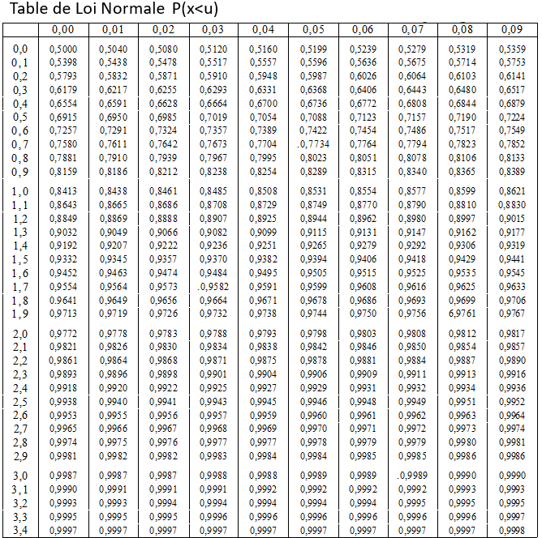

# Que va contenir ce cours ? {.smaller}

\newcommand\b{\color{blue}}
\newcommand\r{\color{red}}
\newcommand\p{\color{purple}}

##  Organisation et évaluation {.smaller}


```{r,echo = FALSE}
knitr::opts_chunk$set(echo = F)
knitr::opts_chunk$set(warning  = F)
```

- 10 séances de cours-TD-TP de 3h00.
- plusieurs DST + 2 TP notés
- Dépôt des documents de cours, TD, TP sur moodle.


## Compétences, Ressources, SAE {.smaller}

- [**Ressource : RES R3.06**]{style="color:#8A1538 ;"} : Tests d'hypothèses pour l'analyse bi-variée, s'appuie très fortement sur la ressource du S2, R2.08 : Statistique inférentielle
- [**Compétence ciblée**]{style="color:#8A1538 ;"} : Analyser statistiquement les données, Niveau 2 : Mettre en oeuvre une analyse exploratoire
- [**Apprentissages critiques**]{style="color:#8A1538 ;"} :
  - [**AC22.04**]{style="color:#8A1538 ;"} : Appréhender l'idée de confronter une hypothèse avec la réalité pour prendre une décision
  - [**AC22.05**]{style="color:#8A1538 ;"} : Apprécier les limites de validité et les conditions d'application d'une analyse
- [**SAÉ concernées**]{style="color:#8A1538 ;"} :
  - Au S3 - [**SAÉ 3.EMS.01**]{style="color:#8A1538 ;"} : Recueil et analyse de données par échantillonnage ou plan d'expérience
  - Au S4 - [**SAÉ 4.EMS.01**]{style="color:#8A1538 ;"} : Expliquer ou prédire une variable quantitative à partir de plusieurs facteurs

## Plan du cours

- **Rappels**
- **Chapitre I** : Introduction sur les tests
- **Chapitre II** : Tests paramétriques à un échantillon
- **Chapitre III** : Test paramétriques de comparaison de deux échantillons
- **Chapitre IV** : Test du $\chi^2$
- **Chapitre V** : Tests de corrélation

## Le code couleur

:::{.callout-warning title="Jaune"}
Ceci est un objectif.
:::

:::{.callout-note title="Bleu"}
Ceci est un rappel, une définition ou un exemple.
:::


:::{.callout-tip title="Vert"}
Ceci est un résultat, un théorème.
:::

:::{.callout-caution title="Orange"}
Ceci est une remarque.
:::


## Ce qu'il faut retenir de ce cours


:::{.callout-note title="Définition : Quantile"}

Le quantile $u\in [0,1]$ de la v.a. $X$ est le nombre réel $q_u$ tel que 

$$P(X\leq q_u ) = u $$
:::


:::{.callout-tip title="Théorème central limite"}

Soit $(X_i)_{i\in\mathbb{N}}$ une suite de v.a. i.i.d. d'espérance $\mu$ et de variance $\sigma^2$ finies. Alors,

$$\sqrt{n} \frac{(\bar{X}_n - \mu)}{\sigma} \xrightarrow[n\rightarrow\infty]{\mathscr{L}}\mathcal{N}(0,1) $$
:::


:::{.callout-note title="Définition : Test statistique"}
C'est une démarche de statistique inférentielle, qui permet à partir d'observations de valider ou d'invalider des hypothèses, en contrôlant le risque de se tromper.
:::

:::{.callout-note title="Étapes d'un test statistique"}

1. Modélisation des données

2. Hypothèse nulle et hypothèse alternative

3. Choix d’une statistique de test

4. Déterminer la zone de rejet $R_\alpha$

5. Mise en œuvre du test, application numérique

6. Calculer la $p$-valeur

7. (Si possible) Calculer la puissance du test

:::


# Rappel


## Probabilité 


:::{.callout-note title="Définition informelle"}
Une probabilité est une fonction qui mesure à quel point on s'attend à ce que qu'un événement se produise, dans une expérience où le résultat n'est pas connu à l'avance (une expérience aléatoire).
:::

::: {.fragment .fade-transparent}

:::{.callout-note title="Définition mathématique"}
- $\Omega$ : L'ensemble des événements possibles. 
- $\mathbb{P}$ est une mesure de probabilité sur $\Omega$ si :
  - Pour $A\subset \Omega,\quad 0 \leq \mathbb{P}(A)\leq 1$
  - $\mathbb{P}(\Omega) = 1$
  - Si $A,B\subset \Omega$ et $A\cap B =  \varnothing$ alors $\mathbb{P}(A\cup B) = \mathbb{P}(A) + \mathbb{P}(B)$

:::
:::
::: {.fragment .fade-transparent}


:::{.callout-caution title="Remarques"}
Si $\mathbb{P}(A) = 0$ alors l'événement $A$ est impossible.

Si $\mathbb{P}(A) = 1$ alors l'événement $A$ est certain.

:::

:::

## Variable aléatoire et loi


:::{.callout-note title="Définition : variable aléatoire"}
Une variable aléatoire $X$ est une fonction qui associe à chaque événement un nombre réel. 
$$X: \Omega \rightarrow \mathbb{R} $$
:::

:::{.callout-note title="Définition : loi de probabilité"}
Une loi de probabilité est une fonction qui associe à chaque valeur possible de $X$ une probabilité.
:::


::: {.fragment .fade-transparent}

:::{.callout-note title="Loi discrète"}
$X$ prend un nombre fini ou dénombrable de valeur.
:::

:::{.callout-note title="Exemple"}
- Loi Benroulli $\mathcal{B}(p)$
- Loi Binomial $\mathcal{B}(n,p)$
- Loi de Poisson $\mathcal{P}(\lambda)$
:::


:::

::: {.fragment .fade-transparent}

:::{.callout-note title="Loi continue"}
$X$ prend un nombre indénombrable de valeur.
:::

:::{.callout-note title="Exemple"}
- Loi uniforme $U$
- Loi exponentielle $\varepsilon(\lambda)$
- Loi de Student $\mathcal{T}(n)$
- Loi normale $\mathcal{N}(\mu,\sigma^2)$
- Loi du $\chi^2$
:::
:::


## Densité


:::{.callout-note title="Définition : densité de probabilité"}
Une variable aléatoire continue $X$ admet $f$ comme densité de probabilté si

$$\mathbb{P}(a\leq X \leq b) = \int_a^b f(x)dx $$
:::

:::{.callout-note title="Exemple : $\mathcal{N}(0,1)$"}
La loi $\mathcal{N}(0,1)$ a pour densité de probabilité $f(x)= \frac{1}{\sqrt{2\pi}}e^{-\frac{1}{2}x^2}$


```{r}
#| fig-align: center
#| fig-height: 4.5
library(latex2exp)
library(ggplot2)
x0 <- seq(from = -5, to = 5, by = 0.05)
norm_dat <- data.frame(x = x0, pdf = dnorm(x0))
ggplot(norm_dat) +
  geom_line(aes(x = x0, y =pdf))+
    stat_function(fun = dnorm, geom = 'area', xlim = c(qnorm(0.1), qnorm(0.95)), fill = 'blue',alpha=0.2)+
  
  annotate("text", 0, y=0.1,     label = "P(a<X<b)",col="blue",cex=3.5) +  
  labs(x=TeX("x"),y="densité f(x)")+
annotate(  "segment",  x = qnorm(0.95), y = 0,  xend = qnorm(0.95), yend = dnorm(qnorm(0.95)),  col = "blue")+
  annotate("text", qnorm(0.95), y=-0.01, label= "b",parse=TRUE,col="blue",cex=6) + 
  annotate(  "segment",  x = qnorm(0.1), y = 0,  xend = qnorm(0.1), yend = dnorm(qnorm(0.1)),  col = "blue")+
  annotate("text", qnorm(0.1), y=-0.01, label= "a",parse=TRUE,col="blue",cex=6) +
  ggtitle(TeX("Densité de $N(0,1)$"))+ theme(aspect.ratio=1)
```

:::


## Fonction de répartition

:::{.callout-note title="Définition"}
La fonction de répartition $F$ de la v.a. $X$ est défini par :

\begin{align}

F :\mathbb{R} & \longrightarrow [0,1]\\
s & \longrightarrow \mathbb{P}(X\leq s)

\end{align} 

:::

:::{.callout-caution title="Remarques"}

- $F$ est croissante
- $\underset{s\rightarrow - \infty}{\lim} F(s) = 0$
- $\underset{s\rightarrow + \infty}{\lim} F(s) = 1$

:::


## Visualisation de la fonction de répartition 


```{r}
library(ggplot2)
library(latex2exp)
library(gridExtra)


s = 0.8
x0 <- seq(from = -5, to = 5, by = 0.05)
norm_dat <- data.frame(x = x0, pdf = dnorm(x0),cdf = pnorm(x0))

p1 = ggplot(norm_dat) +
  geom_line(aes(x = x0, y =pdf))+
    stat_function(fun = dnorm, geom = 'area', xlim = c(-5, s), fill = 'blue',alpha=0.2)+
  labs(x=TeX("$x$"),y="densité")+
  annotate("segment",x = s, y = 0, xend = s, yend =dnorm(s),col="red",linewidth = 1)+  annotate("text", -5 + (s+5)/2, y=0.05, label= "P(X<s)",parse=TRUE,col="blue",cex=8) +
  annotate("text", s, y=-0.01, label= "s",parse=TRUE,col="red",cex=8) + ggtitle(TeX("Densité"))+ theme(aspect.ratio=1)


p2 = ggplot(norm_dat) +
  geom_line(aes(x = x0, y =cdf))+

  labs(x=TeX("$x$"),y="F")+
  annotate("segment",x = s, y = 0, xend = s, yend =pnorm(s),col="red",linewidth = 1,arrow=arrow(type="closed", length = unit(0.05, "npc")))+
  annotate("segment",x = s, y = pnorm(s), xend = -5, yend =pnorm(s),col="blue",linewidth = 1,arrow=arrow(type="closed", length = unit(0.05, "npc")))+
  annotate("text", -3.2, y=pnorm(s)+0.1, label= "P(X<s)",parse=TRUE,col="blue",cex=8) +
  annotate("text", s, y=-0.01, label= "s",parse=TRUE,col="red",cex=8) +
  annotate("point",x = s, y = pnorm(s),col="blue")+ylim(c(-0.1,1.05)) +

  ggtitle(TeX("Fonction de répartition"))+ theme(aspect.ratio=1)

grid.arrange(p1, p2, ncol=2)

```

$$\begin{align}
\r{\text{entrée}} & \longrightarrow \b{\text{sortie}}\\
\r{\mathbb{R}} & \longrightarrow \b{[0,1]}\\
\r{s} & \longrightarrow \b{\mathbb{P}(X\leq s)}\\
\end{align}$$


## Fonction quantile

:::{.callout-note title="Définition"}
La fonction quantile $q$ de la v.a. $X$ est **l'inverse de la fonction de répartition**

$$\begin{align}
q :[0,1] & \longrightarrow \mathbb{R}  \\
u & \longrightarrow F^{-1}(u) := q_u\\
\end{align}$$

:::

:::{.callout-caution title="Remarques"}
Interprétation : pour $u\in [0,1]$, $q_u$ est le nombre réel tel que 

$$\mathbb{P}(X\leq q_u ) = u $$
:::


## Visualisation de la fonction quantile


```{r}
#| context: server
library(ggplot2)
library(latex2exp)
library(gridExtra)


q = 0.8
q = min(q,0.99)
q = max(q,0.01)


x0 <- seq(from = -5, to = 5, by = 0.05)
norm_dat <- data.frame(x = x0, pdf = dnorm(x0),cdf = pnorm(x0))

p1 = ggplot(norm_dat) +
  geom_line(aes(x = x0, y =pdf))+
    stat_function(fun = dnorm, geom = 'area', xlim = c(-5, qnorm(q)), fill = 'red',alpha=0.2)+
  labs(x=TeX("$x$"),y="densité")+
  annotate("segment",x = qnorm(q), y = 0, xend = qnorm(q), yend =dnorm(qnorm(q)),col="blue",linewidth = 1)+  annotate("text", -4 + (qnorm(q)+5)/2, y=0.05, label= "u",parse=TRUE,col="red",cex=8) +
  annotate("text", qnorm(q), y=-0.01, label= "q[u]",parse=TRUE,col="blue",cex=8) + ggtitle(TeX("Densité"))+ theme(aspect.ratio=1)


p2 = ggplot(norm_dat) +
  geom_line(aes(x = x0, y =cdf))+

  labs(x=TeX("$x$"),y="F")+
  annotate("segment",x = qnorm(q), y = q, xend = qnorm(q), yend =0,col="blue",linewidth = 1,arrow=arrow(type="closed", length = unit(0.05, "npc")))+
  annotate("segment",x = -5, y = q, xend = qnorm(q), yend =q,col="red",linewidth = 1,arrow=arrow(type="closed", length = unit(0.05, "npc")))+
  annotate("text", qnorm(q)+1, y=-0.01, label= "q[u]",parse=TRUE,col="blue",cex=8) +
  annotate("point",x = qnorm(q), y = q,col="red")+
  annotate("text", -5, y=q, label= "u",parse=TRUE,col="red",cex=8) +

  ggtitle(TeX("Fonction de répartition"))+ theme(aspect.ratio=1)


  p2 = p2 + coord_flip()+ggtitle(TeX("Fonction quantile"))


grid.arrange(p1, p2, ncol=2)

```

$$\begin{align}
\r{\text{entrée}} & \longrightarrow \b{\text{sortie}}\\
\r{[0,1]} & \longrightarrow \b{\mathbb{R}}\\
\r{u} & \longrightarrow \b{q_u\quad\text{ tel que }\mathbb{P}(X\leq q_u) = u}\\
\end{align}$$

## Une propriété du quantile

:::{.callout-tip title="Théorème"}
Pour les lois symmétriques et centrées, on a 

$$q_{1-u} = -q_u$$
:::

:::{.callout-note title="Exemple"}

La loi $\mathcal{N}(0,1)$ est symmétrique et centrée.

$q_{0.975} = 1.96$

$q_{0.025} = -1.96$


```{r}
#| fig-align: center
#| fig-height: 4.5
library(latex2exp)
library(ggplot2)
x0 <- seq(from = -5, to = 5, by = 0.05)
norm_dat <- data.frame(x = x0, pdf = dnorm(x0))
ggplot(norm_dat) +
  geom_line(aes(x = x0, y =pdf))+
  labs(x=TeX("x"),y="densité f(x)")+
annotate(  "segment",  x = qnorm(0.975), y = 0,  xend = qnorm(0.975), yend = dnorm(qnorm(0.975)),  col = "blue")+
  annotate("text", qnorm(0.95), y=-0.02, label= "q[1-u]",parse=TRUE,col="blue",cex=6) + 
  annotate(  "segment",  x = qnorm(0.025), y = 0,  xend = qnorm(0.025), yend = dnorm(qnorm(0.025)),  col = "blue")+
  annotate("text", qnorm(0.025), y=-0.02, label= "q[u]",parse=TRUE,col="blue",cex=6) +
  ggtitle(TeX("Densité de $N(0,1)$"))+ theme(aspect.ratio=1)
```


:::

## Lire un quantile : version *Old school*


:::{.callout-note title="Table de quantile"}

{fig-align="center" width="55%"}
:::

## Lire un quantile : Code R


```{r,echo=TRUE}
qnorm(0.975)
```

```{r,echo=TRUE}
qnorm(0.025)
```

```{r,echo=TRUE}
qt(0.975, df = 25)
```

::: {.fragment .fade-transparent}


### À retenir : 

:::{.callout-note title="Définition : quantile"}

Le quantile $u\in [0,1]$ de la v.a. $X$ est le nombre réel $q_u$ tel que 

$$P(X\leq q_u ) = u $$
:::

:::

## Théorème centrale limite : Égalité en loi


:::{.callout-tip title="Théorème"}

Si deux variables aléatoires $X$ et $Y$ suivent la même loi, alors :

- $X$ et $Y$ ont la même fonction de répartition.

- $X$ et $Y$ ont les mêmes quantiles.

:::

::: {.fragment .fade-transparent}


:::{.callout-note title="Définition :  Convergence en loi"}


Soit $(X_i)_{i\in\mathbb{N}}$ une suite de v.a. et $X_\infty$ une v.a., on dit que $(X_i)_{i\in\mathbb{N}}$ **converge en loi** vers $X_\infty$ si pour tout réel $x$ on a

$$\lim_{i\rightarrow\infty}\mathbb{P}(X_i\leq x) = \mathbb{P}(X_\infty\leq x) $$

:::

:::{.callout-caution title="Remarques"}

Autrement dit, les **fonctions de répartition** des $X_i$ converge ponctuellement vers la **fonctions de répartition** de $X_\infty$, on notera 
$X_i \xrightarrow[i\rightarrow\infty]{\mathscr{L}} X_\infty$


:::
:::

## Le Théorème central limite 

Le [théorème central limite (TCL)]{style="color:red;"} est un résultat général sur la loi de $\bar{X}_n$ lorsque $n$ est suffisamment grand, **quelle que soit la loi des** $X_i$.

:::{.callout-tip title="Théorème central limite"}

Soit $(X_i)_{i\in\mathbb{N}}$ une suite de v.a. i.i.d. d'espérance $\mu$ et de variance $\sigma^2$ finies. Alors,

$$\sqrt{n} \frac{(\bar{X}_n - \mu)}{\sigma} \xrightarrow[n\rightarrow\infty]{\mathscr{L}}\mathcal{N}(0,1) $$
:::

## La convergence en loi illustrée {.smaller}

- On choisit une loi quelconque d'espérance $\mu$ et de variance finie $\sigma$.

- Pour $n$ fixé, on simule $(x_i)_{1\leq i \leq n}$ selon cette loi et on calcule $t_n = \sqrt{n} \frac{(\bar{x}_n - \mu)}{\sigma}$.

- On repète cette expérience plusieurs fois pour voir la distribution des $t_n$ obtenus.


```{r,message=FALSE}

library(ggplot2)
library(latex2exp)
library(gridExtra)
library(EnvStats)
library(stats)

n = 60

  
  sample = matrix(rexp(1000*n,1),ncol=n)
  X_bar = rowMeans(sample)

  df <- data.frame(x=seq(0,10,by=0.1))
  q1 = ggplot(df) +
    stat_function(aes(x),
                  fun=dexp,
                  args=list(rate=1),
                  geom = 'area',
                  fill="blue",
                  alpha=0.5,
                  col="blue")+ theme(aspect.ratio=0.6)+ylim(0,1.6)+ ggtitle(TeX("Distribution de $X$"))
  mu = 1/1
  Sigma = 1/1

 


  df2 = data.frame(x=sqrt(n)*(X_bar-mu)/Sigma)
  q2 = ggplot(df2,aes(x =x)) +
      geom_histogram(aes(y =..density..),
                     position="identity",
                     alpha=0.5,
                     bins=30,
                     color="black")+
      stat_function(fun = dnorm,
                    linewidth=2,
                    aes(colour = "Loi normale"))+
      theme(aspect.ratio=0.6,legend.position="right")+
      xlim(-6,6)+
      scale_colour_manual(name = "Distribution",
                         values = c("Loi normale" = "red"))+
      ggtitle(TeX("Distribution des $t_n$ observés"))
    q2

      q3 = ggplot(df2, aes(x = x))+
    stat_ecdf(geom = "step",
          linewidth=1)+
    stat_function(fun = pnorm,
          linewidth=2,lty=2,aes(colour = "Loi normale"))+
    theme(aspect.ratio=0.6,legend.position="right")+
    xlim(-6,6)+
    scale_colour_manual(name = "Fonction de répartition",
                         values = c("Loi normale" = "red"))+
      ggtitle(TeX("Fonction de répartition empirique, $P(t_n < x)$"))
    q3
    

```

## Rappel: le Théorème central limite {.smaller}

- Lorsque $n$ est grand, on pourra rapprocher la loi de $\bar{X}_n$ par la loi $\mathcal{N}\left(\mu,\frac{\sigma^2}{n}\right)$.

::: {.fragment .fade-transparent}
- On notera pour simplifier $\bar{X}_n\approx \mathcal{N} \left(\mu,\frac{\sigma^2}{n}\right)$.
:::

::: {.fragment .fade-transparent}
- "Lorsque $n$ est grand"$\approx$ "$n>30$".
:::

::: {.fragment .fade-transparent}
- Si on ne connaît pas la variance $\sigma^2$ des $X_i$, on la remplace par un [**estimateur consistant**]{style="color:red;"} $S^2$, et le TCL reste encore valide.

$$\sqrt{n}\frac{(\bar{X}_n - \mu)}{S}\xrightarrow[n\rightarrow\infty]{\mathscr{L}}\mathcal{N}(0,1) $$
:::


## Ce qu'il faut retenir de ce cours


:::{.callout-note title="Définition : Quantile"}

Le quantile $u\in [0,1]$ de la v.a. $X$ est le nombre réel $q_u$ tel que 

$$P(X\leq q_u ) = u $$
:::


:::{.callout-tip title="Théorème central limite"}

Soit $(X_i)_{i\in\mathbb{N}}$ une suite de v.a. i.i.d. d'espérance $\mu$ et de variance $\sigma^2$ finies. Alors,

$$\sqrt{n} \frac{(\bar{X}_n - \mu)}{\sigma} \xrightarrow[n\rightarrow\infty]{\mathscr{L}}\mathcal{N}(0,1) $$
:::


:::{.callout-note title="Définition : Test statistique"}
C'est une démarche de statistique inférentielle, qui permet à partir d'observations de valider ou d'invalider des hypothèses, en contrôlant le risque de se tromper.
:::

:::{.callout-note title="Étapes d'un test statistique"}

1. Modélisation des données

2. Hypothèse nulle et hypothèse alternative

3. Choix d’une statistique de test

4. Déterminer la zone de rejet $R_\alpha$

5. Mise en œuvre du test, application numérique

6. Calculer la $p$-valeur

7. (Si possible) Calculer la puissance du test

:::


# Introduction sur les tests statistiques


<!-- ## Qu'est-ce qu'un test statistique ? -->

<!-- - Une méthode de statistique inférentielle : inférence des résultats à partir d'un échantillon de la population. -->

<!-- ::: {.fragment .fade-transparent} -->
<!-- - Permet de valider, confronter **des hypothèses** sur une (ou plusieurs) population(s) à partir des résultats observés sur un (ou plusieurs) échantillon(s). -->
<!-- ::: -->

<!-- ::: {.fragment .fade-transparent} -->
<!-- - Permet de contrôler le risque de se tromper à la prise de décision. -->
<!-- ::: -->

<!-- ::: {.fragment .fade-transparent} -->
<!-- - En pratique, on ne dispose que d'un échantillon soumis aux fluctuations d'échantillonnage. -->
<!-- ::: -->

<!-- ## Des exemples : -->

<!-- ::: {.fragment .fade-transparent} -->
<!-- - Les pièces produites par une machine sont-elles conformes ? -->
<!-- ::: -->

<!-- ::: {.fragment .fade-transparent} -->
<!-- - Le médicament testé est-il efficace ? -->
<!-- ::: -->

<!-- ::: {.fragment .fade-transparent} -->
<!-- - Le médicament A est-il plus efficace que le médicament B ? -->
<!-- ::: -->

<!-- ::: {.fragment .fade-transparent} -->
<!-- - Y a-t'il un lien entre le tabagisme et le genre chez les jeunes ? -->
<!-- - ... -->
<!-- ::: -->

<!-- ## Mettre en œuvre un test -->

<!-- - 2 réponse possible : OUI / NON. -->

<!-- ::: {.fragment .fade-transparent} -->
<!-- - Des données relatives à la question issues d'une expérimentation doivent être disponibles (échantillon). -->
<!-- ::: -->

<!-- ::: {.fragment .fade-transparent} -->
<!-- - Les données sont considérées comme la réalisation de variables aléatoires décrites par un modèle. -->
<!-- ::: -->

<!-- :::: {.fragment .fade-transparent} -->
<!-- - La réponse à la question se traduit par l'acceptation ou le rejet d'une hypothèse caractéristique du modèle précédent. -->

<!-- ::: {style="text-align: center;"} -->
<!-- On note souvent l'hypothèse $H_0$. -->
<!-- ::: -->
<!-- :::: -->


## Exemple 1 : la salmonelle {.smaller}

Plusieurs personnes ont souffert d'intoxication alimentaire de salmonelle. Après enquête, on suspecte une marque de glaces d'être responsable de l'intoxication. Pour vérifier cela, des scientifiques ont mesuré le niveau de salmonelle dans 9 pots de glace, tirés de façon aléatoire chez le fabricant de glace. On obtient les mesures suivantes, exprimées en NPP (Nombre le Plus Probable) par gramme :

```{r}
#| echo: true
x<- c(0.175, 0.205, 0.760, 0.719, 0.199, 0.529, 0.306, 0.520, 0.010)
```

::: {.fragment .fade-transparent}
- On sait que le niveau de référence que doit respecter un fabricant de glaces est de 0.3 NPP/g.
:::

::: {.fragment .fade-transparent}
- La question que l'on se pose est : le niveau moyen de salmonelle dans les pots de glace est-il supérieur à 0.3 ?
:::

::: {.fragment .fade-transparent}
```{r}
#| echo: true
mean(x)
```
:::

## Exemple 1 : la salmonelle {.smaller .scrollable}

- Même si sur cet échantillon de 9 pots de glace, la moyenne est supérieure à 0.3, est-ce que cela suffit pour demander au fabricant d'arrêter la production de glace ?

- Imaginons que l'on recommence l'expérience sur 9 autres pots de glace et que l'on trouve cette fois une moyenne de salmonelle égale à 0.22 NPP/g. Que doit-on alors conclure ?

- Que se passe-t-il si on recommence l'expérience cette fois-ci sur 100 pots de glace (au lieu de seulement 9) ? Sera-t-il plus facile de conclure ?

<!-- ```{r} -->
<!-- #| panel: sidebar -->
<!-- sliderInput("slider", "Taille de l'échantillon",  -->
<!--               min = 10, max = 100, value = 10,step=10) -->
<!-- actionButton("button", "Nouvel échantillon") -->
<!-- ``` -->

<!-- ```{r} -->
<!-- #| panel: fill -->
<!-- plotOutput('plot1') -->
<!-- ``` -->

```{r}
set.seed(2)


  echantillon <- function(n){
  X0<-rnorm(n=n, mean = 0.29,sd=0.1)
  X0
  }
 nouvel_echantillon <- echantillon(9)
if (mean(nouvel_echantillon)>0.3){
  text0 = "DANGER !"}else{ text0 = ""}

hist(nouvel_echantillon,main = "Histogramme n=9",xlab="NPP/g",ylab="Fréquence")
abline(v=0.3, col="red",lwd = 3)
abline(v=mean(nouvel_echantillon), col="blue",lwd = 3)
text(x = mean(nouvel_echantillon)+0.05,y = 1,text0,col="red",cex= 2)
legend("topright",legend = c("Moyenne observée", "Niveau de référence"), col=c("blue","red"),lty=1)

 nouvel_echantillon <- echantillon(50)

if (mean(nouvel_echantillon)>0.3){
  text0 = "DANGER !"}else{ text0 = ""}

hist(nouvel_echantillon,main = "Histogramme du nouvel échantillon n=50",xlab="NPP/g",ylab="Fréquence")
abline(v=0.3, col="red",lwd = 3)
abline(v=mean(nouvel_echantillon), col="blue",lwd = 3)
text(x = mean(nouvel_echantillon)+0.05,y = 1,text0,col="red",cex= 2)
legend("topright",legend = c("Moyenne observée", "Niveau de référence"), col=c("blue","red"),lty=1)


```

## Exemple 2 : insecticides {.smaller}

Pour comparer l'effet entre deux insecticides, on applique l'insecticide A et B sur 36 groupes de 30 insectes et après avoir laissé agir pendant une heure, on compte le nombre d'insectes morts.

::: {.fragment .fade-transparent}
On obtient pour l'insecticide A, les nombres d'insectes tués suivants :

```{r}
#| echo: true

A<- c(14, 2, 21, 5, 20, 2, 17, 3, 11, 7,
      11, 3, 5, 23, 1, 4, 16, 10, 3, 6, 4,
      1, 5, 1, 14, 13, 4, 3, 24, 14, 9, 5, 21, 17, 15, 6)

print(mean(A))

```
:::

::: {.fragment .fade-transparent}
Pour l'insecticide B, les nombres d'insectes tués sont :

```{r}
#| echo: true

B<- c(1, 26, 2, 5, 17, 13, 15, 3, 26, 14, 1,
      19, 5, 1, 11, 2, 4, 20, 3, 10, 3, 3, 0,
      22, 7, 12, 13, 5, 13, 6, 0, 10, 16, 7, 12, 17)
print(mean(B))
```
:::

::: {.fragment .fade-transparent}
A partir de ces résultats, peut-on dire que l'insecticide B fonctionne mieux que le A ?
:::

## Exemple 2 : insecticides {.smaller}

::::::: columns
::: {.column .center width="50%"}
- Résultat sur l'échantillon A et B

```{r}
#| echo: true

#| out-width: 80%
boxplot(A,B,names= c("A","B"))
points(x=c(1,2),
       y = c(mean(A),mean(B)),
       pch=20,col = "red",cex=2)
```
:::

::::: {.column .center width="50%"}
::: {.fragment .fade-transparent}
- Si on pouvait recommencer l'expérience, pourrait-on parfois avoir la moyenne du nombre d'insectes tués par l'insecticide A qui soit supérieure au nombre d'insectes tués par l'insecticide B ?

- Le problème est qu'en pratique, on ne dispose que d'un échantillon.
:::
:::::
:::::::

## Exemple 3 : tabagisme {.smaller}

Dans le cadre d'une enquête sur le comportement des jeunes vis-à-vis de la cigarette, on sonde un panel de lycéennes et de lycéens. Les observations suivantes ont été obtenues. Y a-t-il un lien entre genre et tabagisme ?

::::: columns
::: {.column width="50%"}
```{r}
library(knitr)

# Frequency table
freq_table <- matrix(c(12, 38, 63, 137), 
                     nrow = 2, 
                     byrow = TRUE,
                     dimnames = list(Sexe = c("Femme", "Homme"),
                                     Cigarette = c("Fumeur", "Non Fumeur")))

kable(freq_table, caption = "Effectifs")
```
:::

::: {.column width="50%"}
```{r}
# Proportion table
prop_table <- prop.table(freq_table, margin = 1)
prop_table <- round(prop_table, 3)

kable(prop_table, caption = "Fréquences")
```
:::
:::::

:::::: columns
::: {.column width="20%"}
:::

::: {.column width="60%"}
```{r}
library(ggplot2)
#| out.width: "40%"

FH = c(rep("femme",50),rep("homme",200))
fumeur = c(rep("Fumeur",12),rep("Non-fumeur",38),rep("Fumeur",63),rep("Non-fumeur",137))
value = rep(1,250)
df_fumeur <- data.frame(FH,fumeur,value)
ggplot(df_fumeur, aes(fill=fumeur, y=value, x=FH)) + 
    geom_bar(position="fill", stat="identity")+xlab("sexe")+ylab("")+labs(fill="")+ coord_fixed(ratio=2)

```
:::

::: {.column width="20%"}
:::
::::::


## L'objectif


:::{.callout-warning title="Objectif"}
Valider ou non une hypothèse faite sur une (ou plusieurs) population(s). 

À partir des données de l'échantillon, on souhaite choisir entre :

- L'hypothèse nulle $H_0$

- L'hypothèse alternative $H_1$  
:::

::: {.fragment .fade-transparent}

:::{.callout-note title="Exemple"}
Pour les pots de glace et la salmonelle, on souhaite tester :

- $H_0$ : "NON : la quantité de salmonelle des pots de glace **ne dépasse pas** le niveau réglementaire de 0.3 NPP/g".

- $H_1$ : "OUI : la quantité de salmonelle des pots de glace **dépasse** le niveau réglementaire de 0.3 NPP/g".

:::

:::


## Comment montrer qu'une proposition est vraie ? 


:::{.callout-warning title="Objectif"}
On souhaite montrer qu'une proposition est vraie.
:::

::: {.fragment .fade-transparent}


:::{.callout-tip title="Comment faire ?"}
En mathématique, on vérifie que les propositions sont vraies à l'aide de **démonstrations**.
:::

:::
::: {.fragment .fade-transparent}

:::{.callout-note title="Exemple de démonstrations"}


- Démonstration directe
- Démonstration par contraposée
- Démonstration par récurrence
- **Démonstration par l'absurde**
- ...
:::

:::


## Démonstration par l'absurde


**Exercice** : Démontrez par l'absurde que $\sqrt{2}$ est irrationnel.


::: {.fragment fragment-index=1}
**Démonstration par l'absurde**

:::{.callout-note title="Modélisation"}
[$\sqrt{2}$ est un nombre positif tel que]{.fragment fragment-index=1} [$\sqrt{2}^2 = 2$ ]{.fragment fragment-index=2}

:::


:::{.callout-note title="Hypothèses"}

- [$H_0$ : $\sqrt{2}$ est ]{.fragment fragment-index=1} [rationnelle]{.fragment fragment-index=2}

- [$H_1$ : $\sqrt{2}$ est ]{.fragment fragment-index=1} [irrationnelle]{.fragment fragment-index=2}


:::


:::{.callout-note title="Raisonnement"}

[Supposons que $H_0$ est vraie. Dans ce cas,]{.fragment fragment-index=1} 

::: {.fragment fragment-index=2}

- Il existe 2 nombres premiers entre eux $a$ et $b$ tels que  $\sqrt{2} = \frac{a}{b}$.

- On a alors $2b^2 = a^2$. Puisque $a^2$ est pair, $a$ est pair, on a donc $a=2p$. 

- $2 b^2 = (2p)^2 = 4p^2$ donc $b^2 = 2p^2$ donc $b$ est pair.

- $a$ et $b$ sont des multiples de 2, ils ne sont donc pas premiers entre eux. 
:::

:::

:::{.callout-note title="Est-ce possible ?"}
[On aboutit à une ]{.fragment fragment-index=1} [contradiction]{.fragment fragment-index=2}

:::

:::{.callout-note title="Conclusion"}
[On ]{.fragment fragment-index=1} [rejette]{.fragment fragment-index=2} [l'hypothèse $H_0$ et on]{.fragment fragment-index=1} [conserve]{.fragment fragment-index=2} [l'hypothèse $H_1$]{.fragment fragment-index=1} 

:::
:::


::: {.fragment fragment-index=3}

**Test statistique : similaire à démonstration par l'absurde mais probabiliste**

:::{.callout-note title="Modélisation"}
Les données $x_i$ sont des réalisations i.i.d. d'une v.a. $X_i$

:::

::: {.fragment .fade-transparent}


:::{.callout-note title="Hypothèses"}

- $H_0$ : "NON : la quantité de salmonelle **ne dépasse pas** le niveau réglementaire 

- $H_1$ : "OUI : la quantité de salmonelle **dépasse** le niveau réglementaire 

:::
:::

::: {.fragment .fade-transparent}


:::{.callout-note title="Raisonnement"}

Supposons que $H_0$ est vraie. Dans ce cas,

- À partir des variables aléatoire $X_i$, on va construire une statistique de test $T_n$.

- On s'attend à ce $T_n$ suive une certaine loi de probabilité.

- À partir des données, on a observé la réalisation $t_n$


:::
:::

::: {.fragment .fade-transparent}

:::{.callout-note title="Est-ce possible ?"}

$t_n$ se produit avec une probabilité de $p_c$ (probabilité critique).

:::
:::

::: {.fragment .fade-transparent}

:::{.callout-note title="Conclusion"}


Si $p_c$ est trop petite : On rejette $H_0$ et on affirme $H_1$.

Sinon : On ne rejette pas $H_0$, on n'a pas suffisament de preuve pour affirmer $H_1$.


:::
:::
:::


## Risques


- $H_0$ : "la quantité de salmonelle des pots de glace **ne dépasse pas** le niveau réglementaire de 0.3 NPP/g".

- $H_1$ : "la quantité de salmonelle des pots de glace **dépasse** le niveau réglementaire de 0.3 NPP/g".

::: {.fragment .fade-transparent}
2 types d'erreurs possibles :
:::

::: {.fragment .fade-transparent}
- Si $H_0$ est vraie, on peut se tromper en choisissant $H_1$. C'est le [**risque de première espèce**]{style="color:red;"}, appelé aussi "faux positif".
:::

::: {.fragment .fade-transparent}
- Si $H_1$ est vraie, on peut se tromper en choisissant $H_0$. C'est le [**risque de deuxième espèce**]{style="color:red;"}, appelé aussi "faux négatif".
:::


## Risques


:::{.callout-caution title="Remarques"}


Les deux risques ne sont pas symétriques. Selon le consommateur ou le fabricant il y a un risque plus grave que l'autre. Cela dépend du point de vue.

- Pour le fabricant, le plus grave est de dire que sa glace peut être dangereuse pour la santé alors qu'elle ne l'est pas.
- Pour le consommateur, le plus grave est de dire que la glace n'est pas dangereuse pour la santé alors qu'elle l'est.

En pratique on n'arrive généralement pas à contrôler les deux risques. Il faut choisir ce que l'on veut montrer et quel risque on veut contrôler.

:::

## Quantifier les risques


Peut-on quantifier à quel point on se trompe ?

::: {.fragment .fade-transparent}

:::{.callout-note title="Définition : Risque de première espèce"}

- $\alpha$ est le risque de première espèce, ou le **taux de faux positif**.

$$\alpha = \mathbb{P}(\text{rejeter à tort }H_0) = \mathbb{P}_{H_0}(\text{rejeter }H_0)$$

:::

:::

::: {.fragment .fade-transparent}
:::{.callout-note title="Définition : risque de deuxième espèce"}

- $\beta$ est le risque de **deuxième espèce**, ou le **taux de faux négatif**.

$$\beta = \mathbb{P}(\text{accepter à tort }H_0) = \mathbb{P}_{H_1}(\text{accepter }H_0)$$

:::

:::

::: {.fragment .fade-transparent}


:::{.callout-note title="Matrice de confusion"}


|                 | Décision : $H_0$ | Décision : $H_1$ |
|:---------------:|:----------------:|:----------------:|
| Réalité : $H_0$ |    $1-\alpha$    |     $\alpha$     |
| Réalité : $H_1$ |     $\beta$      |    $1-\beta$     |
:::

:::{.callout-caution title="Remarques"}
Si on veut estimer ces probabilités, alors les observations doivent suivre un **modèle probabiliste**.
:::


:::


## Quantifier les risques


:::{.callout-caution title="Remarques"}

- En pratique, le risque de 1ère espèce $\alpha$ est fixé à l'avance aussi petit que l'on veut (5%, 10%), c'est un risque qu'on va essayer de contrôler.

::: {.fragment .fade-transparent}
- Si on arrive à le contrôler, alors on connait le pourcentage d'erreur de se tromper quand on rejette $H_0$.
:::

::: {.fragment .fade-transparent}
- Dans certaines condition, on peut essayer de contrôler $\beta$, le risque de 2ème espèce. Si on ne le fait pas, on ne connait pas la marge d'erreur que l'on commettrait en conservant $H_0$.
:::

:::


## Qu'est-ce qui influence le risque ?  {.smaller .scrollable}

- **Échantillons choisis**. En pratique, on ne dispose que d'un échantillon. Est-ce que l'échantillon est bien représentatif des données ? Est-on en présence d'un échantillon atypique ?
- **Taille des échantillons**. Plus l'échantillon est grand, plus il sera facile de discriminer entre deux hypothèses.
- **Variance des observations**. Plus la variance est faible, plus il sera facile de discriminer entre deux hypothèses.

<!-- ```{r} -->
<!-- #| panel: sidebar -->
<!-- sliderInput("slider_n", "Taille des échantillons", -->
<!--               min = 10, max = 1000, value = 30,step=30) -->
<!-- sliderInput("slider_var", "Variance des échantillons", -->
<!--               min = 0.1, max = 30, value = 30) -->

<!-- actionButton("button", "Nouvel échantillon") -->

<!-- ``` -->

<!-- ```{r} -->
<!-- #| panel: fill -->
<!-- plotOutput('plot2') -->
<!-- ``` -->
Qui a la moyenne la plus élevé entre A et B ?
Dans le graphique suivant, le risque de se tromper est élevé.

```{r}
library(ggplot2)
library(latex2exp)
library(gridExtra)

set.seed(1)
n_obs <- function(){20}
var_obs <- function(){60}


  X0<-rnorm(n=n_obs(), mean = 0,sd=sqrt(var_obs()))
  X1<-rnorm(n=n_obs(), mean = 1.5,sd=sqrt(var_obs()))
  X = c(X0,X1)
  groupe = rep(c("A","B"),each=n_obs())
  df = data.frame(X,groupe)
  q1=ggplot(df,aes(x=groupe,y=X,color=groupe))+
    geom_boxplot()+ylim(-8,8)+ggtitle("n=20, s² = 60  ")

  q2=ggplot(df,
            aes(x =X,  fill= groupe, colour = groupe)) +
  geom_histogram(aes(y = ..density..),
                 alpha = 0.2,
                 position="identity",bins=30) +
  geom_density(alpha = 0, adjust = 1.5,lty=2,lwd=2)+
   xlim(-15, 15) + ylim(0,0.25)
 grid.arrange(q1, q2, ncol=2)
```

Par contre, dans le graphique qui suit, le risque de se tromper est plus faible.


```{r}
n_obs <- function(){60}
var_obs <- function(){2}


  X0<-rnorm(n=n_obs(), mean = 0,sd=sqrt(var_obs()))
  X1<-rnorm(n=n_obs(), mean = 1.5,sd=sqrt(var_obs()))
  X = c(X0,X1)
  groupe = rep(c("A","B"),each=n_obs())
  df = data.frame(X,groupe)
  q1=ggplot(df,aes(x=groupe,y=X,color=groupe))+
    geom_boxplot()+ylim(-8,8)+ggtitle("n=60, s² = 2")

  q2=ggplot(df,
            aes(x =X,  fill= groupe, colour = groupe)) +
  geom_histogram(aes(y = ..density..),
                 alpha = 0.2,
                 position="identity",bins=30) +
  geom_density(alpha = 0, adjust = 1.5,lty=2,lwd=2)+
   xlim(-15, 15) + ylim(0,0.25)
 grid.arrange(q1, q2, ncol=2)

```


# Construire un test statistique

## Construire un test statistique

:::{.callout-warning title="Objectif"}
On souhaite affirmer qu'une proposition est vraie, en contrôlant la probabilité de se tromper.
:::


:::{.callout-note title="Étapes d'un test statistique"}

1. Modélisation des données

2. Hypothèse nulle et hypothèse alternative

3. Choix d’une statistique de test

4. Déterminer la zone de rejet $R_\alpha$

5. Mise en œuvre du test, application numérique

6. Calculer la $p$-valeur

7. (Si possible) Calculer la puissance du test

:::

## Les étapes de construction d’un test 1/6


::: {.fragment .fade-transparent}
:::{.callout-tip title="1 **Modélisation des données**"}

- **Données** : $(x_1,\dots , x_n)$

- **Modélisation** : réalisations de $n$ variables aléatoires $X_1,\dots , X_n$.

- **But** : tester des hypothèses portant sur la loi de probabilité du $n$-uplet $(X_1, \dots , X_n)$.

- Souvent, les $X_i$ sont indépendantes et identiquement distribuées (i.i.d.).

- **Autres hypothèses possibles** : normalité, à vérifier pour mettre en oeuvre le test.
:::
:::

::: {.fragment .fade-transparent}

:::{.callout-tip title="2 **Choix des hypothèses à tester**"}

On choisit l’hypothèse nulle $H_0$ et l’hypothèse alternative $H_1$.

- L’hypothèse $H_0$ correspond à un statu quo.
- L'hypothèse $H_1$ correspond à ce qu'on veut démontrer.

:::
:::


## Les étapes de construction d’un test 2/6

:::{.callout-tip title="3 **Choix d’une statistique de test**"}

$T_n$ : une v.a. fonction de $(X_1,\dots  , X_n)$

- On connaît la loi de $T_n$ sous $H_0$

- Potentiellement un comportement différent sous $H_1$. 

:::

:::{.callout-caution title="Remarques"}

Souvent $T_n$ est reliée à un estimateur de la quantité qui nous intéresse et sur laquelle on effectue le test.

:::


## Les étapes de construction d’un test 3/6

:::{.callout-tip title="4 **Déterminer la zone de rejet** $R_\alpha$ de $H_0$"}

Contrôler le risque de première espèce pour un test de niveau $\alpha$.

- La zone de rejet, notée $R_\alpha$ est telle que $$\mathbb{P}(\text{rejeter à tort }H_0) = \mathbb{P}_{H_0}(\text{rejeter }H_0) = \mathbb{P}_{H_0}(T_n\in R_\alpha)=\alpha$$

- On se servira souvent des quantiles pour définir la zone de rejet.


::: {.fragment .fade-transparent}
- Règle de décision :

$$\left\{
    \begin{array}{ll}
        \mbox{si } T_n \in R_\alpha  & \mbox{alors on rejette } H_0\\
                \mbox{si } T_n \notin R_\alpha  & \mbox{alors on ne rejette pas } H_0
    \end{array}
\right.$$
:::
:::


## Les étapes de construction d’un test 4/6

:::{.callout-tip title="5 **Mise en œuvre du test**"}


- Application numérique de la règle de décision sur l’échantillon observé et conclusion. Soit $t_n$ la réalisation de $T_n$

::: {.fragment .fade-transparent}
- Si $t_n\in R_\alpha$ alors on rejette $H_0$, au risque $\alpha$ de se tromper : il est très peu probable d’obtenir les résultats que l’on a trouvés si $H_0$ est vraie. Les données sont en contradiction avec $H_0$.
:::

::: {.fragment .fade-transparent}
- Si $t   _n\notin R_\alpha$ alors on ne rejette $H_0$ pas, au risque $\alpha$ de se tromper : les données ne sont pas en contradiction avec $H_0$, et on conserve $H_0$.
:::

:::


## Les étapes de construction d’un test 5/6


:::{.callout-tip title="6 **Calculer la probabilité critique**, ou $p$-valeur."}

- Étant donnée l'observation $t_n$, c'est la plus petite valeur de $\alpha$ pour laquelle on rejette $H_0$.

$$p = p_c = \inf_\alpha \{\text{On rejette } H_0 \text{ au niveau } \alpha\} = \inf_\alpha\{t_n \in R_\alpha\}$$
:::

::: {.fragment .fade-transparent}

:::{.callout-tip title="Comment se servir de la $p$-valeur"}
 On se fixe un risque $\alpha$ (par ex 5%), et on compare la $p$-valeur à $\alpha$ pour conclure.
 
  - Si $p_c<\alpha$, on rejette $H_0$ au niveau $\alpha$.
  - Si $p_c>\alpha$, on ne rejette pas $H_0$ au niveau $\alpha$.

:::

:::

:::: {.fragment .fade-transparent}


:::{.callout-caution title="Remarques"}
::: {style="text-align: center;"}
Moyen mnémotechnique : "$p$ critique petite, $H_0$ pourrite"
:::
:::
::::


## Les étapes de construction d’un test 6/6


:::{.callout-tip title="7 **Calculer la puissance du test**."}

La puissance d’un test représente la probabilité de prendre la bonne décision en rejettant l’hypothèse nulle : c’est la probabilité de rejeter $H_1$ à raison :

$$\begin{align}
\pi &= \mathbb{P}_{H_1}(\text{rejeter } H_{0})\\
&= 1 - \beta
\end{align}$$

Pour calculer $\pi$, il faut supposer connaitre la loi des données sous $H_1$. La puissance d’un test est d’autant plus grande que l’hypothèse alternative est éloignée de l’hypothèse nulle.

:::


## Ce qu'il faut retenir de ce cours


:::{.callout-note title="Définition : Quantile"}

Le quantile $u\in [0,1]$ de la v.a. $X$ est le nombre réel $q_u$ tel que 

$$P(X\leq q_u ) = u $$
:::


:::{.callout-tip title="Théorème central limite"}

Soit $(X_i)_{i\in\mathbb{N}}$ une suite de v.a. i.i.d. d'espérance $\mu$ et de variance $\sigma^2$ finies. Alors,

$$\sqrt{n} \frac{(\bar{X}_n - \mu)}{\sigma} \xrightarrow[n\rightarrow\infty]{\mathscr{L}}\mathcal{N}(0,1) $$
:::


:::{.callout-note title="Définition : Test statistique"}
C'est une démarche de statistique inférentielle, qui permet à partir d'observations de valider ou d'invalider des hypothèses, en contrôlant le risque de se tromper.
:::

:::{.callout-note title="Étapes d'un test statistique"}

1. Modélisation des données

2. Hypothèse nulle et hypothèse alternative

3. Choix d’une statistique de test

4. Déterminer la zone de rejet $R_\alpha$

5. Mise en œuvre du test, application numérique

6. Calculer la $p$-valeur

7. (Si possible) Calculer la puissance du test

:::

<!-- # Exemple d'application -->

<!-- ## Exemple : la salmonelle {.smaller} -->

<!-- Plusieurs personnes ont souffert d'intoxication alimentaire de salmonelle. Après enquête, on suspecte une marque de glaces d'être responsable de l'intoxication. Pour vérifier cela, des scientifiques ont mesuré le niveau de salmonelle dans 9 pots de glace, tirés de façon aléatoire chez le fabricant de glace. On obtient les mesures suivantes, exprimées en NPP (Nombre le Plus Probable) par gramme : -->

<!-- ```{r} -->
<!-- #| echo: true -->
<!-- x<- c(0.175, 0.205, 0.760, 0.719, 0.199, 0.529, 0.306, 0.520, 0.010) -->
<!-- ``` -->

<!-- On sait que le niveau de référence que doit respecter un fabricant de glaces est de 0.3 NPP/g. -->

<!-- ```{r} -->
<!-- #| echo: true -->
<!-- mean(x) -->
<!-- ``` -->

<!-- Tester si le niveau moyen de salmonelle dans les pots de glace est significativement supérieur à 0.3 au niveau $\alpha = 5\%$. -->

<!-- ## 1. Modélisation des données {.smaller} -->

<!-- - On représente par $X$ la variable aléatoire (v.a) “quantité de salmonelle dans un pot de glace (en NPP/g)”. On note $\mu = \mathbb{E}[X]$ et $\sigma^2 = \mathbb{V}[X]$ -->

<!-- ::: {.fragment .fade-transparent} -->
<!-- - On suppose ici que $X$ suit une loi gaussienne, et que la variance $\sigma^2$ est connue égale à 0.0686 : $$\begin{align} -->
<!--   X&\sim \mathcal{N}(\mu,\sigma^2)\\ -->
<!--   X&\sim \mathcal{N}(\mu,0.0686) -->
<!--   \end{align}$$ -->
<!-- ::: -->

<!-- ::: {.fragment .fade-transparent} -->
<!-- - Les services sanitaires mesurent la quantité de salmonelle sur un échantillon de pots de glace de taille $n$ tirés aléatoirement. Ici, $n = 9$. -->
<!-- ::: -->

<!-- ## 1. Modélisation des données {.smaller} -->

<!-- - Données de l’échantillon $(x_1,...,x_n)$. Ici, on a $(x_1 = 0.175, x_2 = 0.205,\dots , x_n = 0.01)$ -->

<!-- ::: {.fragment .fade-transparent} -->
<!-- - On considère $(x_1,\dots,x_n)$ que proviennent du résultat d’un tirage aléatoire simple dans la population des pots de glace. -->
<!-- ::: -->

<!-- ::: {.fragment .fade-transparent} -->
<!-- - On considère que les données de l’échantillon $(x_1,...,x_n)$ correspondent à une réalisation d’un n-échantillon $X_1,...,X_n$, où $X_i$ représente la v.a quantité de salmonelle contenue dans le ième pot de glace testé de l’échantillon -->
<!-- ::: -->

<!-- :::: {.fragment .fade-transparent} -->
<!-- ::: {.fragment .highlight-red} -->
<!-- - Modélisation statistique : les $X_i$ sont des v.a indépendantes et identiquement distribuées (i.i.d.) de même loi que $X$ : -->

<!-- $$\begin{align} -->
<!-- X_i&\overset{i.i.d.}{\sim} \mathcal{N}(\mu,\sigma^2) -->
<!-- \\ -->
<!-- X_i&\overset{i.i.d.}{\sim} \mathcal{N}(\mu,0.0686) -->
<!-- \end{align}$$ -->
<!-- ::: -->
<!-- :::: -->

<!-- ## 2. Choix des hypothèses à tester {.smaller} -->

<!-- $$X_i\overset{i.i.d}{\sim} \mathcal{N}(\mu,0.0686)$$ -->

<!-- - Rappel : Tester si le niveau moyen de salmonelle dans les pots de glace est significativement supérieur à 0.3 au niveau $\alpha = 5\%$. -->

<!-- ::: {.fragment .fade-transparent} -->
<!-- $$H_0 : \mu\leq 0.3 \quad\text{contre}\quad H_1: \mu> 0.3  $$ -->
<!-- ::: -->

<!-- ::: {.fragment .fade-transparent} -->
<!-- - Sous $H_0$, $\mu$ peut prendre toutes les valeurs réelles telles que $\mu\leq 0.3$, ceci risque de compliquer les calculs. On peut cependant se sortir de cette situation en considérant que $\alpha$ correspond au risque maximum que l’on accepte de prendre en rejetant $H_0$ à tort. On va réaliser la démarche en utilisant la valeur $\mu$ qui correspond au risque le plus élevé sous $H_0$. -->
<!-- ::: -->

<!-- ::: {.fragment .fade-transparent} -->
<!-- $$H_0 : \mu= 0.3 \quad\text{contre}\quad H_1: \mu> 0.3$$ -->
<!-- ::: -->

<!-- ## 3. Choix d’une statistique de test $T_n$ {.smaller} -->

<!-- ::: {.fragment .fade-transparent} -->
<!-- - Estimateur de $\mu$: $$\bar{X}_n = \frac{1}{n}\sum_{i=1}^n X_i $$ -->
<!-- ::: -->

<!-- ::: {.fragment .fade-transparent} -->
<!-- - Comme $X_i \sim  \mathcal{N}(\mu,\sigma^2)$, alors $\bar{X}_n \sim  \mathcal{N}(\mu,\frac{\sigma^2}{n})$ -->
<!-- ::: -->

<!-- ::: {.fragment .fade-transparent} -->
<!-- - Sous $H_0$ : $\mathcal{N}(0.3,\frac{\sigma^2}{n})$. -->
<!-- ::: -->

<!-- ::: {.fragment .fade-transparent} -->
<!-- - Il faut le plus souvent possible se ramener à une loi usuelle. -->
<!-- ::: -->

<!-- ::: {.fragment .fade-transparent} -->
<!-- - Ici, la variance $\sigma^2$ est connue. Si on centre et réduit $\bar{X}_n$, on obtient -->
<!-- ::: -->

<!-- ::: {.fragment .fade-transparent} -->
<!-- <center>$T_n = \sqrt{n} \frac{(\bar{X}_n-0.3)}{\sigma}.\quad$ [$\text{Sous } H_0, \quad T_n \sim \mathcal{N}(0,1).$]{.fragment .fade-transparent}</center> -->
<!-- ::: -->

<!-- ## 4. Déterminer la zone de rejet $R_\alpha$ -->

<!-- ::: {.fragment .fade-transparent} -->
<!-- - On rejetera $H_0$ si jamais on observe une valeur aberrante/peu probable de $T_n$. -->
<!-- ::: -->

<!-- ::: {.fragment .fade-transparent} -->
<!-- - Rappel : $H_1: \mu> 0.3$, on rejetera donc $H_0$ si $T_n$ a une valeur trop élevée, en définissant un seuil $c_\alpha$. -->
<!-- ::: -->

<!-- ::: {.fragment .fade-transparent} -->
<!-- - Ce seuil doit contrôler le risque de première espèce au niveau $\alpha$. -->
<!-- ::: -->

<!-- ::: {.fragment .fade-transparent} -->
<!-- $$\mathbb{P}(\text{rejeter à tort }H_0)  = \mathbb{P}_{H_0}(T_n \geq c_\alpha)=\alpha $$ -->
<!-- ::: -->

<!-- ## 4. Déterminer la zone de rejet $R_\alpha$ {.smaller} -->

<!-- ::::::::::: columns -->
<!-- ::: {.column width="40%"} -->
<!-- ```{r} -->
<!-- #| fig-align: center -->
<!-- #| fig-height: 8 -->
<!-- library(latex2exp) -->
<!-- library(ggplot2) -->
<!-- x0 <- seq(from = -5, to = 5, by = 0.05) -->
<!-- norm_dat <- data.frame(x = x0, pdf = dnorm(x0)) -->
<!-- ggplot(norm_dat) + -->
<!--   geom_line(aes(x = x0, y =pdf))+ -->
<!--     stat_function(fun = dnorm, geom = 'area', xlim = c(-5, qnorm(0.95)), fill = 'blue',alpha=0.2)+ -->
<!--   stat_function(fun = dnorm, geom = 'area', xlim = c(qnorm(0.95), 5), fill = 'red',alpha=0.2)+ -->
<!--   annotate("text", 0, y=0.2, label= "1-~alpha",parse=TRUE,col="blue",cex=8) + annotate("text", 2, y=0.02, label= "~alpha",parse=TRUE,col="red",cex=8) +  -->
<!--   labs(x=TeX("$T_n$"),y="densité")+ -->
<!--   geom_segment(aes(x = qnorm(0.95), y = 0, xend = qnorm(0.95), yend =dnorm(qnorm(0.95))),col="red")+ -->
<!--   annotate("text", qnorm(0.95), y=-0.01, label= "q[1 - alpha]",parse=TRUE,col="red",cex=8) +  -->
<!--   ggtitle(TeX("Distribution sous $H_0$"))+ theme(aspect.ratio=1) -->
<!-- ``` -->
<!-- ::: -->

<!-- ::::::::: {.column width="60%"} -->
<!-- - Sous $H_0$ : $T_n \sim \mathcal{N}(0,1).$ -->

<!-- - $\mathbb{P}_{H_0}(T_n \geq c_\alpha)=\alpha$ [$\iff  c_\alpha = q_{1-\alpha}$.]{.fragment .fade-transparent} -->

<!-- ::: {.fragment .fade-transparent} -->
<!-- - $q_{1-\alpha}$ est le quantile d'ordre $1-\alpha$ de la loi normale centrée réduite. -->
<!-- ::: -->

<!-- ::: {.fragment .fade-transparent} -->
<!-- ```{r} -->
<!-- #| echo: TRUE -->

<!-- qnorm(1-0.05) -->
<!-- ``` -->
<!-- ::: -->

<!-- ::: {.fragment .fade-transparent} -->
<!-- - $R_\alpha = \{T_n \geq q_{1-\alpha} \}$. On rejette $H_0$ si $T_n \in R_\alpha$ -->
<!-- ::: -->

<!-- ::: {.fragment .fade-transparent} -->
<!-- - $R_\alpha = \{ \sqrt{n} \frac{(\bar{X}_n-0.3)}{\sigma} \geq q_{1-\alpha}\}= \{  \bar{X}_n \geq 0.3+ q_{1-\alpha}\frac{\sigma}{\sqrt{n}} \}$ -->
<!-- ::: -->

<!-- ::: {.fragment .fade-transparent} -->
<!-- ```{r} -->
<!-- #| echo: TRUE -->
<!-- sigma <- sqrt(0.0686)  -->
<!-- n <- length(x) -->
<!-- 0.3 + qnorm(1-0.05) * sigma/sqrt(n) -->
<!-- ``` -->
<!-- ::: -->

<!-- ::: {.fragment .fade-transparent} -->
<!-- - $R_\alpha = \{\bar{X}\geq 0.444\}$ -->
<!-- ::: -->
<!-- ::::::::: -->
<!-- ::::::::::: -->

<!-- ## Mise en œuvre du test {.smaller} -->

<!-- ::: {.fragment .fade-transparent} -->
<!-- ```{r} -->
<!-- #| echo: TRUE -->
<!-- xbar <- mean(x) -->
<!-- print(xbar) -->
<!-- ``` -->
<!-- ::: -->

<!-- ::: {.fragment .fade-transparent} -->
<!-- ```{r} -->
<!-- #| echo: TRUE -->
<!-- tn <- sqrt(n)*(xbar-0.3)/sigma -->
<!-- print(tn) -->
<!-- ``` -->
<!-- ::: -->

<!-- ::: {.fragment .fade-transparent} -->
<!-- ```{r} -->
<!-- #| fig-align: center -->
<!-- library(latex2exp) -->
<!-- library(ggplot2) -->
<!-- x0 <- seq(from = -5, to = 5, by = 0.05) -->
<!-- norm_dat <- data.frame(x = x0, pdf = dnorm(x0)) -->
<!-- ggplot(norm_dat) + -->
<!--   geom_line(aes(x = x0, y =pdf))+ -->
<!--     stat_function(fun = dnorm, geom = 'area', xlim = c(-5, qnorm(0.95)), fill = 'blue',alpha=0.2)+ -->
<!--   stat_function(fun = dnorm, geom = 'area', xlim = c(qnorm(0.95), 5), fill = 'red',alpha=0.2)+ -->
<!--   annotate("text", -0.25, y=0.2, label= "1-~alpha",parse=TRUE,col="blue",cex=8) + annotate("text", 2, y=0.02, label= "~alpha",parse=TRUE,col="red",cex=8) +  -->
<!--   labs(x=TeX("$T_n$"),y="densité")+ -->
<!--   geom_segment(aes(x = qnorm(0.95), y = 0, xend = qnorm(0.95), yend =dnorm(qnorm(0.95))),col="red")+ -->
<!--   geom_segment(aes(x = tn, y = 0, xend = tn, yend =dnorm(tn)),size=1.5,col="blue")+ -->
<!--   annotate("text", tn, y=-0.01, label= "t[n]",parse=TRUE,col="blue",cex=4) +  -->
<!--   annotate("text", qnorm(0.95), y=-0.01, label= "q[1 - alpha]",parse=TRUE,col="red",cex=4) +  -->
<!--   ggtitle(TeX("Distribution sous $H_0$"))+ theme(aspect.ratio=1) -->

<!-- ``` -->
<!-- ::: -->

<!-- ::: {.fragment .fade-transparent} -->
<!-- - Conclusion : On ne rejette pas $H_0$. Le test n'est pas significatif au niveau $\alpha = 5\%$. Les données ne sont pas en contradiction avec $H_0$. -->
<!-- ::: -->

<!-- ## Probabilité critique, $p$-valeur {.smaller} -->

<!-- :::::::::: columns -->
<!-- ::: {.column width="70%"} -->
<!-- ```{r} -->
<!-- #| panel: sidebar -->
<!-- sliderInput("slider_pval",                         label = withMathJax("alpha"),  -->
<!--               min = 0.0, max = 1, value = 0.05) -->
<!-- ``` -->

<!-- ```{r} -->
<!-- #| panel: fill -->
<!-- plotOutput('plot3') -->
<!-- ``` -->

<!-- ```{r} -->
<!-- #| context: server -->
<!-- library(ggplot2) -->
<!-- library(latex2exp) -->


<!-- a_plot3 <- reactive({input$slider_pval}) -->


<!-- output$plot3 <- renderPlot({ -->
<!-- x<- c(0.175, 0.205, 0.760, 0.719, 0.199, 0.529, 0.306, 0.520, 0.010) -->
<!-- xbar = mean(x) -->
<!-- sigma = sqrt(0.0686)  -->
<!-- n = length(x) -->
<!-- tn = sqrt(n)*(xbar-0.3)/sigma -->

<!-- a0 = min(a_plot3(),0.9999) -->
<!-- a0 = max(a0,0.0001) -->
<!-- qa = qnorm(1-a0) -->

<!-- col_tn = ifelse(tn<qa,"blue","red") -->
<!-- text_tn = ifelse(tn<qa,"On~ne~rejette~pas~H[0]","On~rejette~H[0]") -->

<!-- x1 = (qa-5)/2 -->
<!-- x2 = (qa+5)/2 -->

<!-- x0 <- seq(from = -5, to = 5, by = 0.05) -->
<!-- norm_dat <- data.frame(x = x0, pdf = dnorm(x0)) -->
<!-- ggplot(norm_dat) + -->
<!--   geom_line(aes(x = x0, y =pdf))+ -->
<!--     stat_function(fun = dnorm, geom = 'area', xlim = c(-5, qa), fill = 'blue',alpha=0.2)+ -->
<!--   stat_function(fun = dnorm, geom = 'area', xlim = c(qa, 5), fill = 'red',alpha=0.2)+ -->
<!--   annotate("text", x1, y=0.02, label= "1-~alpha",parse=TRUE,col="blue",cex=8) +  -->
<!--   annotate("text", x2, y=0.02, label= "~alpha",parse=TRUE,col="red",cex=8) +  -->
<!--   labs(x=TeX("$x$"),y="densité")+ -->
<!--   annotate("segment",x = qa, y = 0, xend = qa, yend =dnorm(qa),col="red")+ -->
<!--   annotate("segment",x = tn, y = 0, xend = tn, yend =dnorm(tn),linewidth=1.5,col=col_tn)+ -->
<!--   annotate("text", qa, y=-0.01, label= "q[1 - alpha]",parse=TRUE,col="red",cex=4) +  -->
<!--   annotate("text", tn, y=-0.01, label= "t[n]",parse=TRUE,col=col_tn,cex=4) +  -->
<!--   annotate("text", 3, y= 0.35, label= text_tn,parse=TRUE,col=col_tn,cex=4) +  -->

<!--   ggtitle(TeX("Distribution sous $H_0$"))+ theme(aspect.ratio=1) -->
<!-- }) -->
<!-- ``` -->
<!-- ::: -->

<!-- :::::::: {.column width="30%"} -->
<!-- - On a le résultat pour $\alpha=5\%$, mais que dire si $\alpha=10\%$ ? $\alpha=15\%$ ? $\alpha=20\%$ ? -->

<!-- ::: {.fragment .fade-transparent} -->
<!-- - $p_c = \inf_\alpha\{t_n \in R_\alpha\}$ -->
<!-- ::: -->

<!-- ::: {.fragment .fade-transparent} -->
<!-- - Ici, on a $p_c = \mathbb{P}_{H_0}(T_n > t_n)$ -->
<!-- ::: -->

<!-- ::: {.fragment .fade-transparent} -->
<!-- ```{r} -->
<!-- #| echo: TRUE -->
<!-- 1-pnorm(tn,0,1) -->

<!-- ``` -->
<!-- ::: -->

<!-- ::: {.fragment .fade-transparent} -->
<!-- - Si $p_c < \alpha$, on rejette $H_0$ au niveau $\alpha$. -->
<!-- ::: -->

<!-- ::: {.fragment .fade-transparent} -->
<!-- - Si $p_c>\alpha$, on ne rejette pas $H_0$ au niveau $\alpha$. -->
<!-- ::: -->
<!-- :::::::: -->
<!-- :::::::::: -->

<!-- ## $p$-valeur avec R -->

<!-- ```{r} -->
<!-- #| echo: TRUE -->
<!-- t.test(x,mu=0.3,alternative="greater") -->
<!-- ``` -->

<!-- La valeur est différente de celle obtenue précedemment car R suppose que la variance est inconnue, donc $T_n$ suit une autre loi (Student). -->

<!-- ## Risque de deuxième espèce -->

<!-- Les services sanitaires ont des raisons de croire que lorsque qu'un pot de glace est contaminé, la quantité de salmonelle dans le pot vaut en moyenne 0.4 NNP/g. On va alors tester -->

<!-- $$H_0 : \mu= 0.3 \quad\text{contre}\quad H_1: \mu= 0.4$$ -->

<!-- ::: {.fragment .fade-transparent} -->
<!-- - Avec la procédure mise en place précédemment, peut-on déterminer $\beta$ le risque de deuxième espèce, et $\pi$ la puissance du test ? -->
<!-- ::: -->

<!-- ## Risque de deuxième espèce -->

<!-- $$\beta = \mathbb{P}(\text{accepter à tort }H_0) = \mathbb{P}_{H_1}(\text{accepter }H_0)$$ -->

<!-- ```{r} -->
<!-- #| fig-align: center -->
<!-- #| fig-height: 8 -->
<!-- library(latex2exp) -->
<!-- library(ggplot2) -->
<!-- x0 <- seq(from = -5, to = 6, by = 0.05) -->
<!-- norm_dat <- data.frame(x = c(x0,x0), pdf = c(dnorm(x0),dnorm(x0,mean=2.5)),group = rep(c("H0","H1"),each=length(x0))) -->
<!-- ggplot(norm_dat,aes(x = x, y = pdf,color=group)) + -->
<!--   geom_line(linewidth=1)+ -->
<!--   scale_color_manual(values= c("blue","red"),labels = c(expression(H[0]), expression(H[1])), -->
<!-- )+ -->

<!--   stat_function(fun = dnorm, args= list(mean=2.5), geom = 'area', -->
<!--                 xlim = c(-5, qnorm(0.95)), fill = 'green',alpha=0.2, show.legend = FALSE)+ -->
<!--   stat_function(fun = dnorm, args= list(mean=2.5), geom = 'area', -->
<!--                 xlim = c(qnorm(0.95),6 ), fill = 'yellow',alpha=0.2, show.legend = FALSE)+ -->

<!--   labs(x=TeX("$x$"),y="densité",color="Hypothèse")+ -->
<!--   annotate("segment",x = qnorm(0.95), y = 0, -->
<!--            xend = qnorm(0.95), yend =dnorm(qnorm(0.95),mean=2.5),col="red",linewidth=2,lty=2)+ -->
<!--   annotate("text", qnorm(0.95), y=-0.02, label= "q[1 - alpha]",parse=TRUE,col="red",cex=8) +  -->
<!--   annotate("text", 2.7, y=0.1, label= "1-~beta",parse=TRUE,col="darkorange3",cex=8) + -->
<!--   annotate("text", 1, y=0.05, label= "~beta",parse=TRUE,col="darkgreen",cex=8)+ -->
<!--   ggtitle(TeX("Distribution sous $H_0$ et $H_1$"))+ -->
<!--   theme(aspect.ratio=1,plot.title = element_text(size = 20), -->
<!--         legend.title = element_text(size=15), legend.text = element_text(size=15)) -->
<!-- ``` -->

<!-- ## Risque de deuxième espèce {.smaller} -->

<!-- ::: {.fragment .fade-transparent} -->
<!-- Sous $H_1$, $X_i\overset{i.i.d}{\sim} \mathcal{N}(\mu,\sigma^2)$ d'où $X_i \overset{i.i.d}{\sim} \mathcal{N}(\color{red}{0.4},\sigma^2), \quad \text{avec } \sigma^2 = 0.0686$ -->
<!-- ::: -->

<!-- ::: {.fragment .fade-transparent} -->
<!-- Sous $H_1$, on a $\bar{X}_n \sim  \mathcal{N}\left(\mu,\frac{\sigma^2}{n}\right)=\mathcal{N}\left(\color{red}{0.4},\frac{\sigma^2}{n}\right)$ -->
<!-- ::: -->

<!-- ::: {.fragment .fade-transparent} -->
<!-- $$T_n = \sqrt{n} \frac{(\bar{X}_n-0.3)}{\sigma}.$$ -->
<!-- ::: -->

<!-- ::: {.fragment .fade-transparent} -->
<!-- $\bar{X}_n \sim \mathcal{N}\left(\color{red}{0.4},\frac{\sigma^2}{n}\right)$ [$\Rightarrow (\bar{X}_n-0.3) \sim \mathcal{N}\left(\color{red}{0.1},\frac{\sigma^2}{n}\right)$$\Rightarrow (\bar{X}_n-0.3)-\color{red}{0.1} \sim \mathcal{N}\left(0 ,\frac{\sigma^2}{n}\right)$]{.fragment .fade-transparent} -->

<!-- [$\Rightarrow \sqrt{n} \frac{(\bar{X}_n-0.3)}{\sigma} -  \color{red}{\sqrt{n} \frac{0.1}{\sigma}}\sim \mathcal{N}\left(0 ,1\right)$]{.fragment .fade-transparent} [$\Rightarrow T_n - \color{red}{\sqrt{n} \frac{0.1}{\sigma}}\sim \mathcal{N}\left(0 ,1\right)$]{.fragment .fade-transparent} -->
<!-- ::: -->

<!-- ## Risque de deuxième espèce {.smaller} -->

<!-- - On ne rejette pas $H_0$ si $T_n\leq q_{1-\alpha}$ -->

<!-- ::: {.fragment .fade-transparent} -->
<!-- - $\beta = \mathbb{P}_{H_1}(T_n\leq q_{1-\alpha})$ [$= \mathbb{P}_{H_1}(\underbrace{T_n-\color{red}{\sqrt{n} \frac{0.1}{\sigma}}}_{\mathcal{N}(0,1)}\leq \underbrace{q_{1-\alpha}-\color{red}{\sqrt{n} \frac{0.1}{\sigma}}}_{=1.15})$]{.fragment .fade-transparent} -->
<!-- ::: -->

<!-- ::: {.fragment .fade-transparent} -->
<!-- ```{r} -->
<!-- #| echo: TRUE -->
<!-- Alpha <- 0.05 -->
<!-- q_1_alpha <- qnorm(1-Alpha) -->
<!-- rouge <- sqrt(n) * (0.4-0.3)/sigma -->
<!-- beta<-(pnorm(q_1_alpha  - rouge)) -->
<!-- print(beta) -->
<!-- ``` -->
<!-- ::: -->

<!-- ::: {.fragment .fade-transparent} -->
<!-- $$\beta = 0.691$$ $$\pi = 1-\beta = 0.309$$ -->
<!-- ::: -->

<!-- ## Risques et puissance -->

<!-- ```{r} -->
<!-- #| fig-align: center -->
<!-- # #| fig-height: 8 -->
<!-- #| out-width: 80% -->

<!-- library(latex2exp) -->
<!-- library(ggplot2) -->
<!-- x0 <- seq(from = -5, to = 6, by = 0.05) -->
<!-- norm_dat <- data.frame(x = c(x0,x0), pdf = c(dnorm(x0),dnorm(x0,mean=sqrt(n)*0.1/sigma)),group = rep(c("H0","H1"),each=length(x0))) -->
<!-- ggplot(norm_dat,aes(x = x, y = pdf,color=group)) + -->
<!--   geom_line(linewidth=1)+ -->
<!--   scale_color_manual(values= c("blue","red"),labels = c(expression(H[0]), expression(H[1])), -->
<!-- )+ -->

<!--   stat_function(fun = dnorm, args= list(mean=sqrt(n)*0.1/sigma), geom = 'area', -->
<!--                 xlim = c(-5, qnorm(0.95)), fill = 'green',alpha=0.2, show.legend = FALSE)+ -->
<!--   stat_function(fun = dnorm, args= list(mean=sqrt(n)*0.1/sigma), geom = 'area', -->
<!--                 xlim = c(qnorm(0.95),6 ), fill = 'yellow',alpha=0.2, show.legend = FALSE)+ -->

<!--   labs(x=TeX("$x$"),y="densité",color="Hypothèse")+ -->
<!--   annotate("segment",x = qnorm(0.95), y = 0, -->
<!--            xend = qnorm(0.95), yend =dnorm(qnorm(0.95),mean=sqrt(n)*0.1/sigma),col="red",linewidth=2,lty=2)+ -->
<!--   annotate("text", qnorm(0.95), y=-0.02, label= "q[1 - alpha]",parse=TRUE,col="red",cex=8) +  -->
<!--   annotate("text", 2.6, y=0.05, label= "1-~beta",parse=TRUE,col="darkorange3",cex=4) + -->
<!--   annotate("text", 0, y=0.05, label= "~beta",parse=TRUE,col="darkgreen",cex=8)+ -->
<!--   ggtitle(TeX("Distribution sous $H_0$ et $H_1$"))+ -->
<!--   theme(aspect.ratio=1,plot.title = element_text(size = 20), -->
<!--         legend.title = element_text(size=15), legend.text = element_text(size=15)) -->
<!-- ``` -->

<!-- ## Risques et puissance {.smaller} -->

<!-- ```{r} -->
<!-- #| panel: sidebar -->
<!-- sliderInput("slider_alpha",                         label = withMathJax("alpha"),  -->
<!--               min = 0.0, max = 1, value = 0.05) -->

<!-- sliderInput("slider_diff",                         label = "D",  -->
<!--               min = 0.0, max = 0.3, value = 0.1,step=0.01) -->

<!-- sliderInput("slider_ntest",label = "n",  -->
<!--               min = 9, max = 70, value = 9,step=1) -->

<!-- ``` -->

<!-- ```{r} -->
<!-- #| panel: fill -->
<!-- plotOutput('plot4') -->
<!-- ``` -->

<!-- ```{r} -->
<!-- #| context: server -->
<!-- library(ggplot2) -->
<!-- library(latex2exp) -->


<!-- a <- reactive({input$slider_alpha -->
<!-- }) -->

<!-- D <- reactive({input$slider_diff -->
<!-- }) -->

<!-- n <- reactive({input$slider_ntest -->
<!-- }) -->

<!-- output$plot4 <- renderPlot({ -->

<!-- sigma = sqrt(0.0686)  -->

<!-- mean_diff = D()*sqrt(n())/sigma -->

<!-- a0 = min(a(),0.9999) -->
<!-- a0 = max(a0,0.0001) -->
<!-- qa = qnorm(1-a0) -->


<!-- x1 = (qa-5)/2 -->
<!-- x2 = (qa+5)/2 -->

<!-- b0 = round((pnorm(qa  - mean_diff)),3) -->
<!-- b1 = 1 - b0 -->
<!-- text0 = paste0("beta == ",b0) -->
<!-- text1 = paste0("1 - beta == ",b1) -->

<!-- x0 <- seq(from = -5, to = 8, by = 0.05) -->
<!-- norm_dat <- data.frame(x = c(x0,x0), pdf = c(dnorm(x0),dnorm(x0,mean=mean_diff)),group = rep(c("H0","H1"),each=length(x0))) -->
<!-- ggplot(norm_dat,aes(x = x, y = pdf,color=group)) + -->
<!--   geom_line(linewidth=2)+ -->
<!--     stat_function(fun = dnorm, geom = 'area', xlim = c(-5, qa), fill = 'blue',alpha=0.2, show.legend = FALSE)+ -->
<!--   stat_function(fun = dnorm, geom = 'area', xlim = c(qa, 5), fill = 'red',alpha=0.2, show.legend = FALSE)+ -->
<!--   stat_function(fun = dnorm, args= list(mean=mean_diff), geom = 'area', -->
<!--                 xlim = c(-5, qa), fill = 'green',alpha=0.2, show.legend = FALSE)+ -->
<!--   stat_function(fun = dnorm, args= list(mean=mean_diff), geom = 'area', -->
<!--                 xlim = c(qa, 8 ), fill = 'yellow',alpha=0.2, show.legend = FALSE)+ -->

<!--   labs(x=TeX("$x$"),y="densité",color="Hypothèse")+ -->
<!--   annotate("segment",x = qa, y = 0, xend = qa, yend =dnorm(qa),col="red",linewidth=1)+ -->
<!--   annotate("text", qa, y=-0.02, label= "q[1 - alpha]",parse=TRUE,col="red",cex=8) + -->
<!--   annotate("text", -3, y=0.4, label= text0,parse=TRUE,col="darkgreen",cex=8) + -->
<!--     annotate("text", -3, y=0.3, label= text1,parse=TRUE,col="darkorange4",cex=8) + -->
<!--   geom_segment(x = 0, y = 0.41, xend = mean_diff, yend = 0.41, -->
<!--                arrow = arrow(length = unit(0.03, "npc"), ends = "both"))+ -->
<!--   annotate("text", mean_diff/2, y=0.48, label= "sqrt(n) * frac(D, sigma)",parse=TRUE,cex=8)+ -->
<!--   ylim(-0.03,0.5) -->

<!-- }) -->
<!-- ``` -->

<!-- ::: {.fragment .fade-transparent} -->
<!-- - Quand le niveau $\alpha$ augmente, le risque $\beta$ diminue, et la puissance $1-\beta$ augmente. -->
<!-- ::: -->

<!-- ::: {.fragment .fade-transparent} -->
<!-- - Plus $H_1$ est loin de $H_0$, plus la puissance augmente. -->
<!-- ::: -->

<!-- ::: {.fragment .fade-transparent} -->
<!-- - Quand le nombre d'observation augmente, la puissance augmente. -->
<!-- ::: -->

<!-- ::: {.fragment .fade-transparent} -->
<!-- - Pour $\alpha = 5\%$, combien d’observations pour avoir une puissance de 80% ? 90% ? -->
<!-- ::: -->

<!-- ## Tests statistiques sur R -->

<!-- Estimer la puissance statistique pour $n$ et $\alpha$ fixé : -->

<!-- ::::: columns -->
<!-- ::: {.column width="50%"} -->
<!-- ```{r} -->
<!-- #| echo: TRUE -->
<!-- power.t.test(n=9, -->
<!--              delta=0.1, -->
<!--              sd=sd(x), -->
<!--              sig.level=0.05, -->
<!--              type="one.sample", -->
<!--              alternative="one.sided") -->
<!-- ``` -->
<!-- ::: -->

<!-- ::: {.column width="50%"} -->
<!-- ```{r} -->
<!-- #| echo: TRUE -->
<!-- power.t.test(n=9, -->
<!--              delta=0.2, -->
<!--              sd=sd(x), -->
<!--              sig.level=0.05, -->
<!--              type="one.sample", -->
<!--              alternative="one.sided") -->
<!-- ``` -->
<!-- ::: -->
<!-- ::::: -->

<!-- ## Tests statistiques sur R -->

<!-- Estimer le nombre d’observations nécessaires pour avoir une puissance donnée : -->

<!-- ::::: columns -->
<!-- ::: {.column width="50%"} -->
<!-- ```{r} -->
<!-- #| echo: TRUE -->
<!-- power.t.test(power=0.8, -->
<!--              delta=0.1, -->
<!--              sd=sd(x), -->
<!--              sig.level=0.05, -->
<!--              type="one.sample", -->
<!--              alternative="one.sided") -->
<!-- ``` -->
<!-- ::: -->

<!-- ::: {.column width="50%"} -->
<!-- ```{r} -->
<!-- #| echo: TRUE -->
<!-- power.t.test(power=0.9, -->
<!--              delta=0.1, -->
<!--              sd=sd(x), -->
<!--              sig.level=0.05, -->
<!--              type="one.sample", -->
<!--              alternative="one.sided") -->
<!-- ``` -->
<!-- ::: -->
<!-- ::::: -->

<!-- # Conclusion {.smaller} -->

<!-- ## À retenir : La démarche -->

<!-- 1.  Modélisation des données -->
<!-- 2.  Hypothèse nulle et hypothèse alternative -->
<!-- 3.  Choix d’une statistique de test -->
<!-- 4.  Déterminer la zone de rejet $R_\alpha$ avec sa règle de décision -->
<!-- 5.  Mise en œuvre du test, application numérique -->
<!-- 6.  Calculer la $p$-valeur -->
<!-- 7.  Calculer la puissance du test -->

<!-- ## À retenir : Les commandes en R -->

<!-- ```{r} -->
<!-- #| echo: TRUE -->
<!-- #| eval: FALSE -->
<!-- xbar = mean(x) #Moyenne -->
<!-- n = length(x) #n  -->
<!-- sigma = sqrt(var(x))# l'écart type -->
<!-- Tn = sqrt(n) * (xbar - 0.3)/sigma #la statistique de test -->
<!-- qnorm(1-0.05) #quantile de loi normale -->
<!-- t.test(x,mu=0.3,alternative="greater") #Le test -->
<!-- power.t.test(n=9, #puissance du test -->
<!--              delta=0.1, -->
<!--              sd=sd(x), -->
<!--              sig.level=0.05, -->
<!--              type="one.sample", -->
<!--              alternative="one.sided") -->
<!-- ``` -->
