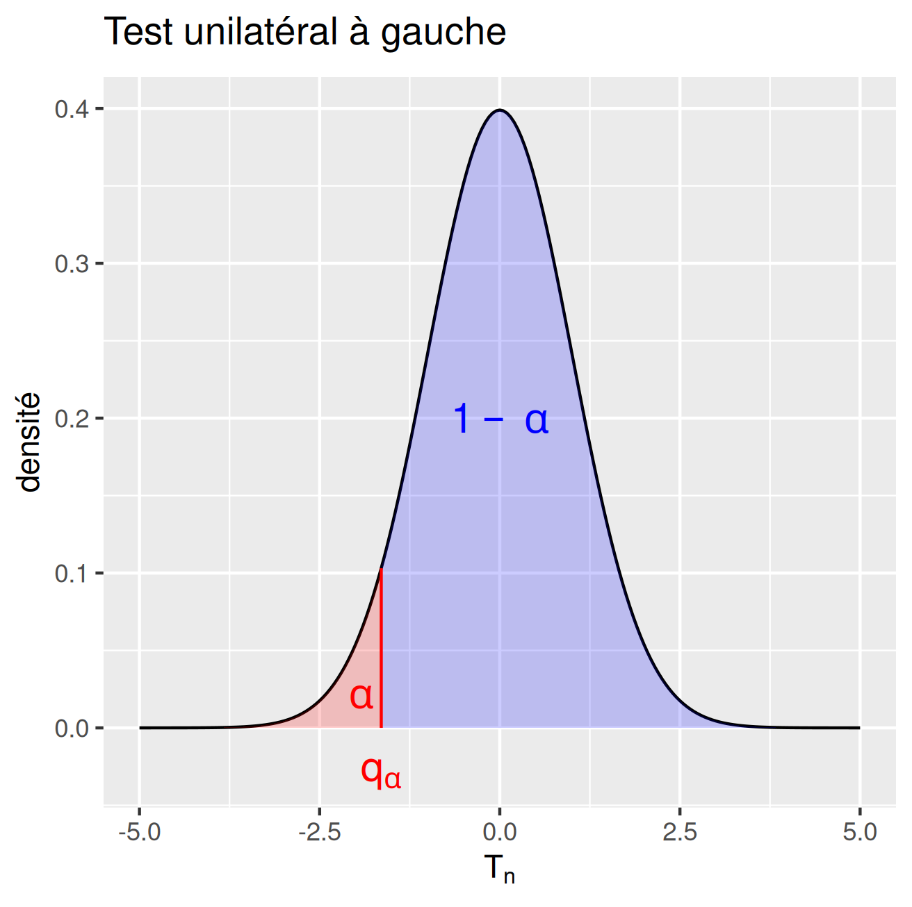
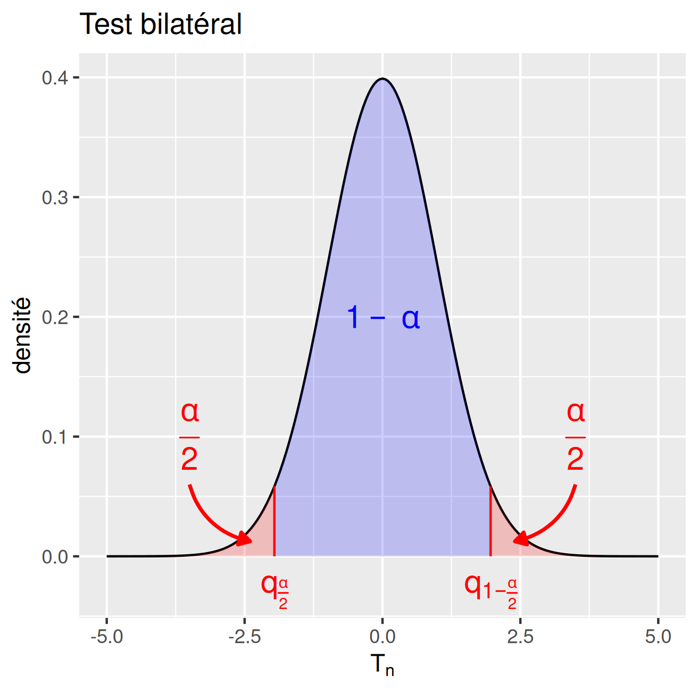
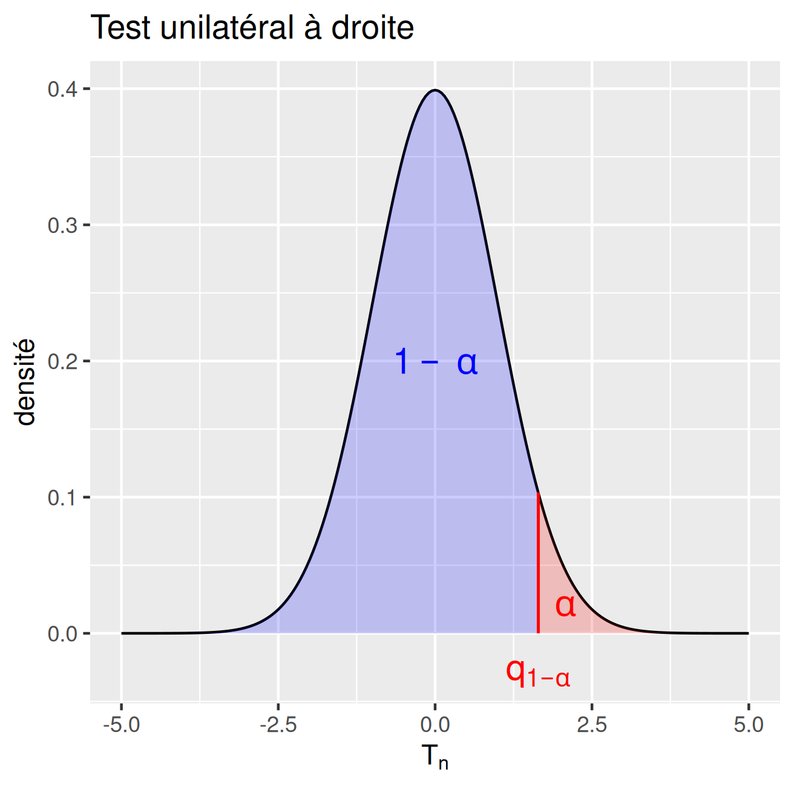
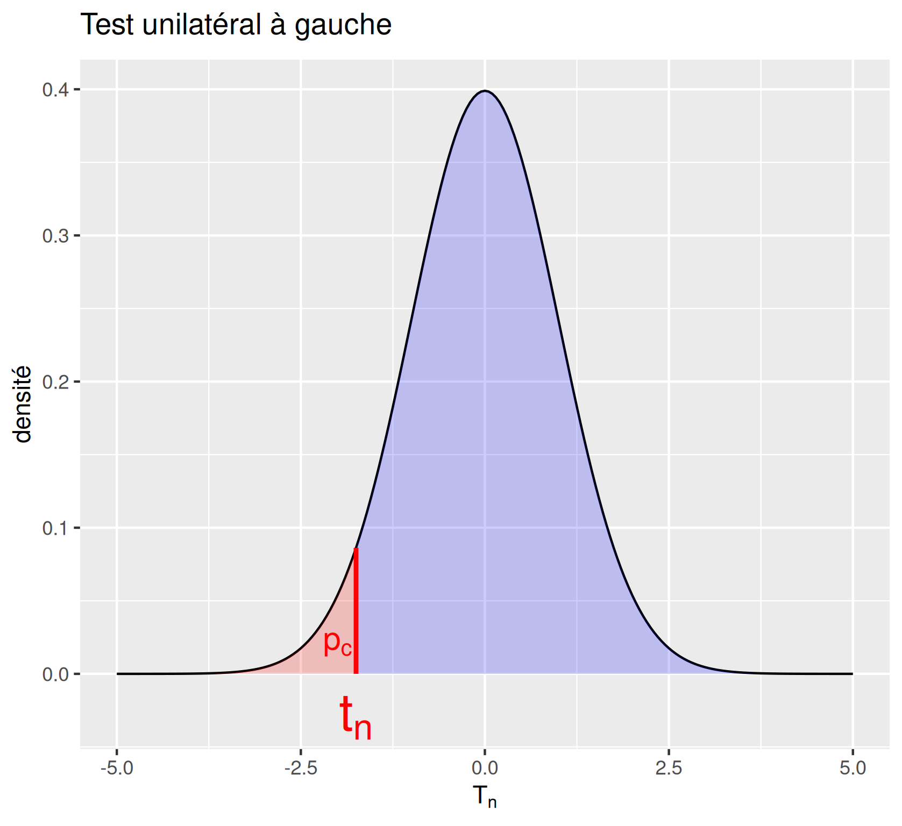
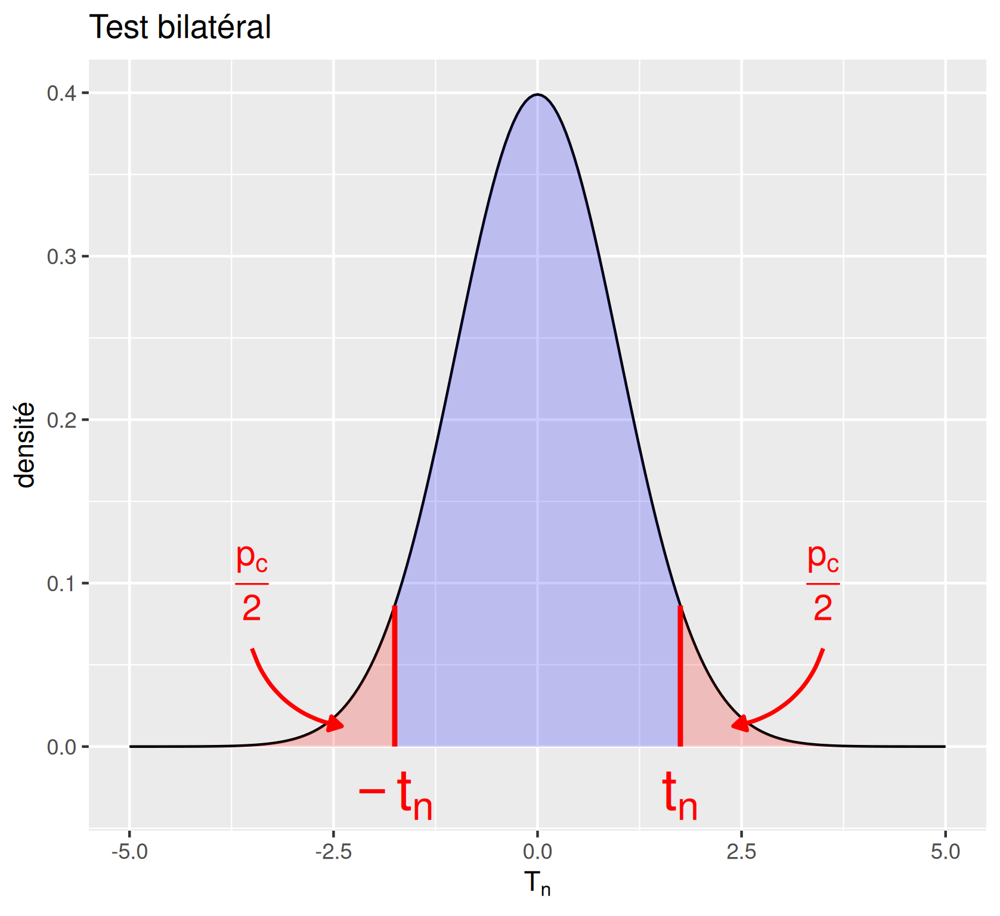
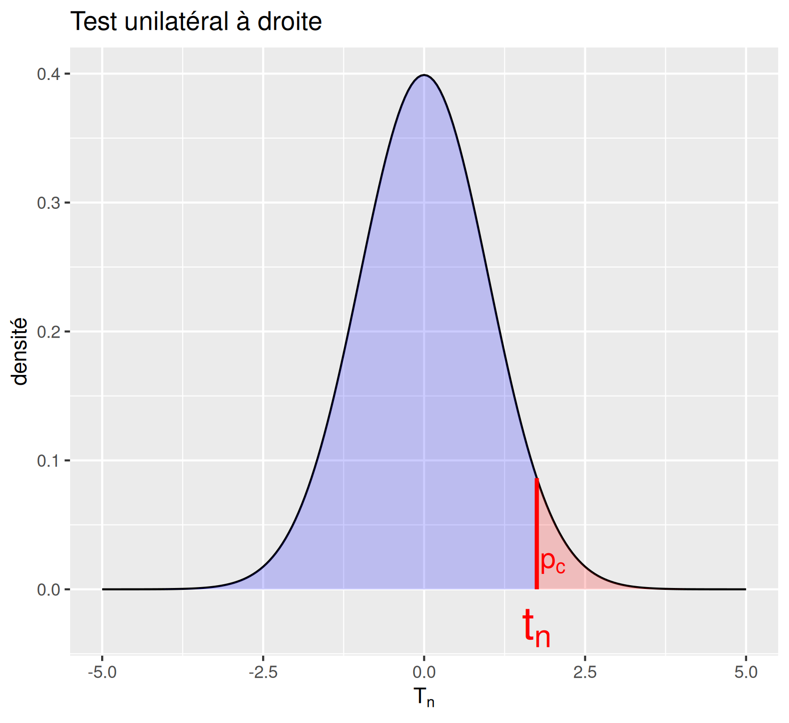

# Introduction

## Tests paramétriques à un échantillon.

```{r,echo=FALSE}
library(ggplot2)
library(latex2exp)
knitr::opts_chunk$set(echo = F)
knitr::opts_chunk$set(warning  = F)

```
:::{.callout-warning title="Objectif"}

À partir d'un échantillon, comparer la caractéristique d'une population à une valeur de référence connue à priori :

1.  **Test de comformité d'une [moyenne]{style="color:red;"}**
<!-- observée sur l'échantillon à une moyenne théorique. -->
2.  **Test de comformité d'une [proportion]{style="color:red;"}**
<!-- observée sur l'échantillon à une proportion théorique. -->
3.  **Test de comformité d'une [variance]{style="color:red;"}** 
<!-- observée sur l'échantillon à une variance théorique. -->

:::


# 1. Test de conformité d'une moyenne

## Ce qu'il faut retenir de ce cours 1/3
::: {style="font-size: 1em;"}

:::{.callout-note title="1 - Modélisation"}
 On considère $(x_1,\dots,x_n)$ comme la réalisation d'un $n$-échantillon $(X_1,\dots,X_n)$ de v.a. i.i.d. de même loi que $X$ avec $\mathbb{E}[X] = \mu$, et $\mathbb{V}[X] = \sigma^2$

:::


:::{.callout-note title="2 - Test unilatéral à gauche"}
$$H_0 : \mu = \mu_0 $$
$$H_1 : \mu < \mu_0 $$
:::

:::{.callout-note title="2 - Test bilatéral"}
$$H_0 : \mu = \mu_0 $$
$$H_1 : \mu \neq \mu_0 $$
:::

:::{.callout-note title="2 - Test Unilatéral à droite"}
$$H_0 : \mu = \mu_0 $$
$$H_1 : \mu > \mu_0 $$
:::

:::{.callout-note title="3 - Statistiques de test et loi sous $H_0$"}


|   | Statistique de test | Loi de $T_n$ sous $H_0$ |   |
|:----------------:|:----------------:|:----------------:|:----------------:|
|  |  | Échantillon gaussien, $n$ petit | Grand échantillon, TCL |
| $\sigma^2$ connue | $T_n = \sqrt{n}\frac{(\bar{X}_n - \mu)}{\sigma}$ | $T_n \sim \mathcal{N}(0,1)$ | $T_n\xrightarrow[n\rightarrow\infty]{\mathscr{L}}\mathcal{N}(0,1)$ |
| [$\sigma^2$ inconnue]{style="color:red;"} | $T_n = \sqrt{n}\frac{(\bar{X}_n - \mu)}{\textcolor{red}{S}}$ | $T_n \sim \mathcal{T}_{n-1}$ | $T_n\xrightarrow[n\rightarrow\infty]{\mathscr{L}}\mathcal{N}(0,1)$ |


:::
:::


## Ce qu'il faut retenir de ce cours 2/3
::: {style="font-size: 1em;"}

:::{.callout-note title="4 - Zone de rejet à gauche"}

$$\{T_n< q_\alpha\}$$ 

{width="6cm" fig-align="center"}

:::

:::{.callout-note title="4 - Zone de rejet bilatéral"}

$$\{|T_n|> q_{1-\frac{\alpha}{2}} \}$$ 

{width="6cm" fig-align="center"}

:::

:::{.callout-note title="4 - Zone de rejet à droite"}

$$\{T_n> q_{1-\alpha}\}$$ 

{width="6cm" fig-align="center"}

:::


:::{.callout-note title="5 - Application numérique"}

:::


:::{.callout-note title="6 - $p$-valeur (unilatéral gauche)"}
$$p_c=\mathbb{P}_{H_0}(T_n<t_n)$$
:::

:::{.callout-note title="6 - $p$-valeur (bilatéral)"}

$$p_c=\mathbb{P}_{H_0}(|T_n|>|t_n|)$$
:::

:::{.callout-note title="6 - $p$-valeur (unilatéral droite)"}
$$p_c=\mathbb{P}_{H_0}(T_n>t_n)$$
:::

:::


## Ce qu'il faut retenir de ce cours 3/3
::: {style="font-size: 1em;"}

:::{.callout-note title="Test unilatéral gauche"}
```{r,echo=TRUE,eval=FALSE}
t.test(x, mu = mu0, 
       alternative = "less")
```

:::

:::{.callout-note title="Test bilateral"}

```{r,echo=TRUE,eval=FALSE}
t.test(x, mu = mu0,
       alternative = "two.sided")

```
:::

:::{.callout-note title="Test unilateral droite"}

```{r,echo=TRUE,eval=FALSE}
t.test(x, mu = mu0, 
       alternative = "greater")
```
:::

:::{.callout-note title="7 - Calcul de la puissance"}
$$\beta = \mathbb{P}_{H_1}(\text{accepter }H_0),\quad \pi = 1 - \beta$$

```{r}
#| fig-align: center
#| fig-height: 4
library(latex2exp)
library(ggplot2)
x0 <- seq(from = -5, to = 6, by = 0.05)
norm_dat <- data.frame(x = c(x0,x0), pdf = c(dnorm(x0),dnorm(x0,mean=2.5)),group = rep(c("H0","H1"),each=length(x0)))
ggplot(norm_dat,aes(x = x, y = pdf,color=group)) +
  geom_line(linewidth=1)+
  scale_color_manual(values= c("blue","red"),labels = c(expression(H[0]), expression(H[1])),
)+

  stat_function(fun = dnorm, args= list(mean=2.5), geom = 'area',
                xlim = c(-5, qnorm(0.95)), fill = 'green',alpha=0.2, show.legend = FALSE)+
  stat_function(fun = dnorm, args= list(mean=2.5), geom = 'area',
                xlim = c(qnorm(0.95),6 ), fill = 'yellow',alpha=0.2, show.legend = FALSE)+

  labs(x=TeX("$x$"),y="densité",color="Hypothèse")+
  annotate("segment",x = qnorm(0.95), y = 0,
           xend = qnorm(0.95), yend =dnorm(qnorm(0.95),mean=2.5),col="red",linewidth=2,lty=2)+
  annotate("text", qnorm(0.95), y=-0.02, label= "q[1 - alpha]",parse=TRUE,col="red",cex=8) +
  annotate("text", 2.7, y=0.1, label= "1-~beta",parse=TRUE,col="darkorange3",cex=8) +
  annotate("text", 1, y=0.05, label= "~beta",parse=TRUE,col="darkgreen",cex=8)+
  ggtitle(TeX("Distribution sous $H_0$ et $H_1$"))+
  theme(aspect.ratio=1,plot.title = element_text(size = 20),
        legend.title = element_text(size=15), legend.text = element_text(size=15))
```

:::


:::{.callout-note title="Estimer la puissance statistique pour $n$ et $\alpha$ fixé :"}
```{r,echo=TRUE ,eval=FALSE}
power.t.test(n=9,
             delta=0.1,
             sd=sd(x),
             sig.level=0.05,
             type="one.sample",
             alternative="one.sided")
```

:::

:::{.callout-note title="Estimer la taille d'échantillon $n$ pour avoir une puissance donnée"}


```{r,echo=TRUE ,eval=FALSE}
power.t.test(power=0.8,
             delta=0.1,
             sd=sd(x),
             sig.level=0.05,
             type="one.sample",
             alternative="one.sided")
```
:::


:::


## Exemple 1 : la salmonelle {.smaller}

Plusieurs personnes ont souffert d'intoxication alimentaire de salmonelle. Après enquête, on suspecte une marque de glaces d'être responsable de l'intoxication. Pour vérifier cela, des scientifiques ont mesuré le niveau de salmonelle dans 9 pots de glace, tirés de façon aléatoire chez le fabricant de glace. On obtient les mesures suivantes, exprimées en NPP (Nombre le Plus Probable) par gramme :

```{r}
#| echo: true
x<- c(0.175, 0.205, 0.760, 0.719, 0.199, 0.529, 0.306, 0.520, 0.010)
```

- On sait que le niveau de référence que doit respecter un fabricant de glaces est de 0.3 NPP/g.

- La question que l'on se pose est : le niveau moyen de salmonelle dans les pots de glace est-il supérieur à 0.3 ?


::: {.fragment .fade-transparent}
```{r}
#| echo: true
mean(x)
```
:::


## Objectif {.smaller}

:::{.callout-warning title="Objectif"}

- Faire un test de niveau $\alpha$ sur la valeur de $\mu$ : la variable quantitative $X$ a-t-elle une moyenne $\mu$ égale à une valeur $\mu_0$ connue, donnée à l'avance ?


::: {.fragment .fade-transparent}
- À partir de l'échantillon, juger de la pertinence de l'hypothèse

$$H_0 : \mu = \mu_0 $$ où $\mu_0$ est la moyenne théorique, en contrôlant le risque $\alpha$ de se tromper en rejetant $H_0$.
:::

:::

::: {.fragment .fade-transparent}

:::{.callout-caution title="Remarques"}

- On appelle ce type de test un [test de conformité]{style="color:blue;"} de moyenne, ou un test sur la valeur d'une espérance.

::: {.fragment .fade-transparent}
- On va comparer la moyenne empirique observée $\bar{x}_n$ et $\mu_0$.
:::

::: {.fragment .fade-transparent}
- Distinguer :  
  - un faible écart dû aux fluctuations d'échantillonnage 
  - un écart significatif, peu probable par des fluctuations de l'estimateur.
:::

:::

:::


## 1. Modélisation {.smaller}

:::{.callout-note title="1. Modélisation"}
On s'intéresse à un caractère quantitatif sur une population représenté par une v.a. $X$.


::: {.fragment .fade-transparent}
- Espérance : $\mathbb{E}[X] = \mu$, variance : $\mathbb{V}[X] = \sigma^2$
:::

::: {.fragment .fade-transparent}
- On considère $(x_1,\dots,x_n)$ comme la réalisation d'un $n$-échantillon $(X_1,\dots,X_n)$ de v.a. i.i.d. de même loi que $X$.
:::

::: {.fragment .fade-transparent}
- On note $\bar{X}_n=\frac{1}{n}\sum\limits_{i=1}^{n}X_i$ la moyenne empirique. Il s'agit d'une v.a., et sa réalisation est $\bar{x}_n=\frac{1}{n}\sum\limits_{i=1}^{n}x_i$
:::

::: {.fragment .fade-transparent}
- $\bar{X}_n$ est un estimateur de $\mu$ et $\bar{x}_n$ est une estimation de $\mu$.
:::

:::


## 2. Hypothèse {.smaller}


De manière générale, on a trois alternatives possibles à l'hypothèse $H_0 : \mu = \mu_0$

::: {.fragment .fade-transparent}
:::{.callout-note title="Définition : **Test unilatéral à gauche**"}

Dans un test **test unilatéral à gauche**, l'hypothèse alternative est :

$$H_1 : \mu < \mu_0 $$

:::

:::

::: {.fragment .fade-transparent}
:::{.callout-note title="Définition : **Test bilatéral**"}

Dans un test **test bilatéral**, l'hypothèse alternative est :

$$H_1 : \mu \neq \mu_0 $$
:::
:::

::: {.fragment .fade-transparent}
:::{.callout-note title="Définition : **Test unilatéral à droite**"}

Dans un test **Test unilatéral à droite**, l'hypothèse alternative est :

$$H_1 : \mu > \mu_0 $$
:::
:::

## 2. Hypothèse composites {.smaller}

:::{.callout-note title="Définition"}

Les hypothèses **composites** (par opposition à l'hypothèse **simple**) sont définies par:

$$H_0: \mu\leq \mu_0 \quad \text{contre}\quad H_1: \mu>\mu_0 $$ ou par

$$H_0: \mu\geq \mu_0 \quad \text{contre}\quad H_1: \mu<\mu_0 $$

:::

::: {.fragment .fade-transparent}

:::{.callout-caution title="Remarques"}

- $\mu$ peut prendre une multitude de valeurs sous l'hypothèse nulle, ceci risque de compliquer les calculs.


:::
:::

::: {.fragment .fade-transparent}

:::{.callout-tip title="Solution"}

- $\alpha$ correspond au risque maximum que l’on accepte de prendre en rejetant $H_0$ à tort.

- Démarche : valeur de $\mu$ qui correspond au risque le plus élevé sous $H_0 \Rightarrow \mu = \mu_0$ .

$$\alpha = \sup_{\mu\in H_0} \alpha_\mu.$$

:::
:::


## 3. Statistique de test

::: {style="font-size: 1em;"}

Deux cas possibles :

::: {.fragment .fade-transparent}
:::{.callout-note title="Statistique de test avec variance connue"}
Si $\sigma^2$ est [connue]{.red} :

$$T_n = \sqrt{n}\frac{(\bar{X}_n-\mu_0)}{\sigma}$$
:::
:::


::: {.fragment .fade-transparent}

:::{.callout-note title="Statistique de test avec variance inconnue"}
Si $\sigma^2$ est [inconnue]{style="color:red;"},

$$T_n = \sqrt{n}\frac{(\bar{X}_n-\mu_0)}{S}$$

avec $S^2 = \frac{1}{n-1}\sum_{i=1}^{n}(X_i - \bar{X}_n)^2$ qui est un estimateur sans biais et consistant de $\sigma^2$.

:::
:::

::: {.fragment .fade-transparent}

:::{.callout-caution title="Remarque"}
Pour un test de conformité de moyenne, la statistique de test, $T_n$, est $\bar{X}_n$ [centrée réduite]{style="color:blue;"} sous $H_0$.
:::
:::
:::


## 3. Loi de la statistique de test $T_n$ sous $H_0$

Deux cas :

- A-t-on un grand échantillon pour utiliser le théorème central limite (TCL)?

- Ou un petit échantillon de loi normale (gaussien) ?

## Rappel: le Théorème central limite 
::: {style="font-size: 1em;"}


:::{.callout-tip title="Théorème central limite"}
Soit $(X_i)_{i\in\mathbb{N}}$ une suite de v.a. i.i.d. d'espérance $\mu_0$ et de variance $\sigma^2$ finies. Alors,

$$\sqrt{n} \frac{(\bar{X}_n - \mu_0)}{\sigma} \xrightarrow[n\rightarrow\infty]{\mathscr{L}}\mathcal{N}(0,1) $$

$$\sqrt{n} \frac{(\bar{X}_n - \mu_0)}{S} \xrightarrow[n\rightarrow\infty]{\mathscr{L}}\mathcal{N}(0,1) $$
avec $S^2 = \frac{1}{n-1}\sum_{i=1}^{n}(X_i - \bar{X}_n)^2$

:::

::: {.fragment .fade-transparent}
:::{.callout-tip title="Pour le test"}
Lorsque l'échantillon sera grand, on pourra se servir du TCL sous l'hypothèse $H_0$ :
$$\mathbb{E}[X] =\mu = \mu_0$$

$$T_n = \sqrt{n}\frac{(\bar{X}_n-\mu_0)}{S} \xrightarrow[n\rightarrow\infty]{\mathscr{L}}\mathcal{N}(0,1)$$


:::
:::
:::

## 3. Petit échantillon

::: {style="font-size: 1em;"}


Lorsque l'échantillon est petit $n\leq 30$ il faudra faire une hypothèse supplémentaire pour conclure. 

:::{.callout-note title="Hypothèse gaussienne"}
En plus de la modélisation initiale, on suppose que $$X_i \overset{i.i.d.}{\sim} \mathcal{N}(\mu,\sigma^2)$$
:::

::: {.fragment .fade-transparent}

:::{.callout-tip title="Loi de la statistique de test $T_n$ sous $H_0$ et l'hypothèse gaussienne"}

Sous $H_0$, si $X_i \overset{i.i.d.}{\sim} \mathcal{N}(\mu,\sigma^2)$, on a pour un échantillon de taille $n$

$$\text{Pour } \sigma \text{ connue : } T_n =\sqrt{n} \frac{(\bar{X}_n - \mu_0)}{\sigma} \sim\mathcal{N}(0,1) $$
 
$$\text{Pour } \sigma \text{ inconnue : } T_n = \sqrt{n} \frac{(\bar{X}_n - \mu_0)}{S}  \sim \mathcal{T}(n-1) $$

:::
:::
:::


## 3. Loi de la statistique de test $T_n$ sous $H_0$ {.smaller}

|   | Statistique de test | Loi de $T_n$ sous $H_0$ |   |
|:----------------:|:----------------:|:----------------:|:----------------:|
|  |  | Échantillon gaussien, $n$ petit | Grand échantillon, TCL |
| $\sigma^2$ connue | $T_n = \sqrt{n}\frac{(\bar{X}_n - \mu)}{\sigma}$ | $T_n \sim \mathcal{N}(0,1)$ | $T_n\xrightarrow[n\rightarrow\infty]{\mathscr{L}}\mathcal{N}(0,1)$ |
| [$\sigma^2$ inconnue]{style="color:red;"} | $T_n = \sqrt{n}\frac{(\bar{X}_n - \mu)}{\textcolor{red}{S}}$ | $T_n \sim \mathcal{T}_{n-1}$ | $T_n\xrightarrow[n\rightarrow\infty]{\mathscr{L}}\mathcal{N}(0,1)$ |


## 4. Constuire la zone de rejet

::: {style="font-size: 1em;"}


:::{.callout-warning title="Objectif"}
Contrôler le risque de première espèce pour un test de niveau $\alpha$.
:::

:::{.callout-note title="Définition : Zone de rejet"}
La zone de rejet, notée $R_\alpha$ est telle que $$\mathbb{P}(\text{rejeter à tort }H_0) = \mathbb{P}_{H_0}(\text{rejeter }H_0) = \mathbb{P}_{H_0}(T_n\in R_\alpha)=\alpha$$
:::

::: {.fragment .fade-transparent}


:::{.callout-note title="Rappels"}

1. Le quantile $\alpha \in [0,1]$ de la v.a. $T_n$ est le nombre réel $q_\alpha$ tel que 

$$\mathbb{P}(T_n\leq q_\alpha ) = \alpha $$

2. Si deux variables aléatoires suivent la même loi, alors elles ont les mêmes quantiles.

:::
:::

::: {.fragment .fade-transparent}

:::{.callout-caution title="Remarque"}
- Si $T_n\sim\mathcal{N}(0,1)$ , alors $T_n$ a les mêmes quantiles que $\mathcal{N}(0,1)$ 
 
- Si $T_n\sim \mathcal{T}(n-1)$ , alors $T_n$ a les mêmes quantiles que $\mathcal{T}(n-1)$

:::
:::

:::


## 4. Zone de rejet et règle de décision. {.smaller}

:::{.callout-caution title="Remarques"}
La zone de rejet va dépendre de $H_1$.
:::


|   | Unilatéral à gauche | Bilatéral | Unilatéral à droite |
|:-----------------|:----------------:|:----------------:|:----------------:|
| $H_1:$ | $\mu<\mu_0$ | $\mu\neq\mu_0$ | $\mu>\mu_0$ |
| Règle de décision, on rejette $H_0$ si... | $T_n$ est trop petit | $T_n$ est loin de 0 | $T_n$ est trop grand |
| $R_\alpha$ | $\{T_n< q_\alpha\}$ | $\{|T_n|> q_{1-\frac{\alpha}{2}}\}$ | $\{T_n> q_{1-\alpha}\}$ |
|  |  |  |  |

```{r}
#| fig-align: center
#| fig-width: 16
#| eval : false
library(latex2exp)
library(ggplot2)
library(gridExtra)
x0 <- seq(from = -5, to = 5, by = 0.05)
norm_dat <- data.frame(x = x0, pdf = dnorm(x0))

q1=ggplot(norm_dat) +
  geom_line(aes(x = x0, y =pdf))+
    stat_function(fun = dnorm, geom = 'area', xlim = c( qnorm(0.05),5), fill = 'blue',alpha=0.2)+
  stat_function(fun = dnorm, geom = 'area', xlim = c(-5,qnorm(0.05)), fill = 'red',alpha=0.2)+
  annotate("text", 0, y=0.2, label= "1-~alpha",parse=TRUE,col="blue",cex=5) + annotate("text", -2, y=0.02, label= "~alpha",parse=TRUE,col="red",cex=5) + 
  labs(x=TeX("$T_n$"),y="densité")+
  annotate("segment",x = qnorm(0.05), y = 0, xend = qnorm(0.05), yend =dnorm(qnorm(0.05)),col="red")+
  annotate("text", qnorm(0.05), y=-0.03, label= "q[alpha]",parse=TRUE,col="red",cex=5) + 
  ggtitle(TeX("Test unilatéral à gauche"))#+ theme(aspect.ratio=1)


q2=ggplot(norm_dat) +
  geom_line(aes(x = x0, y =pdf))+
    stat_function(fun = dnorm, geom = 'area', xlim = c( qnorm(0.025),qnorm(0.975)), fill = 'blue',alpha=0.2)+
  stat_function(fun = dnorm, geom = 'area', xlim = c(-5,qnorm(0.025)), fill = 'red',alpha=0.2)+
  stat_function(fun = dnorm, geom = 'area', xlim = c(qnorm(0.975),5), fill = 'red',alpha=0.2)+
  annotate("text",
           0, y=0.2,
           label= "1-~alpha",
           parse=TRUE,col="blue",
           cex=5) +
  annotate("text",
           -3.5, y=0.1,
           label= "frac(alpha,2)",
           parse=TRUE,
           col="red",cex=5) + 
annotate("text",
         3.5, y=0.1,
         label= "frac(alpha,2)",
         parse=TRUE,col="red",cex=5) + 
  annotate("curve",x = -3.5, y = 0.06, xend = -2.4, yend = 0.1/8,
    arrow = arrow(length = unit(0.2, "cm"), type = "closed"),
    color = "red",
    size = 0.8,
    curvature = 0.3
  ) +
  annotate("curve",x = 3.5, y = 0.06, xend = 2.4, yend = 0.1/8,
    arrow = arrow(length = unit(0.2, "cm"), type = "closed"),
    color = "red",
    size = 0.8,
    curvature = -0.3
  ) +
    labs(x=TeX("$T_n$"),y="densité")+
  annotate("segment",x = qnorm(0.025), y = 0, xend = qnorm(0.025), yend =dnorm(qnorm(0.025)),col="red")+
  annotate("segment",x = qnorm(0.975), y = 0, xend = qnorm(0.975), yend =dnorm(qnorm(0.975)),col="red")+
  annotate("text", qnorm(0.025), y=-0.03, label= "q[frac(alpha,2)]",parse=TRUE,col="red",cex=5)+
  annotate("text", qnorm(0.975), y=-0.03, label= "q[1-frac(alpha,2)]",parse=TRUE,col="red",cex=5) + 
  ggtitle(TeX("Test bilatéral"))#+ theme(aspect.ratio=1)


q3=ggplot(norm_dat) +
  geom_line(aes(x = x0, y =pdf))+
    stat_function(fun = dnorm, geom = 'area', xlim = c(-5, qnorm(0.95)), fill = 'blue',alpha=0.2)+
  stat_function(fun = dnorm, geom = 'area', xlim = c(qnorm(0.95), 5), fill = 'red',alpha=0.2)+
  annotate("text", 0, y=0.2, label= "1-~alpha",parse=TRUE,col="blue",cex=5) + annotate("text", 2, y=0.02, label= "~alpha",parse=TRUE,col="red",cex=5) + 
  labs(x=TeX("$T_n$"),y="densité")+
  geom_segment(aes(x = qnorm(0.95), y = 0, xend = qnorm(0.95), yend =dnorm(qnorm(0.95))),col="red")+
  annotate("text", qnorm(0.95), y=-0.03, label= "q[1 - alpha]",parse=TRUE,col="red",cex=5) + 
  ggtitle(TeX("Test unilatéral à droite"))#+ theme(aspect.ratio=1)

grid.arrange(q1,q2,q3,ncol=3)

```

## 5. Mise en œuvre du test, A.N.
::: {style="font-size: 1em;"}

:::{.callout-tip title="Application numérique"}
Calcul de la réalisation $t_n$ de $T_n$ sur l'échantillon

- $\bar{x}_n= \frac{1}{n}\sum\limits_{i=1}^n x_i$ est la moyenne observée sur l'échantillon.

- si $\sigma^2$ est inconnue, $s^2 = \frac{1}{n-1}\sum_{i=1}^{n}(x_i - \bar{x}_n)^2$ est la variance observée sur l'échantillon; c'est l'estimation de $\sigma^2$ sur l'échantillon.

- si $\sigma^2$ est connue, $t_n = \sqrt{n}\frac{(\bar{x}_n-\mu_0)}{\sigma}$

- si $\sigma^2$ est inconnue, $t_n = \sqrt{n}\frac{(\bar{x}_n-\mu_0)}{s}$

:::

::: {.fragment .fade-transparent}

:::{.callout-tip title="Conclusion"}


- Si $t_n\in R_\alpha$ : On rejette $H_0$, on accepte $H_1$.

- Si $t_n\notin R_\alpha$ : On conserve $H_0$.

:::

:::


:::

 

## Mise en œuvre du test : exemple 


```{r}
#| echo: TRUE
xbar <- mean(x)
print(xbar)
```

::: {.fragment .fade-transparent}
```{r}
#| echo: TRUE
n <- length(x)
sigma = sqrt(var(x))
tn <- sqrt(n)*(xbar-0.3)/sigma
print(tn)
```
:::


::: {.fragment .fade-transparent}
```{r}
#| fig-align: center
library(latex2exp)
library(ggplot2)

x0 <- seq(from = -5, to = 5, by = 0.05)
norm_dat <- data.frame(x = x0, pdf = dnorm(x0))
ggplot(norm_dat) +
  geom_line(aes(x = x0, y =pdf))+
    stat_function(fun = dnorm, geom = 'area', xlim = c(-5, qnorm(0.95)), fill = 'blue',alpha=0.2)+
  stat_function(fun = dnorm, geom = 'area', xlim = c(qnorm(0.95), 5), fill = 'red',alpha=0.2)+
  annotate("text", -0.25, y=0.2, label= "1-~alpha",parse=TRUE,col="blue",cex=8) + annotate("text", 2, y=0.02, label= "~alpha",parse=TRUE,col="red",cex=8) +
  labs(x=TeX("$T_n$"),y="densité")+
  geom_segment(aes(x = qnorm(0.95), y = 0, xend = qnorm(0.95), yend =dnorm(qnorm(0.95))),col="red")+
  geom_segment(aes(x = tn, y = 0, xend = tn, yend =dnorm(tn)),size=1.5,col="blue")+
  annotate("text", tn, y=-0.01, label= "t[n]",parse=TRUE,col="blue",cex=4) +
  annotate("text", qnorm(0.95), y=-0.01, label= "q[1 - alpha]",parse=TRUE,col="red",cex=4) +
  ggtitle(TeX("Distribution sous $H_0$"))+ theme(aspect.ratio=1)

```


:::


::: {.fragment .fade-transparent}
**Conclusion** : On ne rejette pas $H_0$. Le test n'est pas significatif au niveau $\alpha = 5\%$. Les données ne sont pas en contradiction avec $H_0$.
:::

## 6. Probabilité critique, $p$-valeur {.smaller}

On a le résultat pour $\alpha=5\%$, mais que dire si $\alpha=10\%$ ? $\alpha=15\%$ ? $\alpha=20\%$ ?


<!-- ```{r} -->
<!-- #| panel: sidebar -->
<!-- sliderInput("slider_pval",                         label = withMathJax("alpha"), -->
<!--               min = 0.0, max = 1, value = 0.05) -->
<!-- ``` -->

<!-- ```{r} -->
<!-- #| panel: fill -->
<!-- plotOutput('plot3') -->
<!-- ``` -->

<!-- ```{r} -->
<!-- #| context: server -->
<!-- library(ggplot2) -->
<!-- library(latex2exp) -->


<!-- a_plot3 <- reactive({input$slider_pval}) -->


<!-- output$plot3 <- renderPlot({ -->

```{r}

x<- c(0.175, 0.205, 0.760, 0.719, 0.199, 0.529, 0.306, 0.520, 0.010)
xbar = mean(x)
sigma = sqrt(0.0686)
n = length(x)
tn = sqrt(n)*(xbar-0.3)/sigma

a0 = min(0.18,0.9999)
a0 = max(a0,0.0001)
qa = qnorm(1-a0)

col_tn = ifelse(tn<qa,"blue","red")
text_tn = ifelse(tn<qa,"On~ne~rejette~pas~H[0]","On~rejette~H[0]")

x1 = (qa-5)/2
x2 = (qa+5)/2

x0 <- seq(from = -5, to = 5, by = 0.05)
norm_dat <- data.frame(x = x0, pdf = dnorm(x0))
ggplot(norm_dat) +
  geom_line(aes(x = x0, y =pdf))+
    stat_function(fun = dnorm, geom = 'area', xlim = c(-5, qa), fill = 'blue',alpha=0.2)+
  stat_function(fun = dnorm, geom = 'area', xlim = c(qa, 5), fill = 'red',alpha=0.2)+
  annotate("text", x1, y=0.02, label= "1-~alpha",parse=TRUE,col="blue",cex=8) +
  annotate("text", x2, y=0.02, label= "~alpha",parse=TRUE,col="red",cex=8) +
  labs(x=TeX("$x$"),y="densité")+
  annotate("segment",x = qa, y = 0, xend = qa, yend =dnorm(qa),col="red")+
  annotate("segment",x = tn, y = 0, xend = tn, yend =dnorm(tn),linewidth=1.5,col=col_tn)+
  #annotate("text", qa, y=-0.01, label= "q[1 - alpha]",parse=TRUE,col="red",cex=4) +
  annotate("text", tn, y=-0.01, label= "t[n]",parse=TRUE,col=col_tn,cex=4) +
  annotate("text", 3, y= 0.35, label= text_tn,parse=TRUE,col=col_tn,cex=4) +

  ggtitle(TeX("Distribution sous $H_0$"))+ theme(aspect.ratio=1)
```


<!-- }) -->
<!-- ``` -->


- $\textcolor{red}{p_c = \inf_\alpha\{t_n \in R_\alpha\}}$

- Ici, on a $p_c = \mathbb{P}_{H_0}(T_n > t_n)$


```{r}
tn = 0.9201423
```

```{r}
#| echo: TRUE
1-pnorm(tn,0,1)

```

- Si $p_c < \alpha$, on rejette $H_0$ au niveau $\alpha$.

- Si $p_c>\alpha$, on ne rejette pas $H_0$ au niveau $\alpha$.


## 6. Calculer la $p$-valeur {.smaller}

:::{.callout-caution title="Remarques"}
$p_c$ va dépendre de $H_1$.
:::

|   | Unilatéral à gauche | Bilatéral | Unilatéral à droite |
|:-----------------|:----------------:|:----------------:|:----------------:|
| $H_1:$ | $\mu<\mu_0$ | $\mu\neq\mu_0$ | $\mu>\mu_0$ |
| $p_c$ | $p_c=\mathbb{P}_{H_0}(T_n<t_n)$ | $p_c=\mathbb{P}_{H_0}(|T_n|>|t_n|)$ $= 2(1-\mathbb{P}_{H_0}(T_n \leq |t_n|))$ | $p_c=\mathbb{P}_{H_0}(T_n>t_n)$ $= 1-\mathbb{P}_{H_0}(T_n\leq t_n)$ |
<!-- |  |  |  |  | -->

```{r}
#| fig-align: center
#| fig-width: 16

library(latex2exp)
library(ggplot2)
library(gridExtra)
x0 <- seq(from = -5, to = 5, by = 0.05)
norm_dat <- data.frame(x = x0, pdf = dnorm(x0))

tn = -1.75
q1=ggplot(norm_dat) +
  geom_line(aes(x = x0, y =pdf))+
    stat_function(fun = dnorm, geom = 'area', xlim = c( tn,5), fill = 'blue',alpha=0.2)+
  stat_function(fun = dnorm, geom = 'area', xlim = c(-5,tn), fill = 'red',alpha=0.2)+
  annotate("text", -2, y=0.02, label= "p[c]",parse=TRUE,col="red",cex=5) + 
  labs(x=TeX("$T_n$"),y="densité")+
  annotate("segment",x =tn, y = 0, xend =tn, yend =dnorm(tn),col="red",linewidth=1)+
  annotate("text", tn, y=-0.03, label= "t[n]",parse=TRUE,col="red",cex=8) + 
  ggtitle(TeX("Test unilatéral à gauche"))#+ theme(aspect.ratio=1)


q2=ggplot(norm_dat) +
  geom_line(aes(x = x0, y =pdf))+
    stat_function(fun = dnorm, geom = 'area', xlim = c( tn,-tn), fill = 'blue',alpha=0.2)+
  stat_function(fun = dnorm, geom = 'area', xlim = c(-5,tn), fill = 'red',alpha=0.2)+
  stat_function(fun = dnorm, geom = 'area', xlim = c(-tn,5), fill = 'red',alpha=0.2)+
  annotate("text",
           -3.5, y=0.1,
           label= "frac(p[c],2)",
           parse=TRUE,
           col="red",cex=5) + 
annotate("text",
         3.5, y=0.1,
         label= "frac(p[c],2)",
         parse=TRUE,col="red",cex=5) + 
  annotate("curve",x = -3.5, y = 0.06, xend = -2.4, yend = 0.1/8,
    arrow = arrow(length = unit(0.2, "cm"), type = "closed"),
    color = "red",
    size = 0.8,
    curvature = 0.3
  ) +
  annotate("curve",x = 3.5, y = 0.06, xend = 2.4, yend = 0.1/8,
    arrow = arrow(length = unit(0.2, "cm"), type = "closed"),
    color = "red",
    size = 0.8,
    curvature = -0.3
  ) +
    labs(x=TeX("$T_n$"),y="densité")+
  annotate("segment",x = tn, y = 0, xend = tn, yend =dnorm(tn),col="red",linewidth=1)+
  annotate("segment",x = -tn, y = 0, xend = -tn, yend =dnorm(-tn),col="red",linewidth=1)+
  annotate("text", -tn, y=-0.03, label= "t[n]",parse=TRUE,col="red",cex=8)+
  annotate("text", tn, y=-0.03, label= "-t[n]",parse=TRUE,col="red",cex=8) + 
  ggtitle(TeX("Test bilatéral"))#+ theme(aspect.ratio=1)

q3=ggplot(norm_dat) +
  geom_line(aes(x = x0, y =pdf))+
    stat_function(fun = dnorm, geom = 'area', xlim = c(-5, -tn), fill = 'blue',alpha=0.2)+
  stat_function(fun = dnorm, geom = 'area', xlim = c(-tn, 5), fill = 'red',alpha=0.2)+
 annotate("text", 2, y=0.02, label= "p[c]",parse=TRUE,col="red",cex=5) + 
  labs(x=TeX("$T_n$"),y="densité")+
 annotate("segment",x = -tn, y = 0, xend = -tn, yend =dnorm(-tn),col="red",linewidth=1)+
  annotate("text", -tn, y=-0.03, label= "t[n]",parse=TRUE,col="red",cex=8) + 
  ggtitle(TeX("Test unilatéral à droite"))#+ theme(aspect.ratio=1)

grid.arrange(q1,q2,q3,ncol=3)


```


## Applications sous R : t-test à 1 échantillon

- À partir d'un échantillon de mesures de $X$, noté $x= (x_1,\dots,x_n)$.

::: {.fragment .fade-transparent}
Test $H_0: \mu = \mu_0$ contre $H_1 : \mu < \mu_0$

```{r}
#| eval: false
#| echo: true 

t.test(x, mu = mu0, alternative = "less")
```
:::

::: {.fragment .fade-transparent}
\

Test $H_0: \mu = \mu_0$ contre $H_1 : \mu \neq \mu_0$

```{r}
#| eval: false
#| echo: true 

t.test(x, mu = mu0)
```
:::

\

::: {.fragment .fade-transparent}
Test $H_0: \mu = \mu_0$ contre $H_1 : \mu > \mu_0$

```{r}
#| eval: false
#| echo: true 

t.test(x, mu = mu0, alternative = "greater")
```
:::

## Dans notre exemple

```{r}
#| echo: true 
t.test(x,mu = 0.3, alternative = "greater")
```

::: {.fragment .fade-transparent}
::: {style="font-size: 1em;"}


:::{.callout-caution title="Remarques"}
- Les logiciels renvoient $p_c$, c'est à nous de fixer $\alpha$.

- Dans un rapport, il faut toujours donner [la valeur exacte de la $p_c$]{style="color:red;"} et ne jamais donner des informations du type : “$p_c$\> 5%” sans donner explicitement la $p_c$.
:::
:::
:::


## Applications sous R

Lorsque $n$ est grand, on utilise aussi *t.test*.


```{r}
library(ggplot2)
library(latex2exp)
library(gridExtra)
library(EnvStats)
library(stats)


ggplot() +
    geom_function(aes(col ="Normale"),fun = dnorm, xlim = c(-5, 5),linewidth=2,lty=2,linewidth=1.5)+
    geom_function(aes(col =paste0("Student ",30)),fun = dt,args = list(df=30), xlim = c(-5, 5),linewidth=1.5)+
  ggtitle(TeX("Comparaison entre loi de Student et loi normale"))+ guides(col=guide_legend(title="Loi"))+
    theme(legend.text = element_text(size=15),
          legend.title = element_text(size=15))


```


## Exemple 2

Une entreprise produit des balles de ping-pong dont le diamètre moyen doit être égal à une norme de référence de 4cm. Pour savoir si la norme de qualité est respectée, un lot de 100 balles est prélevé sur lequel on observe

```{r}
set.seed(0)
diam = rnorm(100,4.01,0.02696799)
```

::: {.fragment .fade-transparent}
```{r}
#| echo: true
length(diam)
```
:::

::: {.fragment .fade-transparent}
```{r}
#| echo: true
mean(diam)
```
:::

::: {.fragment .fade-transparent}
```{r}
#| echo: true
sd(diam)
```
:::

::: {.fragment .fade-transparent}
La norme est-elle respectée ?
:::

## Exemple 2 {.smaller}

Test $H_0: \mu = \mu_0$ contre $H_1 : \mu \neq \mu_0$

```{r}
#| echo: true
t.test(diam, mu = 4)
```

::: {.fragment .fade-transparent}
Calcul manuel avec l'approximation normale :

```{r}
#| echo: true
tn = sqrt(length(diam))*(mean(diam)-4)/sd(diam)
tn
```

```{r}
#| echo: true
pvaleur = 2*(1-pnorm(abs(tn),0,1))
pvaleur
```
:::

## 7. Risque de deuxième espèce et puissance

Les services sanitaires ont des raisons de croire que lorsque qu'un pot de glace est contaminé, la quantité de salmonelle dans le pot vaut en moyenne 0.4 NNP/g. On va alors tester

$$H_0 : \mu= 0.3 \quad\text{contre}\quad H_1: \mu= 0.4$$

::: {.fragment .fade-transparent}

:::{.callout-warning title="Objectif"}
Avec la procédure mise en place précédemment, peut-on déterminer $\beta$ le risque de deuxième espèce, et $\pi$ la puissance du test ?
:::

:::

## 7. Risque de deuxième espèce

:::{.callout-note title="Rappel"}
$$\beta = \mathbb{P}(\text{accepter à tort }H_0) = \mathbb{P}_{H_1}(\text{accepter }H_0)$$
:::


```{r}
#| fig-align: center
#| fig-height: 4
library(latex2exp)
library(ggplot2)
x0 <- seq(from = -5, to = 6, by = 0.05)
norm_dat <- data.frame(x = c(x0,x0), pdf = c(dnorm(x0),dnorm(x0,mean=2.5)),group = rep(c("H0","H1"),each=length(x0)))
ggplot(norm_dat,aes(x = x, y = pdf,color=group)) +
  geom_line(linewidth=1)+
  scale_color_manual(values= c("blue","red"),labels = c(expression(H[0]), expression(H[1])),
)+

  stat_function(fun = dnorm, args= list(mean=2.5), geom = 'area',
                xlim = c(-5, qnorm(0.95)), fill = 'green',alpha=0.2, show.legend = FALSE)+
  stat_function(fun = dnorm, args= list(mean=2.5), geom = 'area',
                xlim = c(qnorm(0.95),6 ), fill = 'yellow',alpha=0.2, show.legend = FALSE)+

  labs(x=TeX("$x$"),y="densité",color="Hypothèse")+
  annotate("segment",x = qnorm(0.95), y = 0,
           xend = qnorm(0.95), yend =dnorm(qnorm(0.95),mean=2.5),col="red",linewidth=2,lty=2)+
  annotate("text", qnorm(0.95), y=-0.02, label= "q[1 - alpha]",parse=TRUE,col="red",cex=8) +
  annotate("text", 2.7, y=0.1, label= "1-~beta",parse=TRUE,col="darkorange3",cex=8) +
  annotate("text", 1, y=0.05, label= "~beta",parse=TRUE,col="darkgreen",cex=8)+
  ggtitle(TeX("Distribution sous $H_0$ et $H_1$"))+
  theme(aspect.ratio=1,plot.title = element_text(size = 20),
        legend.title = element_text(size=15), legend.text = element_text(size=15))
```

## Risque de deuxième espèce {.smaller}

::: {.fragment .fade-transparent}
Sous $H_1$, $X_i\overset{i.i.d}{\sim} \mathcal{N}(\mu,\sigma^2)$ d'où $X_i \overset{i.i.d}{\sim} \mathcal{N}(\textcolor{red}{0.4},\sigma^2), \quad \text{avec } \sigma^2 = 0.0686$
:::

::: {.fragment .fade-transparent}
Sous $H_1$, on a $\bar{X}_n \sim  \mathcal{N}\left(\mu,\frac{\sigma^2}{n}\right)=\mathcal{N}\left(\textcolor{red}{0.4},\frac{\sigma^2}{n}\right)$
:::

::: {.fragment .fade-transparent}
$$T_n = \sqrt{n} \frac{(\bar{X}_n-0.3)}{\sigma}.$$
:::

::: {.fragment .fade-transparent}
$\bar{X}_n \sim \mathcal{N}\left(\textcolor{red}{0.4},\frac{\sigma^2}{n}\right)$ [$\Rightarrow (\bar{X}_n-0.3) \sim \mathcal{N}\left(\textcolor{red}{0.1},\frac{\sigma^2}{n}\right)$$\Rightarrow (\bar{X}_n-0.3)-\textcolor{red}{0.1} \sim \mathcal{N}\left(0 ,\frac{\sigma^2}{n}\right)$]{.fragment .fade-transparent}

[$\Rightarrow \sqrt{n} \frac{(\bar{X}_n-0.3)}{\sigma} -  \textcolor{red}{\sqrt{n} \frac{0.1}{\sigma}}\sim \mathcal{N}\left(0 ,1\right)$]{.fragment .fade-transparent} [$\Rightarrow T_n - \textcolor{red}{\sqrt{n} \frac{0.1}{\sigma}}\sim \mathcal{N}\left(0 ,1\right)$]{.fragment .fade-transparent}
:::

## 7. Risque de deuxième espèce {.smaller}

- On ne rejette pas $H_0$ si $T_n\leq q_{1-\alpha}$

::: {.fragment .fade-transparent}
- $\beta = \mathbb{P}_{H_1}(T_n\leq q_{1-\alpha})$ [$= \mathbb{P}_{H_1}(\underbrace{T_n-\textcolor{red}{\sqrt{n} \frac{0.1}{\sigma}}}_{\mathcal{N}(0,1)}\leq \underbrace{q_{1-\alpha}-\textcolor{red}{\sqrt{n} \frac{0.1}{\sigma}}}_{=1.15})$]{.fragment .fade-transparent}
:::

::: {.fragment .fade-transparent}
```{r}
#| echo: TRUE
Alpha <- 0.05
q_1_alpha <- qnorm(1-Alpha)
rouge <- sqrt(n) * (0.4-0.3)/sigma
beta<-(pnorm(q_1_alpha  - rouge))
print(beta)
```
:::

::: {.fragment .fade-transparent}
$$\beta = 0.691$$ $$\pi = 1-\beta = 0.309$$
:::

## 7. Risques et puissance

```{r}
#| fig-align: center
# #| fig-height: 8
#| out-width: 80%

library(latex2exp)
library(ggplot2)
x0 <- seq(from = -5, to = 6, by = 0.05)
norm_dat <- data.frame(x = c(x0,x0), pdf = c(dnorm(x0),dnorm(x0,mean=sqrt(n)*0.1/sigma)),group = rep(c("H0","H1"),each=length(x0)))
ggplot(norm_dat,aes(x = x, y = pdf,color=group)) +
  geom_line(linewidth=1)+
  scale_color_manual(values= c("blue","red"),labels = c(expression(H[0]), expression(H[1])),
)+

  stat_function(fun = dnorm, args= list(mean=sqrt(n)*0.1/sigma), geom = 'area',
                xlim = c(-5, qnorm(0.95)), fill = 'green',alpha=0.2, show.legend = FALSE)+
  stat_function(fun = dnorm, args= list(mean=sqrt(n)*0.1/sigma), geom = 'area',
                xlim = c(qnorm(0.95),6 ), fill = 'yellow',alpha=0.2, show.legend = FALSE)+

  labs(x=TeX("$x$"),y="densité",color="Hypothèse")+
  annotate("segment",x = qnorm(0.95), y = 0,
           xend = qnorm(0.95), yend =dnorm(qnorm(0.95),mean=sqrt(n)*0.1/sigma),col="red",linewidth=2,lty=2)+
  annotate("text", qnorm(0.95), y=-0.02, label= "q[1 - alpha]",parse=TRUE,col="red",cex=8) +
  annotate("text", 2.6, y=0.05, label= "1-~beta",parse=TRUE,col="darkorange3",cex=4) +
  annotate("text", 0, y=0.05, label= "~beta",parse=TRUE,col="darkgreen",cex=8)+
  ggtitle(TeX("Distribution sous $H_0$ et $H_1$"))+
  theme(aspect.ratio=1,plot.title = element_text(size = 20),
        legend.title = element_text(size=15), legend.text = element_text(size=15))
```

## 7. Risques et puissance {.smaller}

<!-- ```{r} -->
<!-- #| panel: sidebar -->
<!-- sliderInput("slider_alpha",                         label = withMathJax("alpha"), -->
<!--               min = 0.0, max = 1, value = 0.05) -->

<!-- sliderInput("slider_diff",                         label = "D", -->
<!--               min = 0.0, max = 0.3, value = 0.1,step=0.01) -->

<!-- sliderInput("slider_ntest",label = "n", -->
<!--               min = 9, max = 70, value = 9,step=1) -->

<!-- ``` -->

<!-- ```{r} -->
<!-- #| panel: fill -->
<!-- plotOutput('plot4') -->
<!-- ``` -->

<!-- ```{r} -->
<!-- #| context: server -->
<!-- library(ggplot2) -->
<!-- library(latex2exp) -->


<!-- a <- reactive({input$slider_alpha -->
<!-- }) -->

<!-- D <- reactive({input$slider_diff -->
<!-- }) -->

<!-- n <- reactive({input$slider_ntest -->
<!-- }) -->

<!-- output$plot4 <- renderPlot({ -->

```{r}
sigma = sqrt(0.0686)
D = function(){0.1}
n = function(){9}
a = function(){0.05}

mean_diff = D()*sqrt(n())/sigma

a0 = min(a(),0.9999)
a0 = max(a0,0.0001)
qa = qnorm(1-a0)


x1 = (qa-5)/2
x2 = (qa+5)/2

b0 = round((pnorm(qa  - mean_diff)),3)
b1 = 1 - b0
text0 = paste0("beta == ",b0)
text1 = paste0("1 - beta == ",b1)

x0 <- seq(from = -5, to = 8, by = 0.05)
norm_dat <- data.frame(x = c(x0,x0), pdf = c(dnorm(x0),dnorm(x0,mean=mean_diff)),group = rep(c("H0","H1"),each=length(x0)))
ggplot(norm_dat,aes(x = x, y = pdf,color=group)) +
  geom_line(linewidth=2)+
    stat_function(fun = dnorm, geom = 'area', xlim = c(-5, qa), fill = 'blue',alpha=0.2, show.legend = FALSE)+
  stat_function(fun = dnorm, geom = 'area', xlim = c(qa, 5), fill = 'red',alpha=0.2, show.legend = FALSE)+
  stat_function(fun = dnorm, args= list(mean=mean_diff), geom = 'area',
                xlim = c(-5, qa), fill = 'green',alpha=0.2, show.legend = FALSE)+
  stat_function(fun = dnorm, args= list(mean=mean_diff), geom = 'area',
                xlim = c(qa, 8 ), fill = 'yellow',alpha=0.2, show.legend = FALSE)+

  labs(x=TeX("$x$"),y="densité",color="Hypothèse")+
  annotate("segment",x = qa, y = 0, xend = qa, yend =dnorm(qa),col="red",linewidth=1)+
  annotate("text", qa, y=-0.02, label= "q[1 - alpha]",parse=TRUE,col="red",cex=8) +
  annotate("text", -3, y=0.4, label= text0,parse=TRUE,col="darkgreen",cex=8) +
    annotate("text", -3, y=0.3, label= text1,parse=TRUE,col="darkorange4",cex=8) +
  geom_segment(x = 0, y = 0.41, xend = mean_diff, yend = 0.41,
               arrow = arrow(length = unit(0.03, "npc"), ends = "both"))+
  annotate("text", mean_diff/2, y=0.48, label= "sqrt(n) * frac(D, sigma)",parse=TRUE,cex=8)+ggtitle("n=9")+
  ylim(-0.03,0.5)


```
```{r}
sigma = sqrt(0.0686)
D = function(){0.1}
n = function(){30}
a = function(){0.05}

mean_diff = D()*sqrt(n())/sigma

a0 = min(a(),0.9999)
a0 = max(a0,0.0001)
qa = qnorm(1-a0)


x1 = (qa-5)/2
x2 = (qa+5)/2

b0 = round((pnorm(qa  - mean_diff)),3)
b1 = 1 - b0
text0 = paste0("beta == ",b0)
text1 = paste0("1 - beta == ",b1)

x0 <- seq(from = -5, to = 8, by = 0.05)
norm_dat <- data.frame(x = c(x0,x0), pdf = c(dnorm(x0),dnorm(x0,mean=mean_diff)),group = rep(c("H0","H1"),each=length(x0)))
ggplot(norm_dat,aes(x = x, y = pdf,color=group)) +
  geom_line(linewidth=2)+
    stat_function(fun = dnorm, geom = 'area', xlim = c(-5, qa), fill = 'blue',alpha=0.2, show.legend = FALSE)+
  stat_function(fun = dnorm, geom = 'area', xlim = c(qa, 5), fill = 'red',alpha=0.2, show.legend = FALSE)+
  stat_function(fun = dnorm, args= list(mean=mean_diff), geom = 'area',
                xlim = c(-5, qa), fill = 'green',alpha=0.2, show.legend = FALSE)+
  stat_function(fun = dnorm, args= list(mean=mean_diff), geom = 'area',
                xlim = c(qa, 8 ), fill = 'yellow',alpha=0.2, show.legend = FALSE)+

  labs(x=TeX("$x$"),y="densité",color="Hypothèse")+
  annotate("segment",x = qa, y = 0, xend = qa, yend =dnorm(qa),col="red",linewidth=1)+
  annotate("text", qa, y=-0.02, label= "q[1 - alpha]",parse=TRUE,col="red",cex=8) +
  annotate("text", -3, y=0.4, label= text0,parse=TRUE,col="darkgreen",cex=8) +
    annotate("text", -3, y=0.3, label= text1,parse=TRUE,col="darkorange4",cex=8) +
  geom_segment(x = 0, y = 0.41, xend = mean_diff, yend = 0.41,
               arrow = arrow(length = unit(0.03, "npc"), ends = "both"))+
  annotate("text", mean_diff/2, y=0.48, label= "sqrt(n) * frac(D, sigma)",parse=TRUE,cex=8)+ggtitle("n=30")+
  ylim(-0.03,0.5)


```
<!-- ::: {style="font-size: 0.1em;"} -->


<!-- ::: {.fragment .fade-transparent} -->

:::{.callout-tip title="Propriétés"}

- Quand le niveau $\alpha$ augmente, le risque $\beta$ diminue, et la puissance $1-\beta$ augmente.

- Plus $H_1$ est loin de $H_0$, plus la puissance augmente.

- Quand le nombre d'observation augmente, la puissance augmente.

- Pour $\alpha = 5\%$, combien d’observations pour avoir une puissance de 80% ? 90% ?
:::

<!-- ::: -->
<!-- ::: -->

## Tests statistiques sur R

Estimer la puissance statistique pour $n$ et $\alpha$ fixé :


```{r}
#| echo: TRUE
power.t.test(n=9,
             delta=0.1,
             sd=sd(x),
             sig.level=0.05,
             type="one.sample",
             alternative="one.sided")
```

```{r}
#| echo: TRUE
power.t.test(n=9,
             delta=0.2,
             sd=sd(x),
             sig.level=0.05,
             type="one.sample",
             alternative="one.sided")
```


## Tests statistiques sur R

Estimer le nombre d’observations nécessaires pour avoir une puissance donnée :


```{r}
#| echo: TRUE
power.t.test(power=0.8,
             delta=0.1,
             sd=sd(x),
             sig.level=0.05,
             type="one.sample",
             alternative="one.sided")
```


```{r}
#| echo: TRUE
power.t.test(power=0.9,
             delta=0.1,
             sd=sd(x),
             sig.level=0.05,
             type="one.sample",
             alternative="one.sided")
```


<!-- ## Deux types d'études 1/2 {.smaller} -->

<!-- Les études où [le risque de première espèce est pré-défini]{style="color:red;"}. -->

<!-- C’est le cas dans les essais cliniques par exemple, où le nombre de patients à inclure dans l’étude est pré-déterminé. Un calcul de puissance a été effectué au préalable, tel que, pour un risque de première espèce fixé (typiquement 5%), on calcule le nombre de patient nécessaires pour obtenir un test avec une certaine puissance (par exemple 80% ou 90%). -->

<!-- ::: {.fragment .fade-transparent} -->
<!-- - Dans ces études là , il est normal de se fixer comme risque de première espèce le risque qui a été fixé dans le calcul des patients. -->
<!-- ::: -->

<!-- ::: {.fragment .fade-transparent} -->
<!-- - On rejette alors $H_0$ si la $p$-valeur est plus petite que le seuil fixé à l’avance. -->
<!-- ::: -->

<!-- ::: {.fragment .fade-transparent} -->
<!-- - Si on ne rejette pas $H_0$, on fera toutefois attention dans l’interprétation à distinguer les $p$-valeurs proches du seuil et celles qui sont beaucoup plus grandes. Par exemple, pour un test à 5%, une $p$-valeur égale à 6% et une $p$-valeur égale à 80% ne disent pas la même chose. Dans le premier cas, on peut penser qu’il faudrait refaire l’étude avec un échantillon plus grand, dans le second cas on est quasiment sûr que c’est $H_0$ qui est “vrai”. -->
<!-- ::: -->

<!-- ## Deux types d'études 2/2 {.smaller} -->

<!-- Les autre types d’études, où on a obtenu les données sans faire de calcul de puissance préalable et sans s’être fixé de seuil. C’est typiquement le cas dans les études dites [observationnelles]{style="color:red;"}. Pour ces études, il n’y a aucune raison de se fixer de seuil. L’interprétation de la $p$-valeur devient arbitraire, on peut se fixer par exemple la grille de lecture suivante : -->

<!-- ::: {.fragment .fade-transparent} -->
<!-- - [0 \< $p$-valeur \< 1%]{style="color:blue;"} : le test est extrêmement significatif, on rejette $H_0$ avec un risque égal à la p-valeur de se tromper. -->
<!-- - [1% \< $p$-valeur \< 5%]{style="color:blue;"} : le test est fortement significatif, on rejette $H_0$ avec un risque égal à la p-valeur de se tromper. -->
<!-- - [5% \< $p$-valeur \< 10%]{style="color:blue;"} : les données semblent indiquer que $H_1$ est vraie, on a plutôt tendance à rejeter $H_0$ avec un risque égal à la $p$-valeur de se tromper. -->
<!-- - [10% \< $p$-valeur \< 15%]{style="color:blue;"} : il est difficile de conclure, mais on préféra dire qu’au vu des données il n’est pas possible de rejeter $H_0$. Il faudrait éventuellement refaire une étude, peut être avec plus de données pour discriminer entre $H_0$ et $H_1$. -->
<!-- - [15% \< $p$-valeur]{style="color:blue;"} : on dira qu’au vu des données, il n’est pas possible de rejeter $H_0$. -->
<!-- ::: -->

## Ce qu'il faut retenir de ce cours 1/3
::: {style="font-size: 1em;"}

:::{.callout-note title="1 - Modélisation"}
 On considère $(x_1,\dots,x_n)$ comme la réalisation d'un $n$-échantillon $(X_1,\dots,X_n)$ de v.a. i.i.d. de même loi que $X$ avec $\mathbb{E}[X] = \mu$, et $\mathbb{V}[X] = \sigma^2$

:::


:::{.callout-note title="2 - Test unilatéral à gauche"}
$$H_0 : \mu = \mu_0 $$
$$H_1 : \mu < \mu_0 $$
:::

:::{.callout-note title="2 - Test bilatéral"}
$$H_0 : \mu = \mu_0 $$
$$H_1 : \mu \neq \mu_0 $$
:::

:::{.callout-note title="2 - Test Unilatéral à droite"}
$$H_0 : \mu = \mu_0 $$
$$H_1 : \mu > \mu_0 $$
:::

:::{.callout-note title="3 - Statistiques de test et loi sous $H_0$"}


|   | Statistique de test | Loi de $T_n$ sous $H_0$ |   |
|:----------------:|:----------------:|:----------------:|:----------------:|
|  |  | Échantillon gaussien, $n$ petit | Grand échantillon, TCL |
| $\sigma^2$ connue | $T_n = \sqrt{n}\frac{(\bar{X}_n - \mu)}{\sigma}$ | $T_n \sim \mathcal{N}(0,1)$ | $T_n\xrightarrow[n\rightarrow\infty]{\mathscr{L}}\mathcal{N}(0,1)$ |
| [$\sigma^2$ inconnue]{style="color:red;"} | $T_n = \sqrt{n}\frac{(\bar{X}_n - \mu)}{\textcolor{red}{S}}$ | $T_n \sim \mathcal{T}_{n-1}$ | $T_n\xrightarrow[n\rightarrow\infty]{\mathscr{L}}\mathcal{N}(0,1)$ |


:::
:::


## Ce qu'il faut retenir de ce cours 2/3
::: {style="font-size: 1em;"}

:::{.callout-note title="4 - Zone de rejet à gauche"}

$$\{T_n< q_\alpha\}$$ 

{width="6cm" fig-align="center"}

:::

:::{.callout-note title="4 - Zone de rejet bilatéral"}

$$\{|T_n|> q_{1-\frac{\alpha}{2}} \}$$ 

{width="6cm" fig-align="center"}

:::

:::{.callout-note title="4 - Zone de rejet à droite"}

$$\{T_n> q_{1-\alpha}\}$$ 

{width="6cm" fig-align="center"}

:::


:::{.callout-note title="5 - Application numérique"}

:::


:::{.callout-note title="6 - $p$-valeur (unilatéral gauche)"}
$$p_c=\mathbb{P}_{H_0}(T_n<t_n)$$
:::

:::{.callout-note title="6 - $p$-valeur (bilatéral)"}

$$p_c=\mathbb{P}_{H_0}(|T_n|>|t_n|)$$
:::

:::{.callout-note title="6 - $p$-valeur (unilatéral droite)"}
$$p_c=\mathbb{P}_{H_0}(T_n>t_n)$$
:::

:::


## Ce qu'il faut retenir de ce cours 3/3
::: {style="font-size: 1em;"}

:::{.callout-note title="Test unilatéral gauche"}
```{r,echo=TRUE,eval=FALSE}
t.test(x, mu = mu0, 
       alternative = "less")
```

:::

:::{.callout-note title="Test bilateral"}

```{r,echo=TRUE,eval=FALSE}
t.test(x, mu = mu0,
       alternative = "two.sided")

```
:::

:::{.callout-note title="Test unilateral droite"}

```{r,echo=TRUE,eval=FALSE}
t.test(x, mu = mu0, 
       alternative = "greater")
```
:::

:::{.callout-note title="7 - Calcul de la puissance"}
$$\beta = \mathbb{P}_{H_1}(\text{accepter }H_0),\quad \pi = 1 - \beta$$

```{r}
#| fig-align: center
#| fig-height: 4
library(latex2exp)
library(ggplot2)
x0 <- seq(from = -5, to = 6, by = 0.05)
norm_dat <- data.frame(x = c(x0,x0), pdf = c(dnorm(x0),dnorm(x0,mean=2.5)),group = rep(c("H0","H1"),each=length(x0)))
ggplot(norm_dat,aes(x = x, y = pdf,color=group)) +
  geom_line(linewidth=1)+
  scale_color_manual(values= c("blue","red"),labels = c(expression(H[0]), expression(H[1])),
)+

  stat_function(fun = dnorm, args= list(mean=2.5), geom = 'area',
                xlim = c(-5, qnorm(0.95)), fill = 'green',alpha=0.2, show.legend = FALSE)+
  stat_function(fun = dnorm, args= list(mean=2.5), geom = 'area',
                xlim = c(qnorm(0.95),6 ), fill = 'yellow',alpha=0.2, show.legend = FALSE)+

  labs(x=TeX("$x$"),y="densité",color="Hypothèse")+
  annotate("segment",x = qnorm(0.95), y = 0,
           xend = qnorm(0.95), yend =dnorm(qnorm(0.95),mean=2.5),col="red",linewidth=2,lty=2)+
  annotate("text", qnorm(0.95), y=-0.02, label= "q[1 - alpha]",parse=TRUE,col="red",cex=8) +
  annotate("text", 2.7, y=0.1, label= "1-~beta",parse=TRUE,col="darkorange3",cex=8) +
  annotate("text", 1, y=0.05, label= "~beta",parse=TRUE,col="darkgreen",cex=8)+
  ggtitle(TeX("Distribution sous $H_0$ et $H_1$"))+
  theme(aspect.ratio=1,plot.title = element_text(size = 20),
        legend.title = element_text(size=15), legend.text = element_text(size=15))
```

:::


:::{.callout-note title="Estimer la puissance statistique pour $n$ et $\alpha$ fixé :"}
```{r,echo=TRUE ,eval=FALSE}
power.t.test(n=9,
             delta=0.1,
             sd=sd(x),
             sig.level=0.05,
             type="one.sample",
             alternative="one.sided")
```

:::

:::{.callout-note title="Estimer la taille d'échantillon $n$ pour avoir une puissance donnée"}


```{r,echo=TRUE ,eval=FALSE}
power.t.test(power=0.8,
             delta=0.1,
             sd=sd(x),
             sig.level=0.05,
             type="one.sample",
             alternative="one.sided")
```
:::


:::


# 2. Test de conformité sur la proportion


## Ce qu'il faut retenir de ce cours

::: {style="font-size: 1em;"}


**Test de conformité d'une proportion**

:::{.callout-tip title="Théorème : lien avec le test de conformité de moyenne"}

**Le test de conformité de proportion est un cas particulier du test de conformité de moyenne**
:::

:::{.callout-note title="1 - Modélisation"}

$n$-échantillon i.i.d. $(X_1,\dots,X_n)$ de loi $\mathcal{B}(p)$

:::


:::{.callout-note title="2 - Hypothèses"}
$$H_0 : p=p_0$$

:::

:::{.callout-tip title="3 - Statistique de test dans le cas grand échantillon"}
$$T_n  = \sqrt{n} \frac{(\bar{X}_n-p_0)}{\sqrt{p_0(1-p_0)}}\sim \mathcal{N}(0,1)$$

:::


::: {.fragment .fade-transparent}

**Test de conformité d'une variance**

:::{.callout-note title="1 - Modélisation"}

$n$-échantillon i.i.d. $(X_1,\dots,X_n)$ de loi $\mathcal{N}(\mu,\sigma^2)$

:::


:::{.callout-note title="2 - Hypothèses"}
$$H_0 : \sigma^2=\sigma^2_0$$

:::


:::{.callout-tip title="3 - Statistiques de test"}

- $\mu$ est [**connue**]{style="color:blue;"}  $S_e^2 = \frac{1}{n}\sum_{i=1}^n (X_i-\mu)^2, \quad T_n = \frac{nS_e^2}{\sigma_0^2} \sim\chi^2(n)$ 

- $\mu$ est [**inconnue**]{style="color:red;"} $S^2 = \frac{1}{n}\sum_{i=1}^n (X_i-\bar{X}_n)^2,\quad T_n = \frac{(n-1)S^2}{\sigma_0^2} \sim\chi^2(n-1)$ 

:::

:::{.callout-tip title="4 - Zone de rejet dans le cas bilatéral"}
$$R_\alpha = \left]0, \chi^2_{n-1, \frac{\alpha}{2} }\right[ \cup \left]\chi^2_{n-1,1- \frac{\alpha}{2}},+\infty \right[$$
La zone de rejet n'est pas symétrique.
:::


:::


:::


## Exemple {.smaller}

Un an avant les élections municipales, un maire d’un village de 300 habitants se demande quelles seront les intentions de vote aux prochaines élections. Il charge un élu du conseil municipal d’aller sonder un échantillon représentatif de la population de 50 habitants en leur demandant pour qui ils comptent voter. Aux dernières élections, ce maire avait obtenu 65% des votes. 

::: {.fragment .fade-transparent}

- Les résultats font apparaître 70% d’intentions positives de vote en faveur du maire. 

:::
::: {.fragment .fade-transparent}

- Peut-on conclure que la côté de popularité du maire a évoluée ?

:::


## Objectif


:::{.callout-warning title="Objectif"}
La proportion $p$ d’individus possédant le caractère $X$ dans la population est-elle égale à une valeur $p_0$ connue, donnée à l’avance ?

::: {.fragment .fade-transparent}

- À partir d'un échantillon, juger de la pertinence de l’hypothèse

$$H_0 : p=p_0$$

où $p_0$ est la proportion théorique, en contrôlant le risque $\alpha$ de se tromper en rejetant $H_0$.
:::

:::

## 1. Modélisation {.smaller}

:::{.callout-note title="1 - Modélisation"}

::: {.fragment .fade-transparent}
- La variable $X$ est définie par :
  - $\{X = 1\}$ si l’individu possède la propriété en question 
  - $\{X = 0\}$ sinon
:::

::: {.fragment .fade-transparent}
- On suppose que $\mathbb{P}(X=1) = p$ et que $\mathbb{P}(X=0)=1-p$. On notera $X\sim \mathcal{B}(p)$
:::

::: {.fragment .fade-transparent}
- $n$-échantillon $(X_1,\dots,X_n)$ de loi $\mathcal{B}(p)$
:::

::: {.fragment .fade-transparent}
- On a $n$ observations $(x_1,\dots,x_n)$.
:::

:::

::: {.fragment .fade-transparent}


:::{.callout-note title="Exemple"}
- Proportion d'intentions de votes favorables à un candidat.
  - $\{X = 1\}$ si l’individu est favorable au candidat 
  - $\{X = 0\}$ s'il ne l'est pas.

- Proportion des personnes contaminées par une épidémie.
  - $\{X = 1\}$ si l’individu est contaminée
  - $\{X = 0\}$ s'il ne l'est pas.

:::

:::


<!-- ## Exemple {.smaller} -->

<!-- Un an avant les élections municipales, un maire d’un petit village de 300 habitants se demande quelles seront les intentions de vote aux prochaines élections. Il charge un élu du conseil municipal d’aller sonder un échantillon représentatif de la population de 50 habitants en leur demandant pour qui ils comptent voter. Aux dernières élections, ce maire avait obtenu 65% des votes. Les résultats font apparaître 69% d’intentions positives de vote en faveur du maire. Peut-on conclure que la côté de popularité du maire a évoluée ? -->

<!-- ::: {.fragment .fade-transparent} -->
<!-- - $X$ est la v.a "intention de vote aux prochaines municipales". -->
<!-- ::: -->

<!-- ::: {.fragment .fade-transparent} -->
<!-- - $X = 1$ si le vote est en faveur du maire, 0 sinon. -->
<!-- ::: -->

<!-- ::: {.fragment .fade-transparent} -->
<!-- - $n = 50$ observations de X sont disponibles. -->
<!-- ::: -->

<!-- ::: {.fragment .fade-transparent} -->
<!-- - La proportion des votes que le maire a eus aux dernières élections est de $p_0 = 0.65$. -->
<!-- ::: -->

<!-- ::: {.fragment .fade-transparent} -->
<!-- On veut tester -->

<!-- $$H_0: p = p_0 \quad\text{contre}\quad H_1: p\neq p_0 $$ -->
<!-- ::: -->

::: {style="font-size: 1em;"}


## Lien avec le test de conformité de moyenne. 


:::{.callout-note title="Rappel sur la loi $\mathcal{B}(p)$"}

Soit $X \sim \mathcal{B}(p)$

- $\mathbb{E}[X] = p$
- $\mathbb{V}[X] = p(1-p)$

- Si $(X_1,\dots,X_n) \overset{i.i.d.}{\sim} \mathcal{B}(p)$, alors $\displaystyle\bar{X}_n = \frac{1}{n}\sum_{i=1}^{n}X_i$ est un estimateur du paramètre inconnu $p$.

:::

::: {.fragment .fade-transparent}


:::{.callout-tip title="Théorème : lien avec le test de conformité de moyenne"}

**Le test de conformité de proportion est un cas particulier du test de conformité de moyenne**

:::{.columns}
:::{.column width="50%"}
Conformité de proportion

- $\mathbb{E}[X] = p$

- On va comparer la proportion empirique $\bar{X}_n$ à la proportion théorique $p_0$.

:::
:::{.column width="50%"}
Conformité de moyenne

- $\mathbb{E}[X] = \mu$

- On va comparer la moyenne empirique $\bar{X}_n$ à la moyenne théorique $\mu_0$.

:::
:::
:::


:::
:::

## Exemple : test bilatéral et grand échantillon

::: {style="font-size: 1em;"}


:::{.callout-note title="2 - Hypothèses"}

On veut tester

$$H_0: p = p_0 \quad\text{contre}\quad H_1: p\neq p_0 $$

:::

::: {.fragment .fade-transparent}

:::{.callout-tip title="3 - Statistique de test"}

- $\sigma = \sqrt{\mathbb{V}[X]} = \sqrt{p(1-p)}$

- la statistique de test $T_n$ du test de conformité d'une moyenne 

- le TCL (grand échantillon)

on obtient sous $H_0$

$$T_n =\sqrt{n} \frac{(\bar{X}_n-p_0)}{\sigma} = \sqrt{n} \frac{(\bar{X}_n-p_0)}{\sqrt{p(1-p)}}\sim \mathcal{N}(0,1)$$

:::
:::


::: {.fragment .fade-transparent}

:::{.callout-caution title="Remarques"}
⚠️ $T_n$ dépend de $p$ qui est inconnue ! 
:::

:::

:::

## 3. Loi de $T_n$ sous $H_0$ et 4. Zone de rejet

::: {style="font-size: 1em;"}


:::{.callout-caution title="Remarques"}
Sous $H_0$ on a 
 
 $$p=p_0$$
:::


::: {.fragment .fade-transparent}
:::{.callout-tip title="Statistique de test pour un test de proportion"}
Pour un grand échantillon, on a sous $H_0$

$$T_n  = \sqrt{n} \frac{(\bar{X}_n-p_0)}{\sqrt{p_0(1-p_0)}}\sim \mathcal{N}(0,1)$$
:::

:::
::: {.fragment .fade-transparent}


:::{.callout-tip title="4 - Zone de rejet pour le test bilatéral à grand échantillon"}

$$R_\alpha  = \{|T_n|> q_{1-\frac{\alpha}{2}}\}$$ où $q$ est le quantile de la loi $\mathcal{N}(0,1)$

:::
:::
:::

## 5. Application numérique et 6. p-valeur


:::{.callout-tip title="5 - Application numérique"}

- On calcul $\bar{x}_n$ puis la réalisation $t_n$ de $T_n$ : 

$$t_n = \sqrt{n} \frac{(\bar{x}_n-p_0)}{\sqrt{p_0(1-p_0)}}$$

- On rejette $H_0$ si $|t_n| > q_{1-\frac{\alpha}{2}}$
:::


:::{.callout-tip title="6 - p-valeur"}

$$p_c=\mathbb{P}_{H_0}(|T_n|>|t_n|)= 2(1-\mathbb{P}_{H_0}(T_n \leq |t_n|))$$
:::

## Autres alternatives 

::: {style="font-size: 1em;"}


:::{.callout-tip title="Test unilatéral à gauche"}

2. Hypothèses 

$$H_0: p = p_0 \quad\text{contre}\quad H_1: p< p_0 $$


5. Zone de rejet : $R_\alpha = \{T_n < q_\alpha\}$.

6. $p$-valeur : $p_c=\mathbb{P}_{H_0}(T_n<t_n)$

:::


::: {.fragment .fade-transparent}

:::{.callout-tip title="Test unilatéral à droite"}


2. Hypothèses 

$$H_0: p = p_0 \quad\text{contre}\quad H_1: p> p_0 $$

5. Zone de rejet : $R_\alpha = \{T_n > q_{1-\alpha}\}$.

6. $p$-valeur : $p_c=\mathbb{P}_{H_0}(T_n>t_n)  = 1-\mathbb{P}_{H_0}(T_n\leq t_n)$
:::
:::
:::


## Applications sous R.

```{r}
#| echo: true
prop.test(x=35,n=50,p=0.65,correct = FALSE)
```

## Applications sous R., petit échantillon

:::{.callout-caution title="Remarques"}
Pour les petits échantillons, on utilise les quantiles de la loi binomial, puisque $\sum\limits_{i=1}^n X_i \sim \mathcal{B}(n,p_0)$. Ce test est aussi valide pour des tailles d'échantillons importantes.
:::

::: {.fragment .fade-transparent}
```{r}
#| echo: true
binom.test(x=35,n=50,p=0.65)
```
:::

# 3. Test de conformité d’une variance

## Exemple

::: {style="font-size: 1em;"}


Un manufactureur vient d’installer un machine toute neuve qui remplit des bouteilles de jus de fruit. Lors des premiers réglages de la machine, les techniciens du contrôle de qualité souhaitent vérifier que l’écart-type des contenances est conforme à la norme $\sigma_0$ = 5mL. Ils mesurent donc la contenance (en mL) de 30 bouteilles de jus de fruit au hasard.

::: {.fragment .fade-transparent}
- Les résultats suivants ont été obtenus :

```{r}
#| echo: true
x<- c(205,195,203,204,199,200,204,203,188,203,202,201,199,199,204,
      203,204,196,198,199,202,201,197,203,201,200,198,199,203,201)

print(sd(x))
```
:::

::: {.fragment .fade-transparent}
- Que peuvent-ils en conclure ?
:::

:::


## Objectif

::: {style="font-size: 1em;"}


:::{.callout-warning title="Objectif"}

La variance $\sigma^2$ d’un caractère $X$ dans la population est-elle égale à une valeur $\sigma^2_0$ connue, donnée à l’avance ?

Il s’agit donc de juger de la pertinence de l’hypothèse

$$H_0 : \sigma^2 = \sigma^2_0 $$

où $\sigma_0^2$ est la variance théorique, en contrôlant le risque $\alpha$ de se tromper en rejetant $H_0$.

:::

::: {.fragment .fade-transparent}

:::{.callout-tip title="Idée du test"}
On va comparer la variance observée sur l’échantillon à la variance théorique.
:::

:::

::: {.fragment .fade-transparent}
:::{.callout-caution title="Remarques"}


Tests souvent utilisés dans les procédures de contrôle de qualité : Le contrôle cherche à mettre en évidence, par exemple, si la variabilité de la dimension (épaisseur, longueur, poids, etc.) des pièces produites dépasse, ou non, une valeur maximale $\sigma_0^2$ tolérée.
:::
:::
:::


## 1. Modélisation 

::: {style="font-size: 1em;"}

:::{.callout-note title="1 - Modélisation"}
($x_1,\dots,x_n$) est la réalisation d'un $n$-échantillon ($X_1,\dots,X_n$) i.i.d. de $X$ avec

- $\mathbb{E}[X] = \mu$
- $\mathbb{V}[X]= \sigma^2$
:::

::: {.fragment .fade-transparent}

:::{.callout-tip title="Exemple"}


Dans notre exemple, on a :

- $X$ est la v.a. "contenance de bouteilles de jus de fruits", $X_i$ et la contenance de la $i$-ième bouteille de l'échantillon.

- $n = 30$ observations de $X$ sont disponibles.

:::
:::
:::

## 2. Hypothèses et estimateur {.smaller}


:::{.callout-note title="2 - Hypothèses"}

On souhaite tester

$$H_0: \sigma^2 = \sigma^2_0 \quad\text{contre}\quad H_1: \sigma^2 \neq \sigma^2_0 $$
:::

::: {.fragment .fade-transparent}

:::{.callout-tip title="Estimateurs"}


Si $\mu$ est [**connue**]{style="color:blue;"}, Ce test est basé sur l'estimation de la variance $\sigma^2$ par l'estimateur :

$$S_e^2 = \frac{1}{n}\sum_{i=1}^n (X_i-\mu)^2$$

::: {.fragment .fade-transparent}
Si $\mu$ est [**inconnue**]{style="color:red;"}, on le remplace par son estimateur et on considère l'estimateur sans biais de $\sigma^2$

$$S^2 = \frac{1}{n-1}\sum_{i=1}^n (X_i-\bar{X}_n)^2$$
:::
:::

:::

::: {style="font-size: 1em;"}

## Cas $\mu$ connue, échantillons de loi gaussienne


:::{.callout-note title="1 - Modélisation supplémentaires"}

- Hypothèses gaussienne : $X_i \overset{i.i.d.}{\sim} \mathcal{N}(\mu,\sigma^2)$

- [$\mu$ est connue]{style="color:blue;"}.
:::

:::{.callout-tip title="3 - Statistique de test et loi sous $H_0$"}

Sous $H_0$ : 

$$T_n = \frac{\textcolor{blue}{n} S_e^2}{\sigma_0^2} \sim \chi^2(\textcolor{blue}{n})$$

:::


::: {.fragment .fade-transparent}

```{r}
#| fig-align: center
#| fig-height: 4

df <- data.frame(x=seq(0,30,by=0.1))
ggplot(df) +
    stat_function(aes(x,col=as.factor(2)),
                  fun=dchisq,
                  args=list(df=2),
                  geom = 'line',
                  alpha=0.5,linewidth=1)+
  stat_function(aes(x,col=as.factor(4)),
                  fun=dchisq,
                  args=list(df=4),
                  geom = 'line',
                  alpha=0.5,linewidth=1)+ 
   stat_function(aes(x,col=as.factor(5)),
                  fun=dchisq,
                  args=list(df=5),
                  geom = 'line',
                  alpha=0.5,linewidth=1)+ 
  stat_function(aes(x,col=as.factor(10)),
                  fun=dchisq,
                  args=list(df=10),
                  geom = 'line',
                  alpha=0.5,linewidth=1)+
  stat_function(aes(x,col=as.factor(20)),
                  fun=dchisq,
                  args=list(df=20),
                  geom = 'line',
                  alpha=0.5,linewidth=1)+

   guides(col=guide_legend(title="n"))+
  
  
  ggtitle(TeX("Distribution $\\chi^2(n)$"))

```
:::


:::


::: {style="font-size: 1em;"}

## Cas $\mu$ inconnue, échantillons de loi gaussienne


:::{.callout-note title="1 - Modélisation supplémentaires"}

- Hypothèses gaussienne : $X_i \overset{i.i.d.}{\sim} \mathcal{N}(\mu,\sigma^2)$

- [$\mu$ est inconnue]{style="color:red;"}.
:::

:::{.callout-tip title="3 - Statistique de test et loi sous $H_0$"}

Sous $H_0$ : 

$$T_n = \frac{(\textcolor{red}{n-1}) S^2}{\sigma_0^2} \sim \chi^2(\textcolor{red}{n-1})$$

:::


::: {.fragment .fade-transparent}

```{r}
#| fig-align: center
#| fig-height: 4

df <- data.frame(x=seq(0,30,by=0.1))
ggplot(df) +
    stat_function(aes(x,col=as.factor(2)),
                  fun=dchisq,
                  args=list(df=2),
                  geom = 'line',
                  alpha=0.5,linewidth=1)+
  stat_function(aes(x,col=as.factor(4)),
                  fun=dchisq,
                  args=list(df=4),
                  geom = 'line',
                  alpha=0.5,linewidth=1)+ 
   stat_function(aes(x,col=as.factor(5)),
                  fun=dchisq,
                  args=list(df=5),
                  geom = 'line',
                  alpha=0.5,linewidth=1)+ 
  stat_function(aes(x,col=as.factor(10)),
                  fun=dchisq,
                  args=list(df=10),
                  geom = 'line',
                  alpha=0.5,linewidth=1)+
  stat_function(aes(x,col=as.factor(20)),
                  fun=dchisq,
                  args=list(df=20),
                  geom = 'line',
                  alpha=0.5,linewidth=1)+

   guides(col=guide_legend(title="n"))+
  
  
  ggtitle(TeX("Distribution $\\chi^2(n)$"))

```
:::


:::

::: {style="font-size: 1em;"}

## 4. Zone de rejet dans le cas gaussien avec $\mu$ inconnu 


:::{.callout-tip title="4 - Zone de rejet dans le cas bilatéral"}
$$R_\alpha = \left]0, \chi^2_{n-1, \frac{\alpha}{2} }\right[ \cup \left]\chi^2_{n-1,1- \frac{\alpha}{2}},+\infty \right[$$

:::


```{r}
#| fig-align: center
#| fig-height: 4

df <- data.frame(x=seq(8,60,by=0.1))
ggplot(df) +
    stat_function(fun = dchisq, args=list(df=29), geom = 'area', xlim = c( qchisq(0.025,29),qchisq(0.975,29)), fill = 'blue',alpha=0.2)+
  stat_function(fun = dchisq, args=list(df=29), geom = 'area', xlim = c(0,qchisq(0.025,29)), fill = 'red',alpha=0.2)+
  stat_function(fun = dchisq, args=list(df=29), geom = 'area', xlim = c(qchisq(0.975,29),60), fill = 'red',alpha=0.2)+
  annotate("text",
           15, y=0.007,
           label= "frac(alpha,2)",
           parse=TRUE,
           col="red",cex=5) + 
annotate("text",
         47, y=0.007,
         label= "frac(alpha,2)",
         parse=TRUE,col="red",cex=5) + 
  annotate("text",
         30, y=0.02,
         label= "1- alpha",
         parse=TRUE,col="blue",cex=8) +
    labs(x=TeX("$T_n$"),y="densité")+
  
  annotate("segment",x = qchisq(0.025,29), y = 0, yend =dchisq(qchisq(0.025,29),29),col="red",linewidth=1)+
annotate("segment",x = qchisq(0.975,29), y = 0, yend =dchisq(qchisq(0.975,29),29),col="red",linewidth=1)+
    annotate("text", qchisq(0.025,29), y=-0.0050,
             label=  expression(chi[n - 1 ~ "," ~  frac(alpha, 2)]^2),
             parse=TRUE,col="red",cex=8)+
      annotate("text", qchisq(0.975,29), y=-0.0050,
             label=  expression(chi[n - 1 ~ "," ~ 1 - frac(alpha, 2)]^2),
             parse=TRUE,col="red",cex=8)+
  ylim(-0.01,0.055)+
  ggtitle(TeX("Distribution $\\chi^2(29)$"))

```

::: {.fragment .fade-transparent}
:::{.callout-caution title="Remarques"}
La zone de rejet n'est pas symétrique !
:::

:::
:::


## Exemple sur les jus de fruits {.smaller}


```{r}
#| echo: true

Alpha = 0.05
n=length(x)
var0 = 5**2
var_obs = var(x)
tn = (n-1)*var(x)/var0
print(tn)
print(qchisq(Alpha/2,df=n-1))
print(qchisq(1-Alpha/2,df=n-1))

```


::: {.fragment .fade-transparent}
```{r}
#| fig-align: center
#| fig-height: 4

df <- data.frame(x=seq(8,60,by=0.1))
ggplot(df) +
    stat_function(fun = dchisq, args=list(df=29), geom = 'area', xlim = c( qchisq(0.025,29),qchisq(0.975,29)), fill = 'blue',alpha=0.2)+
  stat_function(fun = dchisq, args=list(df=29), geom = 'area', xlim = c(0,qchisq(0.025,29)), fill = 'red',alpha=0.2)+
  stat_function(fun = dchisq, args=list(df=29), geom = 'area', xlim = c(qchisq(0.975,29),60), fill = 'red',alpha=0.2)+
  
  annotate("text",
         30, y=0.02,
         label= "1- alpha",
         parse=TRUE,col="blue",cex=8) +
    labs(x=TeX("$T_n$"),y="densité")+
  
  
  annotate("segment",x = tn, y = 0, yend =dchisq(tn,29),col="red",linewidth=1)+
 annotate("text", tn, y=-0.0050,
             label=  "t[n]",
             parse=TRUE,col="red",cex=8)+
   
  ylim(-0.01,0.055)+
  ggtitle(TeX("Distribution $\\chi^2(29)$"))

```
:::

::: {.fragment .fade-transparent}
On rejette $H_0$ au niveau $\alpha=5\%$
:::


## Cas grand échantillon
::: {style="font-size: 1em;"}


Cas $\mu$ [**connue**]{style="color:blue;"}

:::{.callout-note title="1 - Modélisation supplémentaire"}
- On note $Z_i:=(X_i- \textcolor{blue}{\mu})^2$, de sorte que $\displaystyle S^2 = \frac{1}{n}\sum_{i=1}^nZ_i = \bar{Z}_n$.
<!-- - $Z_i$ sont i.i.d. et $\mathbb{E}[Z_i] = \sigma^2$ -->
- $n>30$
- $\mathbb{E}[X_i^4]$ est finie.
:::

:::{.callout-tip title="Lien avec le test de conformité de moyenne"}
**Ce test de conformité de variance est un cas particulier du test de conformité de moyenne**
$$T_n = \sqrt{n}\frac{(S_e^2 - \sigma^2_0)}{\sqrt{\frac{1}{n-1}\sum_{i=1}^n (Z_i - \bar{Z_n})^2}} \sim \mathcal{N}(0,1)$$

:::


Cas $\mu$ [**inconnue**]{style="color:red;"}

:::{.callout-note title="1 - Modélisation supplémentaire"}
- On note $W_i:=(X_i- \textcolor{red}{\bar{X_n}})^2$, de sorte que $\displaystyle S^2 = \frac{1}{n-1}\sum_{i=1}^nW_i = \frac{n}{n-1}\bar{W}_n$.
<!-- - $Z_i$ sont i.i.d. et $\mathbb{E}[Z_i] = \sigma^2$ -->
- $n>50$
- $\mathbb{E}[X_i^4]$ est finie.
:::

:::{.callout-tip title="Lien avec le test de conformité de moyenne"}
**Ce test de conformité de variance est un cas particulier du test de conformité de moyenne**
$$T_n = \sqrt{n}\frac{(S^2 - \sigma^2_0)}{\sqrt{\frac{1}{n-1}\sum_{i=1}^n (W_i - \bar{W_n})^2}} \sim \mathcal{N}(0,1)$$

:::


:::


## Résumé {.smaller}

:::: {style="font-size: 1em;"}
::: {#tbl-panel layout-ncol="2"}
|                |            Stat. de test            |    Loi sous $H_0$    |
|:----------------:|:--------------------------------:|:-------------------:|
|  $\mu$ connue  |  $T_n = \frac{nS_e^2}{\sigma_0^2}$  |  $T_n\sim\chi^2(n)$  |
| $\mu$ inconnue | $T_n = \frac{(n-1)S^2}{\sigma_0^2}$ | $T_n\sim\chi^2(n-1)$ |

: Cas gaussien, $n$ quelconque

| Stat. de test | Loi sous $H_0$ |
|:----------------------------------:|:----------------------------------:|
| $T_n =  \sqrt{n}\frac{(S_e^2 - \sigma^2_0)}{\sqrt{\frac{1}{n-1}\sum_{i=1}^n (Z_i - \bar{Z_n})^2}}$ | $T_n \xrightarrow[n\rightarrow\infty]{\mathscr{L}}\mathcal{N}(0,1)$ |
| $T_n =  \sqrt{n}\frac{(S^2 - \sigma^2_0)}{\sqrt{\frac{1}{n-1}\sum_{i=1}^n (W_i - \bar{W_n})^2}}$ | $T_n \xrightarrow[n\rightarrow\infty]{\mathscr{L}}\mathcal{N}(0,1)$ |
: Cas non gaussien, $n$ grand

Résumé des lois pour le test de conformité d'une variance
:::
::::

::: {.fragment .fade-transparent}

:::{.callout-caution title="Remarques"}

- Les régions de rejet sont définies de la même manière que précédemment en utilisant les quantiles correspondant à la loi de $T_n$ au niveau $\alpha$ fixé. 

- Attention les régions de rejet ne sont pas symétriques.
:::
:::


# Conclusion

## Ce qu'il faut retenir de ce cours

::: {style="font-size: 1em;"}


**Test de conformité d'une proportion**

:::{.callout-tip title="Théorème : lien avec le test de conformité de moyenne"}

**Le test de conformité de proportion est un cas particulier du test de conformité de moyenne**
:::

:::{.callout-note title="1 - Modélisation"}

$n$-échantillon i.i.d. $(X_1,\dots,X_n)$ de loi $\mathcal{B}(p)$

:::


:::{.callout-note title="2 - Hypothèses"}
$$H_0 : p=p_0$$

:::

:::{.callout-tip title="3 - Statistique de test dans le cas grand échantillon"}
$$T_n  = \sqrt{n} \frac{(\bar{X}_n-p_0)}{\sqrt{p_0(1-p_0)}}\sim \mathcal{N}(0,1)$$

:::


**Test de conformité d'une variance**

:::{.callout-note title="1 - Modélisation"}

$n$-échantillon i.i.d. $(X_1,\dots,X_n)$ de loi $\mathcal{N}(\mu,\sigma^2)$

:::


:::{.callout-note title="2 - Hypothèses"}
$$H_0 : \sigma^2=\sigma^2_0$$

:::


:::{.callout-tip title="3 - Statistiques de test"}

- $\mu$ est [**connue**]{style="color:blue;"}  $S_e^2 = \frac{1}{n}\sum_{i=1}^n (X_i-\mu)^2, \quad T_n = \frac{nS_e^2}{\sigma_0^2} \sim\chi^2(n)$ 

- $\mu$ est [**inconnue**]{style="color:red;"} $S^2 = \frac{1}{n}\sum_{i=1}^n (X_i-\bar{X}_n)^2,\quad T_n = \frac{(n-1)S^2}{\sigma_0^2} \sim\chi^2(n-1)$ 

:::

:::{.callout-tip title="4 - Zone de rejet dans le cas bilatéral"}
$$R_\alpha = \left]0, \chi^2_{n-1, \frac{\alpha}{2} }\right[ \cup \left]\chi^2_{n-1,1- \frac{\alpha}{2}},+\infty \right[$$
La zone de rejet n'est pas symétrique.
:::


:::

## Conclusion générale

::: {style="font-size: 1em;"}


:::{.callout-note title="3 tests de conformité"}
- Test de conformité d'une **moyenne**.
- Test de conformité d'une **proportion**.
- Test de conformité d'une **variance**.
:::


:::{.callout-note title="Démarche d'un test"}


1.  Modélisation des données 
2.  Hypothèse nulle et hypothèse alternative 
3.  Choix d’une statistique de test.
4.  Déterminer la zone de rejet $R_\alpha$ 
5.  Mise en œuvre du test, application numérique avec R.
6.  Calcul de la p-valeur
7.  Calcul de la puissance

:::
:::
